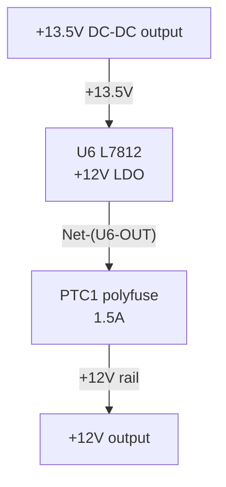

# CLAUDE.md

This file provides guidance to Claude Code (claude.ai/code) when working with code in this repository.

## Project Overview

This is a hardware project for designing a USB-PD powered modular synthesizer power
supply that converts USB-C PD 15V to +12V/1.2A, -12V/0.8A, and +5V/0.5A outputs for
modular synthesizers. The design splits into two boards: **Board A** (USB-PD sink core)
negotiates and switches the 15V rail; **Board B** (synth power conversion) turns it into
the three output rails via DC-DC converters + linear regulators + protection.

## Current Phase

**Spec-driven 2-board architecture (epic #86, spec-architecture epic).** The v4 (0.4.0)
PCBA — the 4th JLCPCB order — still failed USB-PD negotiation. Rather than order a v5
single-board respin, the project split into a reusable **Board A** (USB-PD sink core:
STUSB4500 + USB-C + load switch + NVM pads) and a **Board B** (synth power conversion:
DC-DCs + LDOs + protection + outputs). Both boards now exist as real KiCad projects
under `boards/`, generated from Python spec modules (the `schgen` toolchain) rather than
hand-drawn. A structured evidence review locked a set of component-level fixes
(part swaps, a new gate-clamp diode, canonical LCSC numbers) — see
`scripts/schgen/decisions.json` for the machine-consumable decision record and
`doc/src/content/docs/inbox/spec-architecture-review.md` for the full findings and
rationale. PCB layout and JLCPCB order files for Board A/B are **not** started yet —
schematics only, so far.

- For the versioning scheme (X.Y.Z), see `doc/src/content/docs/inbox/versioning.md`
- For the two-board split rationale, see `doc/src/content/docs/overview/two-board-plan.md`
- For per-board design docs, see `doc/src/content/docs/overview/board-a-usb-pd-core.md`
  and `doc/src/content/docs/overview/board-b-synth-power.md`
- For the v4 PD failure diagnosis that triggered the split (ranked root-cause
  candidates + bench procedure), see
  `doc/src/content/docs/inbox/v4-pd-failure-diagnosis.md`
- For the board-split decision (locked fix list + Board A/B interface contract), see
  `doc/src/content/docs/inbox/board-split-decision.md`
- For the wave-6 decision lock (part swaps, provisions, dispositions), see
  `scripts/schgen/decisions.json` and
  `doc/src/content/docs/inbox/spec-architecture-review.md`
- For the bring-up/test procedure, see `doc/src/content/docs/inbox/v3-bringup-test-procedure.md`
- For the STUSB4500 pin-by-pin guide, see `doc/src/content/docs/inbox/stusb4500-pinout.md`
- For STUSB4500 NVM programming setup, see `doc/src/content/docs/inbox/nvm-programming.md`
- For detailed current state, see `doc/src/content/docs/inbox/current-status.md`

## Component & Circuit Work — Route to Skills

Do not answer a component-rating, pin, package, substitution, or cross-circuit question
from memory or training data. This project keeps exact, evidence-backed records per
component and per cross-component interaction as Claude Code skills; route to them
first.

Use `.claude/skills/component-spec-audit` whenever circuit, schematic, PCB, BOM,
firmware, bring-up, substitution, or related documentation work touches component
identity, behavior, ratings, pins, packages, defaults, previews, or interactions.
**Adding or replacing a BOM component always starts there** — it owns the exact
schematic/spec change, evidence, KiCad assets, previews, generated docs, and
validation. Run its offline validator first
(`.claude/skills/component-spec-audit/scripts/validate.py`) and route every exact
MPN/LCSC/function through the central inventory. Never infer unavailable evidence from
memory or a same-name/generic-family part.

Load every matching exact owner skill, including bundles that carry both a fitted part
and its removed/candidate siblings:

- `component-stusb4500qtr` — U1, PD sink controller (board A)
- `component-umw-ao3401a-c347476` — Q1, load-switch P-FET (board A)
- `component-usb-type-c-009-c456012` — J1, USB-C receptacle (board A)
- `component-high-diode-smaj20a-c571370` — D5, VBUS TVS clamp (board A)
- `component-pesd24vs1ub-c85382` — D6/D7, CC-line ESD, DNP provision (board A)
- `component-bzt52c11-c92321` — D8, Q1 gate-source zener clamp (board A)
- `component-jst-b6b-xh-a` — J4 (board A) / J5 (board B), the locked A↔B interface
  connector
- `component-lm2596s-adj-c347423` — U2/U3/U4 DC-DC converters, including U4's inverting
  buck-boost stress chain (board B)
- `component-ss34-c8678` — D1/D2/D3 catch/freewheeling diodes (board B)
- `component-cya1265-100uh-c19268674` — L1/L2/L3 DC-DC inductors (board B)
- `component-l7812cd2t-c13456`, `component-l7805abd2t-c86206`, `component-cj7912-c94173`
  — U6/U7/U8 linear regulators (board B)
- `component-ptc-smd1210p200tf-c20808` — PTC1, +12V rail (fitted part is the
  SMD1210P150TF/16 sibling this bundle also owns — see decision (g))
- `component-ptc-msmd110-33v-c70119` — PTC2, +5V rail
- `component-ptc-bsmd1206-150-16v-c883133` — PTC3, -12V rail
- `component-smaj15a-c571368` — TVS1/TVS3, ±12V output clamps
- `component-sd05-c502527` — TVS2, +5V rail (fitted part is the SMAJ6.5A sibling this
  bundle also owns — see decision (a))
- `component-project-passives` — the project's resistor/MLCC/electrolytic/LED lines
  shared across both boards
- `component-faston-c591344`, `component-hdr-2541wr-2x08p-c5383092` — output connectors
  (board B)

Also load `circuit-spec-integration` for any cross-component rail, protection, startup,
state/configuration, converter, sensing, thermal, harness, symbol/footprint, as-built,
or firmware interaction spanning more than one component skill. Component and
integration skills audit design state; they do not authorize silently changing
component selections, connectivity, firmware behavior, or unresolved harness domains.

## Schematic Regeneration — Route to schgen

Board A and Board B schematics under `boards/` are **not hand-drawn**. Each is
generated from a Python spec module (`scripts/schgen/board_a_spec.py` /
`board_b_spec.py`) by the `schgen` toolchain — the spec module is the source of truth,
the `.kicad_sch` file is a build artifact. Do not hand-edit `boards/board-a/board-a.kicad_sch`
or `boards/board-b/board-b.kicad_sch` directly. See `scripts/schgen/README.md` for the
full regen/verify workflow (`gen_schematic.py`, `check_baseline.py`,
`check_decisions.py`, `verify.sh` on a machine with `kicad-cli`) and
`doc/src/content/docs/how-to/kicad-workflow.md` for the doc-facing walkthrough.

## Versioning (X.Y.Z)

Custom scheme (not semver). Current version in the `VERSION` file at repo root.

- **X** = product release (still `0`, nothing shipped). Bump: `/l-bump-version-x` — tag + GitHub release; resets Z; **keeps Y**.
- **Y** = Nth JLCPCB PCBA order (lifetime counter). Bump: `/l-bump-version-y` — tag + GitHub release; resets Z.
- **Z** = local checkpoint tag. Bump: `/l-bump-version-z` — git tag only, no release.

Old labels map onto Y: v1→0.1.0, v2→0.2.0, v3→0.3.0, v4→**0.4.0** (current). When older docs
say "v2/v3/v4" they mean the JLCPCB order = the Y digit. Bump skills live in
`.claude/skills/l-bump-version-*`; shared logic in `.claude/scripts/bump-version.sh`. Full
details: `doc/src/content/docs/inbox/versioning.md`.

## Repository Structure

- `/boards/` — **generated Board A / Board B KiCad projects** (`board-a/`, `board-b/`),
  each built from its spec module by `schgen` — see `boards/README.md`
- `/scripts/schgen/` — the spec-driven schematic generator: spec modules, the locked
  decision record (`decisions.json`), baseline/allow-list JSON, and the
  generate/verify/check-decisions CLI tools — see `scripts/schgen/README.md`
- `/doc/` - **zudo-doc documentation site** (zfb/MDX/Tailwind/Preact, deployed to Cloudflare Workers; has its own CLAUDE.md)
- `/footprints/` - **KiCad footprint library** (has its own CLAUDE.md)
- `/symbols/` - **KiCad symbol library** (`zudo-pd.kicad_sym`)
- `/diagram-sources/` - Python schemdraw scripts for circuit diagram generation
- `/3dp-files/` - 3D printable files (component guards, enclosures)
- `/jlcpcb-templates/` - JLCPCB BOM/CPL template files
- `/jlcpcb-order-snapshots/` - Historical order snapshots for reference
- `/__inbox/` - **Temporary files** (gitignored, use for working files)

### Legacy root KiCad project (repository root)

`zudo-pd.kicad_pro` / `zudo-pd.kicad_sch` / `usb-pd-input.kicad_sch` /
`dc-dc-conversion.kicad_sch` / `linear-regulation.kicad_sch` / `output.kicad_sch` /
`zudo-pd.kicad_pcb` at the repo root are the **as-built v4 (0.4.0) reference** — the
single combined board that was actually ordered and assembled four times, kept for
bring-up/diagnosis reference against the physical dead v4 boards. This project is
**PCB-human-owned**: it is edited by hand in KiCad, not by `schgen`, and is **not**
regenerated from a spec module. `boards/board-a/` and `boards/board-b/` are the two
new projects that supersede it going forward; the legacy files stay in place as the
historical source both were derived from and as the reference for bench-diagnosing the
physical v4 boards.

## Technical Architecture

The power supply uses a 4-stage architecture:

1. **USB-PD Stage**: STUSB4500 IC (USB-IF certified PD protocol controller) negotiates 15V from USB-C PD
2. **DC-DC Stage**: Three LM2596S-ADJ converters create intermediate voltages
   - +15V → +13.5V (for +12V rail)
   - +15V → +7.5V (for +5V rail)
   - +15V → -13.5V (LM2596S-ADJ in inverting buck-boost configuration) (for -12V rail)
3. **Linear Regulator Stage**: LM78xx/LM79xx-family LDOs for final low-noise outputs
   - L7812: +13.5V → +12V
   - L7805: +7.5V → +5V
   - CJ7912: -13.5V → -12V
4. **Protection Stage**: PTC resettable fuses and TVS diodes for overcurrent/overvoltage protection

There is no LM2586 or SEPIC anywhere in this design — the -12V rail is a single
LM2596S-ADJ run in an inverting buck-boost configuration (one inductor to system GND,
catch diode to the negative output). See `scripts/schgen/decisions.json` decision (b)
for the evidence trail behind this wording.

## Key Design Features

- **Low-noise design**: DC-DC + Linear regulator combination for <1mVp-p ripple
- **JLCPCB compatibility**: All parts selected for JLCPCB SMT assembly
- **Safety margins**: 150%+ current capacity on all circuits
- **Modular synth optimized**: Voltage and current specifications match typical modular synthesizer requirements

## Documentation Language

**All documentation must be written in English.** This includes:
- Circuit diagrams and annotations
- Technical specifications
- README files
- Code comments
- Commit messages

Use English for all text to ensure international accessibility and collaboration. ASCII art diagrams should use English labels to avoid encoding issues.

## Schematic Documentation Conventions

When documenting circuit connectivity for AI→human handoff, use a **net-connectivity table + Mermaid block diagram** rather than ASCII-art schematics. The rationale: LLMs are unreliable at 2-D spatial layout (ASCII art), but reliable at connectivity (tabular data). Geometry-free artifacts are also regenerable from a KiCad netlist without opening the GUI. Full convention, worked example, and the `kicad-cli` export command:
`doc/src/content/docs/how-to/net-table-convention.md`.

### Net-Table Schema

One sub-table per hierarchical sheet or board. Column schema:

| Net | Connected pins (Ref.Pin) | Value/Note |
|-----|--------------------------|------------|

- **Net**: the KiCad net name as it appears in the netlist (e.g. `+15V`, `-13.5V`, `GND`, `Net-(U6-OUT)`).
- **Connected pins (Ref.Pin)**: space-separated list of `Ref.Pin` tokens for pins on that net that belong to the sheet/board being documented (e.g. `U8.VI`, `C14.1`). Cross-sheet/cross-board pins may be omitted or noted as `<sheet>/Ref.Pin`.
- **Value/Note**: component value, net role, or signal description (e.g. `LDO input`, `470 µF bulk cap`, `+12V LDO output`).

For `boards/board-a` and `boards/board-b`, the net table is directly readable off the
spec module's `NETS` dict (`scripts/schgen/board_a_spec.py` / `board_b_spec.py`) — no
export step needed, since the spec **is** the source of truth. For the legacy root
project, generate the table from a **KiCad netlist** export (geometry-free), not by
eyeballing symbol positions:

```
kicad-cli sch export netlist --format kicadxml --output __inbox/<name>.xml zudo-pd.kicad_sch
```

Keep raw XML exports in `__inbox/` (gitignored). Only the rendered table goes in docs.

### Mermaid Block Diagram

Use a `flowchart TD` for stage-level topology — one node per functional block, edges labeled with net names or voltage levels:



This **replaces ASCII-art schematics** as the canonical AI→human connectivity handoff. ASCII art may still be used as an optional human-readable illustration, but it is not the authoritative connectivity record.

## File Types

- `.kicad_pro` - KiCad project configuration
- `.kicad_sch` - KiCad schematic files (circuit diagrams)
- `.kicad_pcb` - KiCad PCB layout files
- `.kicad_mod` - KiCad footprint files (physical component pads)
- `.kicad_sym` - KiCad symbol library files (schematic symbols)
- `fp-lib-table` / `sym-lib-table` - Library configurations
- No code compilation or testing is required - this is a hardware design project
