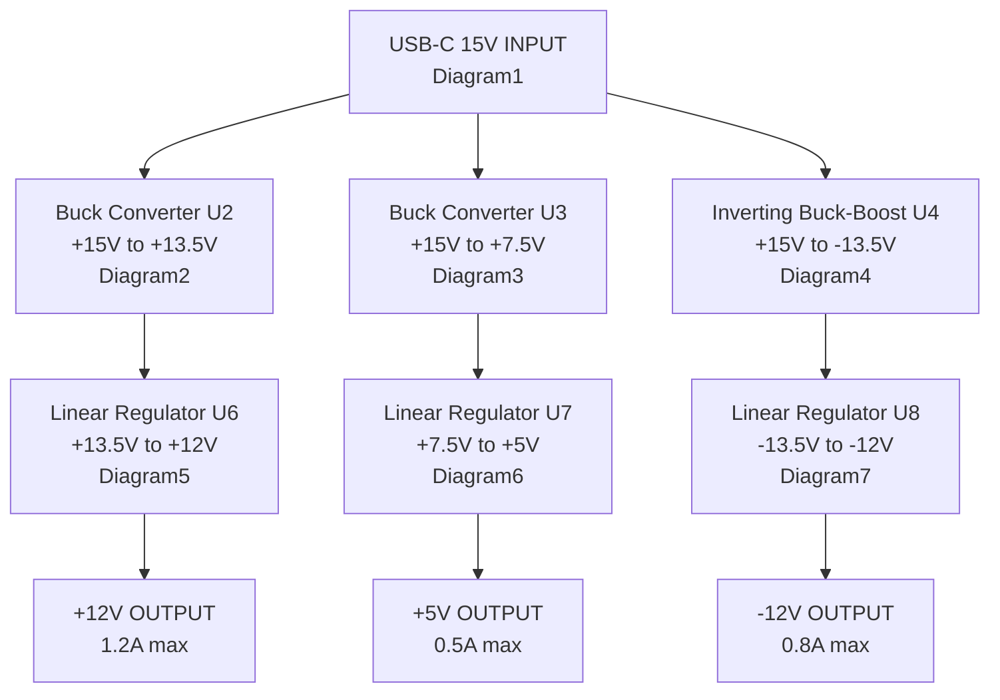

import BuckU2Diagram from '../_fragments/buck-u2-diagram.mdx';
import BuckU3Diagram from '../_fragments/buck-u3-diagram.mdx';
import InverterU4Diagram from '../_fragments/inverter-u4-diagram.mdx';
import LdoU6Diagram from '../_fragments/ldo-u6-diagram.mdx';
import LdoU7Diagram from '../_fragments/ldo-u7-diagram.mdx';
import LdoU8Diagram from '../_fragments/ldo-u8-diagram.mdx';
import CircuitSvg from '@site/src/components/CircuitSvg';
import Diagram1Svg from '@site/static/circuits/diagram1-usb-pd.svg';

# Circuit Diagrams

Complete circuit configuration shown in stages.

## Power Flow Overview

This diagram shows the complete power conversion chain from USB-C input to all output rails, including the relationship between all circuit diagrams.



**Power Conversion Strategy:**

- **Two-stage design**: DC-DC converters provide efficient voltage reduction, linear regulators provide low-noise final outputs
- **+12V rail**: USB-C 15V → Buck (U2) → LDO (U6) → +12V OUT
- **+5V rail**: USB-C 15V → Buck (U3) → LDO (U7) → +5V OUT
- **-12V rail**: USB-C 15V → Inverting Buck-Boost (U4) → LDO (U8) → -12V OUT

---

## Diagram1: USB-PD Power Supply Section

### Diagram1-1: USB-C Connector to CH224D IC (Complete Connection)

<CircuitSvg src={Diagram1Svg} alt="USB-C Connector J1" padding="10px" />

<details>
<summary>View ASCII art version</summary>

```
USB-C Connector J1 (6-pin power-only):
┌─────────────────────────────┐
│  2, 5  VBUS  ───────────────┼──→ VBUS Rail (5V initially, 15V after PD)
│                             │
│  3     CC1   ───────────────┼──→ To CH224D CC1
│  4     CC2   ───────────────┼──→ To CH224D CC2
│                             │
│  1, 6  GND   ───────────────┼──→ System GND
└─────────────────────────────┘

CH224D IC (QFN-20) - USB PD Sink Controller:
                    ┌──────────────────────────────┐
VBUS (5V→15V) ──────┤ 2. VBUS (Power I/O)          │
                    │                              │
                 ┌──┤11. CC1 (PD Comm)             │──→ To USB-C CC1
                 │  │10. CC2 (PD Comm)             │──→ To USB-C CC2
                 │  │                              │
                 │  │ 1. DRV  ──┬──────────────────│
                 │  │19. CFG1 ──┘                  │
                 │  │13. CFG2 ── Open              │
                 │  │12. CFG3 ── Open              │
                 │  │                              │
                 │  │ 8. DP   ──┬──────────────────│  ← SHORT together
                 │  │ 9. DM   ──┘                  │  ← (PD-only mode)
                 │  │                              │
                 │  │ 7. VDD (4.7V LDO)            │──→ C30 (1µF) ──→ GND
                 │  │                              │
                 │  │ 5. GATE (Internal Switch)    │ ── NC (internal use only)
                 │  │ 6. NMOS# (Ext Switch Ctrl)   │──→ GND (not using ext)
                 │  │                              │
                 │  │14. ISP (Current Sense +) ──┬─│
                 │  │15. ISN (Current Sense -) ──┘ │──→ GND (not using)
                 │  │                              │
                GND │ 0. GND (EPAD)                │
                    └──────────────────────────────┘

CRITICAL: VBUS is both input AND output!
- Initially: VBUS = 5V (default USB)
- After PD negotiation: VBUS = 15V (requested voltage)
- Pin 18 is NC (Not Connected) - NO separate output pin!
- Downstream circuits connect directly to VBUS

Input Filter Capacitors (on VBUS rail):
J1 VBUS ──┬────────────────┬─── CH224D pin 2 (VBUS) ──→ +15VOUT (to DC-DC stages)
          │                │
         C1               C2
       10µF            100nF
   electrolytic       ceramic
    (farther)        (CLOSE!)
          │                │
         GND              GND

- C1 (10µF electrolytic): Bulk filtering for both input 5V and output 15V
- C2 (100nF ceramic): High-frequency decoupling, placed CLOSE to CH224D pin 2
- Both capacitors filter the VBUS rail (voltage changes from 5V → 15V after PD)

VDD Decoupling (Internal 4.7V Regulator):
VDD (pin 7) ─── C30 (1µF) ──→ GND  (Close to IC)

CC Pin Pull-down Resistors (USB-PD Sink Identification):
CC1 (pin 11) ───┬─── R12 (5.1kΩ) ──→ GND
                │
                └──→ To USB-C CC1 (pin 3)

CC2 (pin 10) ───┬─── R13 (5.1kΩ) ──→ GND
                │
                └──→ To USB-C CC2 (pin 4)

Note: 5.1kΩ pull-downs identify device as USB-PD sink (power consumer)
```

### Diagram1-2: Voltage Configuration (15V Selection via Rset)

```
Rset Configuration Circuit:

DRV (pin 1) ──┬── CFG1 (pin 19)  ← These pins connected together
              │
             R11 (Rset = 56kΩ, 0603, ±0.1%)
              │
             GND

How it works:
1. DRV pin provides weak drive output
2. Resistor value determines voltage at CFG1
3. CH224D reads CFG1 voltage to determine requested voltage

CFG2 (pin 13) ── Open (or GND)  ← Not connected in resistor mode
CFG3 (pin 12) ── Open (or GND)  ← Not connected in resistor mode

Voltage Selection Table:
┌──────────┬──────────────────┐
│ R11 Value│ Requested Voltage│
├──────────┼──────────────────┤
│ 6.8 kΩ   │ 9V               │
│ 24 kΩ    │ 12V              │
│ 56 kΩ    │ 15V ✅ (This)    │
│ NC       │ 20V              │
└──────────┴──────────────────┘
```

### Diagram1-3: USB PD Negotiation Process

```
Step-by-step PD negotiation sequence:

1. Initial Connection (0-100ms):
   ┌─────────┐                    ┌─────────┐
   │ USB-C   │ ─── VBUS (5V) ───→ │ CH224D  │
   │ PD      │                    │  Sink   │
   │ Adapter │ ← CC1/CC2 pins  ─→ │         │
   └─────────┘   (with 5.1kΩ Rd)  └─────────┘

   VBUS = 5V (default USB voltage)
   CC pull-downs identify device as sink

2. Capability Discovery (100-200ms):
   CH224D requests available voltages via CC communication
   PD Adapter responds: 5V, 9V, 12V, 15V, 20V profiles

3. Voltage Request (200-300ms):
   CH224D requests 15V (based on R11 = 56kΩ configuration)

4. Acceptance & Voltage Transition (300-1000ms):
   PD Adapter accepts request
   VBUS transitions: 5V → 15V

5. Power Ready (>1000ms):
   VBUS stable at 15V
   System can draw up to 45W (15V × 3A)
   PG pin goes LOW (power good indicator)

CRITICAL: VBUS voltage changes from 5V to 15V on the same pin!
          There is NO separate output pin.
```

### Diagram1-4: Power Good (PG) LED Indicator

```
                                    CH224D IC (QFN-20)
                                    ┌─────────────────────┐
                                    │                     │
                                    │ 8. PG (Open-drain)  │
                                    │                     │
                                    └──────────┬──────────┘
                                               │
┌─────────────┐     ┌─────────┐     ┌──────────┐
│ +5V Rail    │     │   R10   │     │  LED1    │
│ (from D7)   ├─────┤  330Ω   ├─────┤  Green   ├──────────┘
└─────────────┘     └─────────┘     └──────────┘

Operation:
- PG pin is open-drain output
- When power negotiation succeeds: PG pulls LOW
- Current flows: +5V → R10 → LED1 → PG → GND
- LED current: I = (5V - 2.2V) / 330Ω ≈ 8.5mA ✅
```

### Diagram1-5: Internal Switch & Current Sensing Configuration

```
Internal Power Switch (GATE & NMOS#):
                                CH224D IC (QFN-20)
                    ┌───────────────────────────────────┐
                    │                                   │
VBUS (input) ───────┤ 2. VBUS                           │
                    │                                   │
                    │ 5. GATE ──→ Internal NMOS ────────┤──→ VBUS (output)
                    │              (Built-in switch)    │    (15V after PD)
                    │                                   │
               GND ─┤ 6. NMOS# (Ext Switch Control)     │
                    │   ↑                               │
                    │   └─ Tied to GND (not using       │
                    │      external MOSFET)             │
                    │                                   │
                    └───────────────────────────────────┘

**Internal Switch Operation:**
- CH224D has built-in N-channel MOSFET between VBUS input and output
- Pin 5 (GATE) drives the internal MOSFET gate
- For our 15V/3A application, internal switch is sufficient (up to 5A capability)
- **Pin 6 (NMOS#) tied to GND** = Use internal switch only

**External Switch Option (Not Used):**
- For higher current (>5A), you can use external MOSFET
- Pin 5 (GATE) would drive external MOSFET gate
- Pin 6 (NMOS#) would be configured differently
- We don't need this for our 3A max design

Current Sensing (ISP & ISN):
                                CH224D IC (QFN-20)
                    ┌───────────────────────────────────┐
                    │                                   │
                    │14. ISP (Current Sense +) ────────┼─┐
                    │15. ISN (Current Sense -) ────────┘ │
                    │                                     └─→ GND
                    └───────────────────────────────────┘

**Current Sensing Operation:**
- ISP/ISN pins can monitor current through the power path
- Useful for overcurrent protection or current limiting
- **Shorted together and tied to GND** = Not using current sensing
- CH224D still provides overcurrent protection via internal monitoring

**Our Configuration Summary:**
- ✅ Using internal MOSFET switch (sufficient for 3A)
- ✅ Pin 6 (NMOS#) → GND
- ✅ Pins 14, 15 (ISP, ISN) → Shorted together → GND
- ✅ No external components needed for these pins
```

</details>

<details>
<summary>Connection List</summary>

**CRITICAL Understanding:**

- VBUS is BOTH input (initially 5V) AND output (15V after negotiation)
- Pin 18 is NC - there is NO separate output pin!
- Downstream circuits (U2, U3, U4) connect directly to VBUS

**Power Rail (VBUS):**

- `USB-C VBUS (pins 2, 5)` → `CH224D pin 2 (VBUS)` → `VBUS Rail`
  - Initially: VBUS = 5V (default USB voltage)
  - After PD negotiation: VBUS = 15V (requested voltage)
  - This SAME pin serves as power output to DC-DC converters

**CC Communication Lines (USB-PD Protocol):**

- `USB-C CC1 (pin 3)` → `CH224D pin 11 (CC1)` → `R12 (5.1kΩ)` → `GND`
- `USB-C CC2 (pin 4)` → `CH224D pin 10 (CC2)` → `R13 (5.1kΩ)` → `GND`
- **Critical**: 5.1kΩ pull-downs (Rd) identify device as USB-PD sink

**Ground:**

- `USB-C GND (pins 1, 6)` → `System GND` → `CH224D pin 0 (EPAD)` (thermal pad)

**Input Filter Capacitors:**

- `C1 (10µF/25V electrolytic)`: `VBUS` ⟷ `GND` (bulk filtering)
- `C2 (100nF ceramic)`: `VBUS` ⟷ `GND` (high-freq decoupling, close to IC)

**VDD Decoupling (Internal 4.7V Regulator):**

- `C30 (1µF ceramic)`: `VDD (pin 7)` ⟷ `GND` (internal regulator output)

**Voltage Configuration (15V Selection):**

- `CH224D pin 1 (DRV)` → Connected to `pin 19 (CFG1)`
- `CFG1` → `R11 (56kΩ, ±0.1%)` → `GND`
- `CH224D pin 13 (CFG2)` → `Open` or `GND`
- `CH224D pin 12 (CFG3)` → `Open` or `GND`

**LED Status Indicator Circuit:**

- `+5V rail (from Diagram7)` → `R10 (330Ω)` → `LED1 (Green LED)` → `CH224D pin 8 (PG)` → `GND`
- LED indicates: **Power Good** (lights up when 15V USB-PD negotiation succeeds)
- LED current: `I = (5V - 2.2V) / 330Ω ≈ 8.5mA` ✅
- **Note**: PG pin is open-drain, pulls LOW when power is good

**PD-Only Mode Configuration:**

- `CH224D pin 8 (DP)` ↔ `pin 9 (DM)` - **Shorted together** (disables BC1.2 and other USB data protocols)
- **Why short DP to DM?** 6-pin USB-C connector has no DP/DM pins. Per datasheet, we must short DP to DM on CH224D to use PD-only mode.
- `CH224D pin 18` - NC (Not Connected in datasheet)

**Internal Switch Configuration:**

- `CH224D pin 5 (GATE)` - Drives internal NMOS gate (no external connection)
- `CH224D pin 6 (NMOS#)` → `GND` (enables internal switch mode, disables external MOSFET control)

**Current Sensing Configuration:**

- `CH224D pin 14 (ISP)` ↔ `pin 15 (ISN)` - **Shorted together** → `GND`
- Not using current sensing feature (CH224D provides overcurrent protection internally)

</details>

## Diagram2: USB-PD +15V → +13.5V Buck Converter (LM2596S-ADJ #1)

<BuckU2Diagram />

<details>
<summary>Connection List</summary>

**Input Power:**

- `+15V input` → `U2 (LM2596S-ADJ) pin 1 (VIN)`
- `GND` → `U2 pin 5 (ON/OFF)` (always-on: tie to GND or leave floating)

**Output Path (Buck Converter Topology):**

1. `U2 pin 2 (OUTPUT)` → `L1 (100µH, 4.5A)` → Junction point
2. Junction point → `C3 (470µF/25V)` → `GND` (output filter capacitor)
3. Junction point → `+13.5V output` (to next stage)

**Flyback Diode (Freewheeling Diode):**

- `D1 (SS34 Schottky)`:
  - Cathode → Junction between `OUTPUT (pin 2)` and `L1`
  - Anode → `GND`
  - Purpose: Provides path for inductor current when switch turns off

**Input Capacitors:**

- `C5 (100µF electrolytic)`: `+15V input` ⟷ `GND` (bulk input filter)
- `C6 (100nF ceramic)`: `+15V input` ⟷ `GND` (high-frequency decoupling)

**Output Capacitor:**

- `C3 (470µF/25V electrolytic)`: Connected **in parallel** between `+13.5V output` ⟷ `GND`
- Purpose: Output filtering, ripple reduction, and energy storage for transient response
- **Important**: C3 is NOT in series with the output - it's a shunt element that allows AC ripple current to flow to GND

**Feedback Network (Voltage Setting):**

- Voltage divider: `+13.5V output` → `R1 (10kΩ)` → **Tap point** → `R2 (1kΩ)` → `GND`
- `U2 pin 4 (FB)` → Connected to **tap point** (junction between R1 and R2)
- The tap point voltage = `13.5V × R2/(R1+R2) = 13.5V × 1kΩ/11kΩ = 1.23V`
- Chip maintains FB pin at 1.23V by adjusting duty cycle
- Output voltage formula: `VOUT = 1.23V × (1 + R1/R2) = 1.23V × (1 + 10kΩ/1kΩ) = 13.53V`

**Ground:**

- `U2 pin 3 (GND)` → `System GND`
- All capacitor negative terminals → `System GND`
- `D1 anode` → `System GND`

**Key Points:**

- The inductor L1 is on the **OUTPUT side** of pin 2 (OUTPUT), not the input side
- D1 cathode connects to the junction between OUTPUT (pin 2) and L1 (the "switching node")
- When U2's internal switch is ON: Current flows VIN → Switch → OUTPUT → L1 → C3 → Load
- When U2's internal switch is OFF: Inductor current flows through D1 (L1 → D1 → GND → L1)

</details>

## Diagram3: +15V → +7.5V Buck Converter (LM2596S-ADJ #2, U3)

<BuckU3Diagram />

<details>
<summary>Connection List</summary>

**Input Power:**

- `+15V input` → `U3 (LM2596S-ADJ) pin 1 (VIN)`
- `GND` → `U3 pin 5 (ON/OFF)` (always-on: tie to GND or leave floating)

**Output Path (Buck Converter Topology):**

1. `U3 pin 2 (OUTPUT)` → `L2 (100µH, 4.5A)` → Junction point
2. Junction point → `C4 (470µF/25V)` → `GND` (output filter capacitor)
3. Junction point → `+7.5V output` (to L7805 linear regulator)

**Flyback Diode (Freewheeling Diode):**

- `D2 (SS34 Schottky)`:
  - Cathode → Junction between `OUTPUT (pin 2)` and `L2`
  - Anode → `GND`
  - Purpose: Provides path for inductor current when switch turns off

**Input Capacitors:**

- `C5 (100µF electrolytic)`: `+15V input` ⟷ `GND` (bulk input filter, shared with U2)
- `C6 (100nF ceramic)`: `+15V input` ⟷ `GND` (high-frequency decoupling, shared with U2)

**Output Capacitor:**

- `C4 (470µF/25V electrolytic)`: Connected **in parallel** between `+7.5V output` ⟷ `GND`
- Purpose: Output filtering, ripple reduction, and energy storage for transient response
- **Important**: C4 is NOT in series with the output - it's a shunt element that allows AC ripple current to flow to GND

**Feedback Network (Voltage Setting):**

- Voltage divider: `+7.5V output` → `R3 (5.1kΩ)` → **Tap point** → `R4 (1kΩ)` → `GND`
- `U3 pin 4 (FB)` → Connected to **tap point** (junction between R3 and R4)
- The tap point voltage = `7.5V × R4/(R3+R4) = 7.5V × 1kΩ/6.1kΩ = 1.23V`
- Chip maintains FB pin at 1.23V by adjusting duty cycle
- Output voltage formula: `VOUT = 1.23V × (1 + R3/R4) = 1.23V × (1 + 5.1kΩ/1kΩ) = 7.5V`

**Ground:**

- `U3 pin 3 (GND)` → `System GND`
- All capacitor negative terminals → `System GND`
- `D2 anode` → `System GND`

**Key Points:**

- The inductor L2 is on the **OUTPUT side** of pin 2 (OUTPUT), not the input side
- D2 cathode connects to the junction between OUTPUT (pin 2) and L2 (the "switching node")
- When U3's internal switch is ON: Current flows VIN → Switch → OUTPUT → L2 → C4 → Load
- When U3's internal switch is OFF: Inductor current flows through D2 (L2 → D2 → GND → L2)
- This stage provides +7.5V to the L7805 linear regulator for final +5V output

</details>

## Diagram4: +15V → -13.5V Inverting Buck-Boost (LM2596S-ADJ, U4)

<InverterU4Diagram />

## Diagram5: +13.5V → +12V Linear Regulator (L7812, U6)

<LdoU6Diagram />

<details>
<summary>Connection List</summary>

**Regulator:**

- U6 (L7812CD2T-TR): `+13.5V input` → Pin 1 (IN), Pin 3 (OUT) → `+12V output`, Pin 2 (GND) → `GND`

**Input Capacitors (connected in parallel between +13.5V and GND):**

- C14 (470nF ceramic): High-frequency noise filtering
- C20 (470µF electrolytic): Input bulk stabilization

**Output Capacitors (connected in parallel between +12V and GND):**

- C17 (100nF ceramic): High-frequency decoupling
- C21 (470µF electrolytic): Output stabilization and transient response

**Status LED:**

- LED2 (Green): `+12V` → `R7 (1kΩ)` → `LED2 anode` → `LED2 cathode` → `GND`
- LED current: `I = (12V - 2V) / 1kΩ ≈ 10mA`

</details>

## Diagram6: +7.5V → +5V Linear Regulator (L7805, U7)

<LdoU7Diagram />

<details>
<summary>Connection List</summary>

**Regulator:**

- U7 (L7805ABD2T-TR): `+7.5V input` → Pin 1 (IN), Pin 3 (OUT) → `+5V output`, Pin 2 (GND) → `GND`

**Input Capacitors (connected in parallel between +7.5V and GND):**

- C15 (470nF ceramic): High-frequency noise filtering
- C22 (470µF electrolytic): Input bulk stabilization

**Output Capacitors (connected in parallel between +5V and GND):**

- C18 (100nF ceramic): High-frequency decoupling
- C23 (470µF electrolytic): Output stabilization and transient response

**Status LED:**

- LED3 (Blue): `+5V` → `R8 (330Ω)` → `LED3 anode` → `LED3 cathode` → `GND`
- LED current: `I = (5V - 2.8V) / 330Ω = 6.67mA` (improved brightness, 3× brighter than previous 1kΩ design)

</details>

## Diagram7: -13.5V → -12V Linear Regulator (CJ7912, U8)

<LdoU8Diagram />

<details>
<summary>Connection List</summary>

**Regulator:**

- U8 (CJ7912): `-13.5V input` → Pin 1 (IN), Pin 2 (OUT) → `-12V output`, Pin 3 (GND) → `GND`
- **Note:** LM7912 pinout differs from LM7812/7805: pin 1=IN, pin 2=OUT, pin 3=GND

**Input Capacitors (connected in parallel between -13.5V and GND):**

- C16 (470nF ceramic): High-frequency noise filtering
- C24 (470µF electrolytic): Input bulk stabilization
  - **Polarity:** Negative terminal to `-13.5V`, Positive terminal to `GND`

**Output Capacitors (connected in parallel between -12V and GND):**

- C19 (100nF ceramic): High-frequency decoupling
- C25 (470µF electrolytic): Output stabilization and transient response
  - **Polarity:** Negative terminal to `-12V`, Positive terminal to `GND`

**Status LED:**

- LED4 (Red): `GND` → `LED4 anode` → `LED4 cathode` → `R9 (1kΩ)` → `-12V`
- LED current: `I = (0V - (-12V) - 2V) / 1kΩ = 10mA`
- **Note:** LED is reversed compared to positive rails (anode to GND, cathode to negative voltage)

</details>
