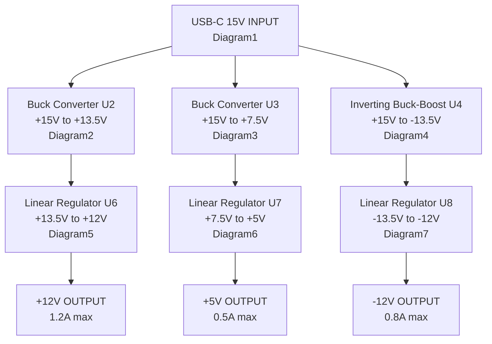

import BuckU2Diagram from '../_fragments/buck-u2-diagram.mdx';
import BuckU3Diagram from '../_fragments/buck-u3-diagram.mdx';
import InverterU4Diagram from '../_fragments/inverter-u4-diagram.mdx';
import LdoU6Diagram from '../_fragments/ldo-u6-diagram.mdx';
import LdoU7Diagram from '../_fragments/ldo-u7-diagram.mdx';
import LdoU8Diagram from '../_fragments/ldo-u8-diagram.mdx';
import CircuitSvg from '@site/src/components/CircuitSvg';
import Diagram1Svg from '@site/static/circuits/diagram1-usb-pd.svg';
import InverterU4Svg from '@site/static/circuits/inverter-u4-diagram.svg';

# Circuit Diagrams

Complete circuit configuration shown in stages.

## Power Flow Overview

This diagram shows the complete power conversion chain from USB-C input to all output rails, including the relationship between all circuit diagrams.



**Power Conversion Strategy:**

- **Two-stage design**: DC-DC converters provide efficient voltage reduction, linear regulators provide low-noise final outputs
- **+12V rail**: USB-C 15V → Buck (U2) → LDO (U6) → +12V OUT
- **+5V rail**: USB-C 15V → Buck (U3) → LDO (U7) → +5V OUT
- **-12V rail**: USB-C 15V → Inverting Buck-Boost (U4) → LDO (U8) → -12V OUT

---

## Diagram1: USB-PD Power Supply Section (STUSB4500)

:::info v1.1 Upgrade
This section documents the **STUSB4500-based** design (v1.1). The STUSB4500 is USB-IF certified with ~95%+ charger compatibility. For the deprecated CH224D design (v1.0), see [CH224D documentation](../components/ch224d).
:::

### Diagram1-1: Complete STUSB4500 Circuit with Load Switch

```
                           VBUS_IN (from USB-C J1)
                                    │
    ┌───────────────────────────────┼───────────────────────────────────┐
    │                               │                                   │
    │                          R11 (100kΩ)                              │
    │                               │                                   │
    │                               ├──────── Q1 (AO3401A) ─────────────┤
    │                               │          S ←───── D               │
    │                          R12 (56kΩ)          │                    │
    │                               │              G                    │
    │                               │              │                    │
    │   STUSB4500 (QFN-24)          │              │                    │
    │   ┌────────────────────┐      │              │                    │
    │   │                    │      │              │                    │
    │   │  VBUS_EN_SNK ──────┼──────┘              │                    │
    │   │  (pin 16)          │                     │                    │
    │   │                    │                    C35 (100nF)           │
    │   │  VDD (pin 24) ─────┼── VBUS_IN           │                    │
    │   │        │           │                    GND                   │
    │   │       C2 (100nF)   │                                          │
    │   │        │           │                     ▼                    │
    │   │       GND          │                 VBUS_OUT ──→ (to DC-DC)  │
    │   │                    │                     │                    │
    │   │  VREG_2V7 (pin 23) │                    TP1                   │
    │   │        │           │                                          │
    │   │       C30 (1µF)    │                                          │
    │   │        │           │                                          │
    │   │       GND          │                                          │
    │   │                    │                                          │
    │   │  VREG_1V2 (pin 21) │                                          │
    │   │        │           │                                          │
    │   │       C34 (1µF)    │                                          │
    │   │        │           │                                          │
    │   │       GND          │                                          │
    │   │                    │                                          │
    │   │  VSYS (pin 22) ────┼── VREG_2V7 (tie together)                │
    │   │                    │                                          │
    │   │  RESET (pin 6) ────┼── GND (internal pull-down, NC also OK)   │
    │   │                    │                                          │
    │   │  DISCH (pin 9) ────┼── R13 (470Ω) ── VBUS_OUT                 │
    │   │                    │                                          │
    │   │  ADDR0 (pin 12) ───┼── GND                                    │
    │   │  ADDR1 (pin 13) ───┼── GND                                    │
    │   │                    │                                          │
    │   │  GND (pin 10)      │                                          │
    │   │  EP (pin 25) ──────┼── GND                                    │
    │   │                    │                                          │
    │   │  CC1 (pin 2) ──────┼────┬── USB-C CC1                         │
    │   │  CC1DB (pin 1) ────┼────┘                                     │
    │   │                    │    │                                     │
    │   │  CC2 (pin 4) ──────┼────┼─┬── USB-C CC2                       │
    │   │  CC2DB (pin 5) ────┼────┼─┘                                   │
    │   │                    │    │                                     │
    │   └────────────────────┘    │                                     │
    │                             │                                     │
    │   ESD Protection D4 (USBLC6-2SC6):                                 │
    │   ┌──────────────────────┐                                        │
    │   │ Pin 1 (I/O1) ────────┼─ USB-C CC1 ─→ Pin 6 (I/O1) ─→ CC1     │
    │   │ Pin 3 (I/O2) ────────┼─ USB-C CC2 ─→ Pin 4 (I/O2) ─→ CC2     │
    │   │ Pin 2 (GND)  ────────┼─ GND                                   │
    │   │ Pin 5 (VBUS) ────────┼─ VBUS_IN                               │
    │   └──────────────────────┘                                        │
    │                                                                   │
    └───────────────────────────────────────────────────────────────────┘
                                    │
                                   GND

USB-C Connector J1 (6-pin power-only):
┌─────────────────────────────────────┐
│  A9,B9  VBUS  ──────────────────────┼──→ VBUS_IN Rail (5V initially)
│                                     │
│  A5     CC1   ──────────────────────┼──→ To STUSB4500 CC1 (pin 2)
│  B5     CC2   ──────────────────────┼──→ To STUSB4500 CC2 (pin 4)
│                                     │
│  A1,B12 GND   ──────────────────────┼──→ System GND
└─────────────────────────────────────┘
```

### Diagram1-2: Load Switch Operation (Power Path Control)

```
Power Path with P-Channel MOSFET Load Switch:

                    VBUS_IN (15V after PD negotiation)
                           │
                      R11 (100kΩ)  ← Gate pull-up (default OFF)
                           │
VBUS_EN_SNK ───┬── R12 (56kΩ) ──┴─── Gate ─── Q1 (AO3401A)
(from STUSB4500)│                              │    │
               │                            Source Drain
              C35 (100nF)                      │    │
               │                           VBUS_IN  │
              GND                                   ▼
                                              VBUS_OUT (to DC-DC)

Load Switch Operation:
┌────────────────────────────────────────────────────────────────────┐
│ State              │ VBUS_EN_SNK │ Gate Voltage │ Q1 State │ Output│
├────────────────────┼─────────────┼──────────────┼──────────┼───────┤
│ No cable / PD fail │ LOW (0V)    │ HIGH (VBUS)  │ OFF      │ 0V    │
│ PD negotiation OK  │ HIGH (~3V)  │ LOW (~2V)    │ ON       │ 15V   │
└────────────────────────────────────────────────────────────────────┘

Why P-Channel MOSFET?
- Simple high-side switch (no charge pump needed)
- Gate referenced to VBUS (easy to drive with VBUS_EN_SNK)
- Default OFF when gate is pulled to VBUS via R11

Soft-Start Calculation:
- Time constant: τ = R12 × C35 = 56kΩ × 100nF = 5.6ms
- Limits dV/dt during turn-on, reducing inrush current
```

### Diagram1-3: USB PD Negotiation Process (STUSB4500)

```
Step-by-step PD negotiation sequence:

1. Initial Connection (0-100ms):
   ┌─────────┐                    ┌───────────┐
   │ USB-C   │ ─── VBUS (5V) ───→ │ STUSB4500 │──→ Q1 OFF (no output)
   │ PD      │                    │           │
   │ Adapter │ ← CC1/CC2 pins  ─→ │ (handles  │
   └─────────┘                    │  Rd int.) │
                                  └───────────┘
   VBUS = 5V (default USB voltage)
   STUSB4500 presents Rd internally (no external 5.1kΩ needed)
   VBUS_EN_SNK = LOW → Q1 OFF → VBUS_OUT = 0V

2. Capability Discovery (100-200ms):
   STUSB4500 requests Source Capabilities via CC
   PD Adapter responds: 5V, 9V, 12V, 15V, 20V profiles

3. Voltage Request (200-300ms):
   STUSB4500 requests 15V (from NVM configuration)
   Built-in retry on failure (unlike CH224D)

4. Acceptance & Voltage Transition (300-500ms):
   PD Adapter accepts request
   VBUS transitions: 5V → 15V
   STUSB4500 waits for stable VBUS

5. Power Ready (>500ms):
   STUSB4500 confirms 15V stable
   VBUS_EN_SNK goes HIGH → Q1 turns ON
   VBUS_OUT = 15V (power delivered to DC-DC stages)

KEY DIFFERENCE from CH224D:
- Q1 prevents power delivery until PD negotiation succeeds
- No 5V exposure to downstream circuits
- Clean startup without voltage transitions on output
```

### Diagram1-4: STUSB4500 Pin Configuration

```
STUSB4500 (QFN-24) - USB-IF Certified PD Sink Controller:

              ┌───────────────────────────────────────┐
              │              (Top View)               │
              │                                       │
    CC1DB   1 │●                                   24│ VDD ─── VBUS_IN + C2 (100nF)
      CC1   2 │                                   23│ VREG_2V7 ── C30 (1µF) ── GND
       NC   3 │                                   22│ VSYS ── VREG_2V7
      CC2   4 │                                   21│ VREG_1V2 ── C34 (1µF) ── GND
    CC2DB   5 │                                   20│ POWER_OK2 (NC)
    RESET   6 │── GND (or NC)                    19│ ALERT (NC)
      SCL   7 │── NC (or I2C)                     18│ VBUS_VS_DISCH (NC)
      SDA   8 │── NC (or I2C)                     17│ A_B_SIDE (NC)
    DISCH   9 │── R13 (470Ω) ── VBUS_OUT          16│ VBUS_EN_SNK ──→ Gate drive
      GND  10 │── GND                             15│ GPIO (NC)
   ATTACH  11 │── NC                              14│ POWER_OK3 (NC)
    ADDR0  12 │── GND                             13│ ADDR1 ── GND
              │                                       │
              │         ┌──────────────┐              │
              └─────────┤  EP (pin 25) ├──────────────┘
                        │     GND      │
                        └──────────────┘

Critical Pin Connections:
┌──────────────┬──────────────────────────────────────────────────────┐
│ Pin          │ Connection                                           │
├──────────────┼──────────────────────────────────────────────────────┤
│ VDD (24)     │ VBUS_IN + C2 (100nF) to GND                          │
│ CC1 (2)      │ USB-C CC1, also to CC1DB (pin 1)                     │
│ CC2 (4)      │ USB-C CC2, also to CC2DB (pin 5)                     │
│ CC1DB (1)    │ Tie to CC1 (enables dead battery mode)               │
│ CC2DB (5)    │ Tie to CC2 (enables dead battery mode)               │
│ VBUS_EN_SNK (16) │ To gate drive (R12) → Q1 gate                    │
│ VREG_2V7 (23)│ C30 (1µF) to GND, also to VSYS (pin 22)              │
│ VREG_1V2 (21)│ C34 (1µF) to GND                                     │
│ VSYS (22)    │ Tie to VREG_2V7                                      │
│ RESET (6)    │ GND (or NC) - Active-HIGH, has internal pull-down    │
│ DISCH (9)    │ R13 (470Ω) to VBUS_OUT (for VBUS discharge)          │
│ ADDR0 (12)   │ GND                                                  │
│ ADDR1 (13)   │ GND (I2C address = 0x28)                             │
│ GND (10)     │ System GND                                           │
│ EP (25)      │ System GND (thermal pad)                             │
│ NC pins      │ 3,7,8,11,14,15,17,18,19,20 - Not connected           │
└──────────────┴──────────────────────────────────────────────────────┘
```

<details>
<summary>Connection List</summary>

**Power Supply:**

- `USB-C VBUS (pins A9, B9)` → `VBUS_IN Rail` → `STUSB4500 VDD (pin 24)`
- `C1 (10µF ceramic)`: `VBUS_IN` ⟷ `GND` (bulk filtering)
- `C2 (100nF ceramic)`: `VDD (pin 24)` ⟷ `GND` (close to IC)

**Internal Regulators:**

- `VREG_2V7 (pin 23)` → `C30 (1µF)` → `GND`
- `VREG_1V2 (pin 21)` → `C34 (1µF)` → `GND`
- `VSYS (pin 22)` → `VREG_2V7 (pin 23)` (tie together)

**CC Lines:**

- `USB-C CC1 (pin A5)` → `STUSB4500 CC1 (pin 2)` → `CC1DB (pin 1)` (tie CC1 and CC1DB together)
- `USB-C CC2 (pin B5)` → `STUSB4500 CC2 (pin 4)` → `CC2DB (pin 5)` (tie CC2 and CC2DB together)
- `D4 (USBLC6-2SC6)`: Pin 1 → USB-C CC1, Pin 6 → STUSB4500 CC1/CC1DB, Pin 3 → USB-C CC2, Pin 4 → STUSB4500 CC2/CC2DB, Pin 2 → GND, Pin 5 → VBUS_IN

**Load Switch (Power Path Control):**

- `VBUS_IN` → `R11 (100kΩ)` → `Q1 Gate` (pull-up, default OFF)
- `VBUS_EN_SNK (pin 16)` → `R12 (56kΩ)` → `Q1 Gate`
- `Q1 Gate` → `C35 (100nF)` → `GND` (soft-start)
- `Q1 (AO3401A)`: Source = VBUS_IN, Drain = VBUS_OUT
- **Result**: Q1 conducts when VBUS_EN_SNK goes HIGH after PD success

**VBUS Discharge:**

- `DISCH (pin 9)` → `R13 (470Ω)` → `VBUS_OUT`
- Purpose: Quickly discharge VBUS when cable disconnected

**Configuration:**

- `RESET (pin 6)` → `GND` (or NC) - Active-HIGH, has internal pull-down
- `ADDR0 (pin 12)` → `GND`
- `ADDR1 (pin 13)` → `GND`
- I2C address = 0x28 (for NVM programming)

**Ground:**

- `USB-C GND (pins A1, B12)` → `System GND`
- `STUSB4500 GND (pin 10)` → `System GND`
- `STUSB4500 EP (pin 25)` → `System GND` (thermal + ground)

**NVM Programming (One-time Setup):**

The STUSB4500 requires NVM programming to configure the 15V PDO:

| PDO  | Voltage | Current | Purpose            |
| ---- | ------- | ------- | ------------------ |
| PDO1 | 5V      | 1.5A    | Fixed (mandatory)  |
| PDO2 | **15V** | **3A**  | **Target voltage** |
| PDO3 | 20V     | 1.5A    | Fallback option    |

Programming methods:

1. **STSW-STUSB002** GUI tool (requires STEVAL-ISC005V1 eval board)
2. **Arduino/MCU via I2C** using community libraries
3. **Pre-programmed parts** from some distributors

</details>

## Diagram2: USB-PD +15V → +13.5V Buck Converter (LM2596S-ADJ #1)

<BuckU2Diagram />

<details>
<summary>Connection List</summary>

**Input Power:**

- `+15V input` → `U2 (LM2596S-ADJ) pin 1 (VIN)`
- `GND` → `U2 pin 5 (ON/OFF)` (always-on: tie to GND or leave floating)

**Output Path (Buck Converter Topology):**

1. `U2 pin 2 (OUTPUT)` → `L1 (100µH, 4.5A)` → Junction point
2. Junction point → `C3 (470µF/25V)` → `GND` (output filter capacitor)
3. Junction point → `+13.5V output` (to next stage)

**Flyback Diode (Freewheeling Diode):**

- `D1 (SS34 Schottky)`:
  - Cathode → Junction between `OUTPUT (pin 2)` and `L1`
  - Anode → `GND`
  - Purpose: Provides path for inductor current when switch turns off

**Input Capacitors:**

- `C5 (100µF electrolytic)`: `+15V input` ⟷ `GND` (bulk input filter)
- `C6 (100nF ceramic)`: `+15V input` ⟷ `GND` (high-frequency decoupling)

**Output Capacitor:**

- `C3 (470µF/25V electrolytic)`: Connected **in parallel** between `+13.5V output` ⟷ `GND`
- Purpose: Output filtering, ripple reduction, and energy storage for transient response
- **Important**: C3 is NOT in series with the output - it's a shunt element that allows AC ripple current to flow to GND

**Feedback Network (Voltage Setting):**

- Voltage divider: `+13.5V output` → `R1 (10kΩ)` → **Tap point** → `R2 (1kΩ)` → `GND`
- `U2 pin 4 (FB)` → Connected to **tap point** (junction between R1 and R2)
- The tap point voltage = `13.5V × R2/(R1+R2) = 13.5V × 1kΩ/11kΩ = 1.23V`
- Chip maintains FB pin at 1.23V by adjusting duty cycle
- Output voltage formula: `VOUT = 1.23V × (1 + R1/R2) = 1.23V × (1 + 10kΩ/1kΩ) = 13.53V`

**Ground:**

- `U2 pin 3 (GND)` → `System GND`
- All capacitor negative terminals → `System GND`
- `D1 anode` → `System GND`

**Key Points:**

- The inductor L1 is on the **OUTPUT side** of pin 2 (OUTPUT), not the input side
- D1 cathode connects to the junction between OUTPUT (pin 2) and L1 (the "switching node")
- When U2's internal switch is ON: Current flows VIN → Switch → OUTPUT → L1 → C3 → Load
- When U2's internal switch is OFF: Inductor current flows through D1 (L1 → D1 → GND → L1)

</details>

## Diagram3: +15V → +7.5V Buck Converter (LM2596S-ADJ #2, U3)

<BuckU3Diagram />

<details>
<summary>Connection List</summary>

**Input Power:**

- `+15V input` → `U3 (LM2596S-ADJ) pin 1 (VIN)`
- `GND` → `U3 pin 5 (ON/OFF)` (always-on: tie to GND or leave floating)

**Output Path (Buck Converter Topology):**

1. `U3 pin 2 (OUTPUT)` → `L2 (100µH, 4.5A)` → Junction point
2. Junction point → `C4 (470µF/25V)` → `GND` (output filter capacitor)
3. Junction point → `+7.5V output` (to L7805 linear regulator)

**Flyback Diode (Freewheeling Diode):**

- `D2 (SS34 Schottky)`:
  - Cathode → Junction between `OUTPUT (pin 2)` and `L2`
  - Anode → `GND`
  - Purpose: Provides path for inductor current when switch turns off

**Input Capacitors:**

- `C5 (100µF electrolytic)`: `+15V input` ⟷ `GND` (bulk input filter, shared with U2)
- `C6 (100nF ceramic)`: `+15V input` ⟷ `GND` (high-frequency decoupling, shared with U2)

**Output Capacitor:**

- `C4 (470µF/25V electrolytic)`: Connected **in parallel** between `+7.5V output` ⟷ `GND`
- Purpose: Output filtering, ripple reduction, and energy storage for transient response
- **Important**: C4 is NOT in series with the output - it's a shunt element that allows AC ripple current to flow to GND

**Feedback Network (Voltage Setting):**

- Voltage divider: `+7.5V output` → `R3 (5.1kΩ)` → **Tap point** → `R4 (1kΩ)` → `GND`
- `U3 pin 4 (FB)` → Connected to **tap point** (junction between R3 and R4)
- The tap point voltage = `7.5V × R4/(R3+R4) = 7.5V × 1kΩ/6.1kΩ = 1.23V`
- Chip maintains FB pin at 1.23V by adjusting duty cycle
- Output voltage formula: `VOUT = 1.23V × (1 + R3/R4) = 1.23V × (1 + 5.1kΩ/1kΩ) = 7.5V`

**Ground:**

- `U3 pin 3 (GND)` → `System GND`
- All capacitor negative terminals → `System GND`
- `D2 anode` → `System GND`

**Key Points:**

- The inductor L2 is on the **OUTPUT side** of pin 2 (OUTPUT), not the input side
- D2 cathode connects to the junction between OUTPUT (pin 2) and L2 (the "switching node")
- When U3's internal switch is ON: Current flows VIN → Switch → OUTPUT → L2 → C4 → Load
- When U3's internal switch is OFF: Inductor current flows through D2 (L2 → D2 → GND → L2)
- This stage provides +7.5V to the L7805 linear regulator for final +5V output

</details>

## Diagram4: +15V → -13.5V Inverting Buck-Boost (LM2596S-ADJ, U4)

<InverterU4Diagram />

## Diagram5: +13.5V → +12V Linear Regulator (L7812, U6)

<LdoU6Diagram />

<details>
<summary>Connection List</summary>

**Regulator:**

- U6 (L7812CD2T-TR): `+13.5V input` → Pin 1 (IN), Pin 3 (OUT) → `+12V output`, Pin 2 (GND) → `GND`

**Input Capacitors (connected in parallel between +13.5V and GND):**

- C14 (470nF ceramic): High-frequency noise filtering
- C20 (470µF electrolytic): Input bulk stabilization

**Output Capacitors (connected in parallel between +12V and GND):**

- C17 (100nF ceramic): High-frequency decoupling
- C21 (470µF electrolytic): Output stabilization and transient response

**Status LED:**

- LED2 (Green): `+12V` → `R7 (1kΩ)` → `LED2 anode` → `LED2 cathode` → `GND`
- LED current: `I = (12V - 2V) / 1kΩ ≈ 10mA`

</details>

## Diagram6: +7.5V → +5V Linear Regulator (L7805, U7)

<LdoU7Diagram />

<details>
<summary>Connection List</summary>

**Regulator:**

- U7 (L7805ABD2T-TR): `+7.5V input` → Pin 1 (IN), Pin 3 (OUT) → `+5V output`, Pin 2 (GND) → `GND`

**Input Capacitors (connected in parallel between +7.5V and GND):**

- C15 (470nF ceramic): High-frequency noise filtering
- C22 (470µF electrolytic): Input bulk stabilization

**Output Capacitors (connected in parallel between +5V and GND):**

- C18 (100nF ceramic): High-frequency decoupling
- C23 (470µF electrolytic): Output stabilization and transient response

**Status LED:**

- LED3 (Blue): `+5V` → `R8 (330Ω)` → `LED3 anode` → `LED3 cathode` → `GND`
- LED current: `I = (5V - 2.8V) / 330Ω = 6.67mA` (improved brightness, 3× brighter than previous 1kΩ design)

</details>

## Diagram7: -13.5V → -12V Linear Regulator (CJ7912, U8)

<LdoU8Diagram />

<details>
<summary>Connection List</summary>

**Regulator:**

- U8 (CJ7912): Pin 1 (GND) → `GND`, Pin 2 (IN) ← `-13.5V input`, Pin 3 (OUT) → `-12V output`
- **Note:** LM7912 pinout differs from LM7812/7805: pin 1=GND, pin 2=IN, pin 3=OUT (79xx negative regulators)

**Input Capacitors (connected in parallel between -13.5V and GND):**

- C16 (470nF ceramic): High-frequency noise filtering
- C24 (470µF electrolytic): Input bulk stabilization
  - **Polarity:** Negative terminal to `-13.5V`, Positive terminal to `GND`

**Output Capacitors (connected in parallel between -12V and GND):**

- C19 (100nF ceramic): High-frequency decoupling
- C25 (470µF electrolytic): Output stabilization and transient response
  - **Polarity:** Negative terminal to `-12V`, Positive terminal to `GND`

**Status LED:**

- LED4 (Red): `GND` → `LED4 anode` → `LED4 cathode` → `R9 (1kΩ)` → `-12V`
- LED current: `I = (0V - (-12V) - 2V) / 1kΩ = 10mA`
- **Note:** LED is reversed compared to positive rails (anode to GND, cathode to negative voltage)

</details>
