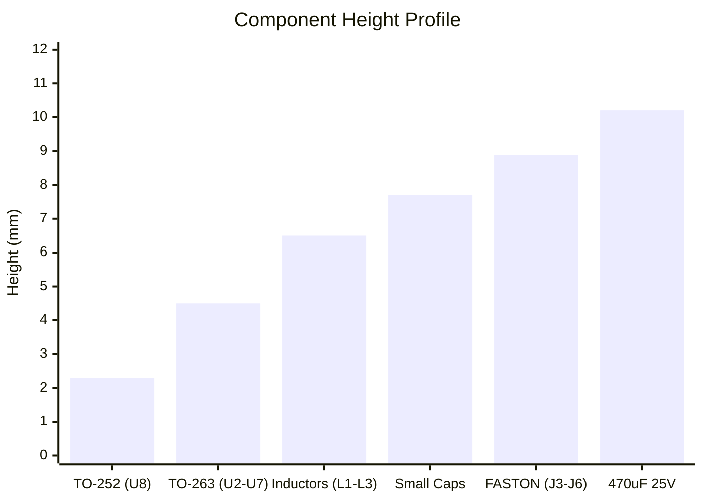

# Mechanical Design

Physical dimensions and mechanical considerations for PCB layout and enclosure design.

## Component Heights

Physical height reference for PCB layout and enclosure design.

### Power Components

| Component         | Designator                | Package         | Height     | Notes                  |
| ----------------- | ------------------------- | --------------- | ---------- | ---------------------- |
| **LM2596S-ADJ**   | U2, U3, U4                | TO-263-5        | **4.5mm**  | DC-DC converters       |
| **L7812CD2T-TR**  | U6                        | TO-263-2        | **4.5mm**  | +12V linear regulator  |
| **L7805ABD2T-TR** | U7                        | TO-263-2        | **4.5mm**  | +5V linear regulator   |
| **CJ7912**        | U8                        | TO-252-3 (DPAK) | **2.3mm**  | -12V linear regulator  |
| **CYA1265-100UH** | L1, L2, L3                | SMD 13.8x12.8mm | **~6-7mm** | Power inductors        |
| **1217754-1**     | J3, J4, J5, J6            | FASTON 250 THT  | **8.89mm** | Power terminals        |
| **470uF 25V**     | C3, C11, C20-C21, C24-C25 | D10xL10.2mm     | **10.2mm** | Electrolytic (tallest) |
| **470uF 16V**     | C4                        | D6.3xL7.7mm     | **7.7mm**  | Electrolytic           |
| **470uF 10V**     | C22, C23                  | D6.3xL7.7mm     | **7.7mm**  | Electrolytic           |
| **100uF 25V/50V** | C5, C7, C9                | D6.3xL7.7mm     | **7.7mm**  | Electrolytic           |

### Height Profile



### PCB Design Implications

- **Tallest components**: 470uF 25V electrolytic caps (10.2mm)
- **Second tallest**: FASTON terminals J3-J6 (8.89mm)
- **Third tallest**: Smaller electrolytics &amp; inductors (7.7mm / ~6-7mm)
- **Total board height**: ~12mm including PCB thickness (1.6mm)
- **Clearance**: Keep space around TO-263 packages for thermal dissipation
- **CJ7912 advantage**: Lower profile (2.3mm) allows flexible placement
- **FASTON placement**: Position at board edge for cable access
- **Capacitor placement**: Consider grouping tall caps for enclosure fit

## PCB Dimensions

_To be determined based on component placement._

## Heatsink Design

### Aluminum PCB Heatsink Concept

A cost-effective heatsink solution using JLCPCB's aluminum PCB service. The aluminum PCB acts as a custom-fit heatsink that sits on top of the voltage regulators (U6, U7, U8) and DC-DC converters (U2, U3, U4).

#### Design Approach

```
Cross-section view:

    Aluminum PCB (heatsink)
    ┌─────────────────────────────────────────────────────┐
    │░░░░░░░░░░░░░░░░░░░░░░░░░░░░░░░░░░░░░░░░░░░░░░░░░░░░░│
    └──┬──────────┬─────────────────┬─────────────────┬───┘
       │ Thermal  │                 │                 │
       │ Pad      │    (cutout)     │    (cutout)     │
    ┌──┴──┐    ┌──┴──┐           ┌──┴──┐           ┌──┴──┐
    │ IC  │    │ IC  │           │Cap  │           │Cap  │
    │ U6  │    │ U7  │           │     │           │     │
    └─────┘    └─────┘           └─────┘           └─────┘
    ════════════════════════════════════════════════════════
                        Main PCB
```

**Key features:**

1. **Same outline as main PCB** - Easy alignment and mounting
2. **Cutouts for tall components** - Electrolytics (10.2mm), inductors (6-7mm), FASTON terminals
3. **Solid areas over ICs** - TO-263 (4.5mm) and TO-252 (2.3mm) packages for heat transfer
4. **Thermal gap pads** - Fill the gap between IC top surface and aluminum PCB

#### Target Components for Cooling

| Component      | Designator | Package  | Height | Heat Dissipation           |
| -------------- | ---------- | -------- | ------ | -------------------------- |
| L7812CD2T-TR   | U6         | TO-263-2 | 4.5mm  | High (1.5V × 1.2A = 1.8W)  |
| L7805ABD2T-TR  | U7         | TO-263-2 | 4.5mm  | High (2.5V × 0.5A = 1.25W) |
| CJ7912         | U8         | TO-252-3 | 2.3mm  | High (1.5V × 0.8A = 1.2W)  |
| LM2596S-ADJ ×3 | U2-U4      | TO-263-5 | 4.5mm  | Medium (switching losses)  |

#### Gap Calculation for Thermal Pads

The gap between IC package top and aluminum PCB bottom depends on:

- Aluminum PCB thickness: ~1.6mm
- Standoff/spacer height: TBD
- IC package height: 2.3mm (TO-252) to 4.5mm (TO-263)

**Recommended thermal pad thickness:** 1mm - 2mm (get multi-thickness pack to test)

### Thermal Gap Pad Selection

Thermal gap pads (サーマルパッド) provide thermal interface between ICs and the aluminum heatsink.

#### Required Specifications

| Spec                 | Requirement                 |
| -------------------- | --------------------------- |
| Thermal Conductivity | 12+ W/m·K (higher = better) |
| Thickness            | 0.5mm - 2mm (measure gap)   |
| Size                 | 100×100mm (cut to fit)      |
| Electrical           | Non-conductive              |
| Material             | Silicone-based              |

#### Recommended Products

**AliExpress (Budget, 2-4 week shipping):**

| Product            | W/m·K  | Size      | Price | Link                                                                |
| ------------------ | ------ | --------- | ----- | ------------------------------------------------------------------- |
| 24W/mK Thermal Pad | **24** | 100×100mm | ~$3   | [AliExpress](https://ja.aliexpress.com/item/1005010519398949.html)  |
| Upsiren 24W/mK     | **24** | 100×100mm | ~$3   | [AliExpress](https://www.aliexpress.com/item/1005008513777020.html) |
| Rgeek 12.8W/mK     | 12.8   | 100×100mm | ~$5   | [AliExpress](https://www.aliexpress.com/item/1005003167744654.html) |

**Amazon Japan (Fast delivery, 1-2 days):**

| Product              | W/m·K | Size                    | Price   | Link                                                   |
| -------------------- | ----- | ----------------------- | ------- | ------------------------------------------------------ |
| OwlTree 3-pack       | 12.8  | 100×100mm (0.5/1/1.5mm) | ~¥1,500 | [Amazon.co.jp](https://www.amazon.co.jp/dp/B09DC772PR) |
| Thermalright         | 12.8  | 120×120mm               | ~¥1,000 | [Amazon.co.jp](https://www.amazon.co.jp/dp/B08ZN832NZ) |
| 17.3W Non-conductive | 17.3  | 100×100mm               | ~¥1,500 | [Amazon.co.jp](https://www.amazon.co.jp/dp/B0CM7TF733) |

#### Application Tips

1. **Clean surfaces** - Remove dust and oil from IC and aluminum PCB
2. **Cut to size** - Match IC package footprint (TO-263: ~10×9mm, TO-252: ~6.5×6mm)
3. **Slight compression** - Pads should be 10-20% compressed for optimal contact
4. **No air gaps** - Ensure pad fully covers IC thermal surface

### Ordering Aluminum PCB from JLCPCB

1. **Create edge cuts** in KiCad matching main PCB outline
2. **Add cutouts** for tall components (capacitors, inductors, FASTON terminals)
3. **Export Gerber files** with edge cuts only (no circuit needed)
4. **Order as aluminum PCB** from JLCPCB
5. **Select thickness** based on thermal mass requirements

_Detailed KiCad procedure to be added after prototype testing._

## Enclosure Considerations

_To be added._
