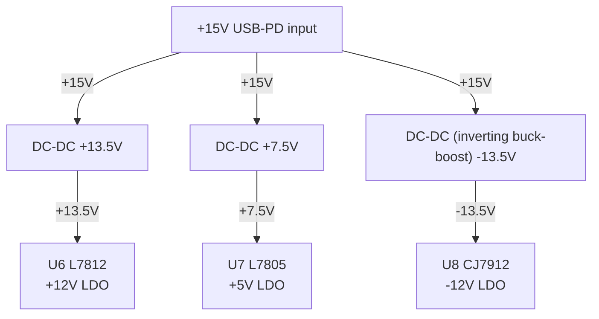
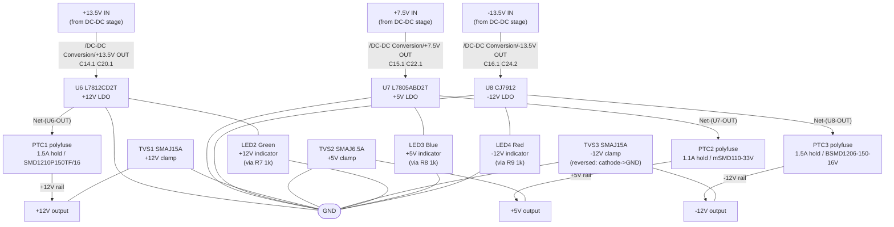

## Overview

This page explains the repo convention for documenting circuit connectivity.
The preferred AI→human handoff artifact is a **net-connectivity table** (derived
from the KiCad netlist) paired with a **Mermaid block diagram** for stage-level
topology.

**Why not ASCII art?** LLMs are unreliable at 2-D spatial layout — a slight
misalignment makes a diagram misleading. Net tables are geometry-free (no 2-D
representation), generated from the authoritative netlist, and trivially
verifiable. Mermaid renders as a proper block diagram in the doc site. ASCII art
may still be used as an optional human-readable illustration, but it is not the
authoritative connectivity record.

## Net-Table Schema

One sub-table per hierarchical sheet. The three columns are:

| Net | Connected pins (Ref.Pin) | Value/Note |
|-----|--------------------------|------------|

- **Net** — the KiCad net name exactly as it appears in the exported netlist
  (e.g. `+15V`, `-13.5V`, `GND`, `Net-(U6-OUT)`). Cross-sheet nets keep their
  full path prefix (e.g. `/DC-DC Conversion/+13.5V OUT`).
- **Connected pins (Ref.Pin)** — space-separated list of `Ref.Pin` tokens for
  all pins on that net that belong to the sheet being documented (e.g.
  `U8.2 C16.1 C24.2`). Pins from other sheets may be omitted or listed as
  `<sheet>/Ref.Pin`.
- **Value/Note** — component value, net role, or signal description (e.g.
  `LDO input rail`, `470 µF bulk cap`, `+12V LDO output before polyfuse`).

## Generating the Table

**For `boards/board-a` and `boards/board-b`**, skip the netlist export entirely —
the net table is read directly off the spec module's `NETS` dict
(`scripts/schgen/board_a_spec.py` / `board_b_spec.py`), which **is** the source
of truth the `.kicad_sch` file is generated from. No KiCad install needed.

**For the legacy root project** (`zudo-pd.kicad_sch`), there is no spec module,
so derive the table from the **KiCad netlist** — never by eyeballing symbol
positions in the GUI. Export with (assumes `kicad-cli` is on `PATH`; on macOS
where KiCad wasn't added to `PATH` during install, the binary lives at
`/Applications/KiCad/KiCad.app/Contents/MacOS/kicad-cli`):

```sh
kicad-cli sch export netlist \
  --format kicadxml \
  --output __inbox/<sheet-name>-netlist.xml \
  zudo-pd.kicad_sch
```

The root schematic `zudo-pd.kicad_sch` contains all hierarchical sheets; one
export covers everything. Keep the raw XML in `__inbox/` (gitignored). Parse it
with Python's `xml.etree.ElementTree` — every `<net>` element lists `<node
ref="..." pin="..." />` children that map directly to the `Ref.Pin` column.

## Mermaid Block Diagram

Pair every net table with a `flowchart TD` that shows the stage-level signal
flow. Use one node per functional block; label edges with net names or voltage
levels:



Keep the diagram at the **block level** — one node per functional stage, not
one node per component. Component-level detail lives in the net table.

## Worked Example: Board B — LDO + Protection Stage

Board B (`boards/board-b/board-b.kicad_sch`, generated from
`scripts/schgen/board_b_spec.py`) is a flat (non-hierarchical) schematic, so
there is one net table for the whole board. This example is a filtered slice
covering the LDO stage (U6 L7812CD2T +12V, U7 L7805ABD2T +5V, U8 CJ7912 −12V),
its bypass capacitors, indicator LEDs, polyfuse protection (PTC1–3), and TVS
clamping diodes (TVS1–3).

The table and diagram below are read directly off `board_b_spec.py`'s `NETS`
dict — no KiCad netlist export needed, per the "Generating the Table" section
above.

### Block Diagram



### Net Table — Board B LDO + Protection Stage

| Net | Connected pins (Ref.Pin) | Value/Note |
|-----|--------------------------|------------|
| `/DC-DC Conversion/+13.5V OUT` | `U6.1 C14.1 C20.1` (also carries DC-DC-stage pins `L1.2 R1.2 C3.1 C31.2` and test pad `TP3.1`, omitted here) | LDO input for +12V rail; `U6.1` = IN pin; `C14.1`/`C20.1` = 470 µF/35V input bulk caps |
| `/DC-DC Conversion/+7.5V OUT` | `U7.1 C15.1 C22.1` (also `L2.2 R3.1 C4.1 C32.2`, `TP4.1`, omitted here) | LDO input for +5V rail; `U7.1` = IN pin; `C15.1` = 470 nF, `C22.1` = 470 µF/10V |
| `/DC-DC Conversion/-13.5V OUT` | `U8.2 C16.1 C24.2` (also `U4.3 U4.5 U4.6 D3.2 C9.2 C10.2 C11.2 R6.2`, `TP5.1`, omitted here) | LDO input for -12V rail; `U8.2` = VIN pin; `C16.1` = 470 nF, `C24.2` = 470 µF/35V |
| `Net-(U6-OUT)` | `U6.3 C17.2 C21.1 R7.1 PTC1.1` | +12V LDO output before polyfuse; `C17.2` = 100 nF output bypass, `C21.1` = 470 µF/35V, `R7.1` = LED resistor |
| `Net-(U7-OUT)` | `U7.3 C18.1 C23.1 R8.1 PTC2.1` | +5V LDO output before polyfuse; `C18.1` = 100 nF output bypass, `C23.1` = 470 µF/10V |
| `Net-(U8-OUT)` | `U8.3 C19.1 C25.2 R9.1 PTC3.1` | -12V LDO output before polyfuse; `C19.1` = 100 nF output bypass, `C25.2` = 470 µF/35V |
| `+12V rail` | `PTC1.2 TVS1.1` (also output connectors `J7.1 J7.2 J10.7 J10.8 J11.7 J11.8`, omitted here) | Protected +12V output; `PTC1.2` = polyfuse output, `TVS1.1` = TVS cathode clamp |
| `+5V rail` | `PTC2.2 TVS2.1` (also `J8.1 J8.2 J10.5 J10.6 J11.5 J11.6`, omitted here) | Protected +5V output; `PTC2.2` = polyfuse output, `TVS2.1` = TVS cathode clamp |
| `-12V rail` | `PTC3.2 TVS3.2` (also `J6.1 J6.2 J10.15 J10.16 J11.15 J11.16`, omitted here) | Protected -12V output; `PTC3.2` = polyfuse output, `TVS3.2` = TVS **anode** — TVS3's orientation is reversed vs. TVS1/TVS2 (locked by decision `tvs3-orientation`) |
| `Net-(R7-LED2)` | `R7.2 LED2.1` | +12V indicator LED anode node; `R7.2` = resistor output, `LED2.1` = LED anode (LED2 uses reversed pin numbering: pin 1 = A) |
| `Net-(R8-LED3)` | `R8.2 LED3.2` | +5V indicator LED anode node; `LED3.2` = LED anode |
| `Net-(R9-LED4)` | `R9.2 LED4.1` | -12V indicator LED cathode node; `LED4.1` = LED cathode (LED4 conducts from GND into the -12V network) |
| `GND` (filtered to this stage) | `U6.4 U7.2 U8.1 C14.2 C15.2 C17.1 C18.2 C20.2 C21.2 C22.2 C23.2 C16.2 C24.1 C19.2 C25.1 LED2.2 LED3.1 LED4.2 TVS1.2 TVS2.2 TVS3.1` | Common ground; LDO GND pins, all bulk/bypass cap negatives, LED cathodes/anodes, TVS return pins. `GND` is shared board-wide — this row omits DC-DC-stage, interface, and output-connector GND pins also on the net |

<Note>
Pin numbers follow the spec module's `COMPONENTS`/`NETS` tables, which match the
symbol pin numbers `gen_schematic.py` emits into the schematic — not necessarily
the physical package pin numbers. For example, `U6.1` is symbol pin 1 of U6
(L7812CD2T, TO-263-2 package), which is the IN pin.
</Note>

## Reference

- Root `CLAUDE.md` § Schematic Documentation Conventions — the convention spec.
- `doc/CLAUDE.md` § Circuit Diagram Writing Rules — authoring guidance for docs.
- `scripts/schgen/board_b_spec.py` — the source-of-truth spec module the table
  above was read from (see its `NETS` dict).
