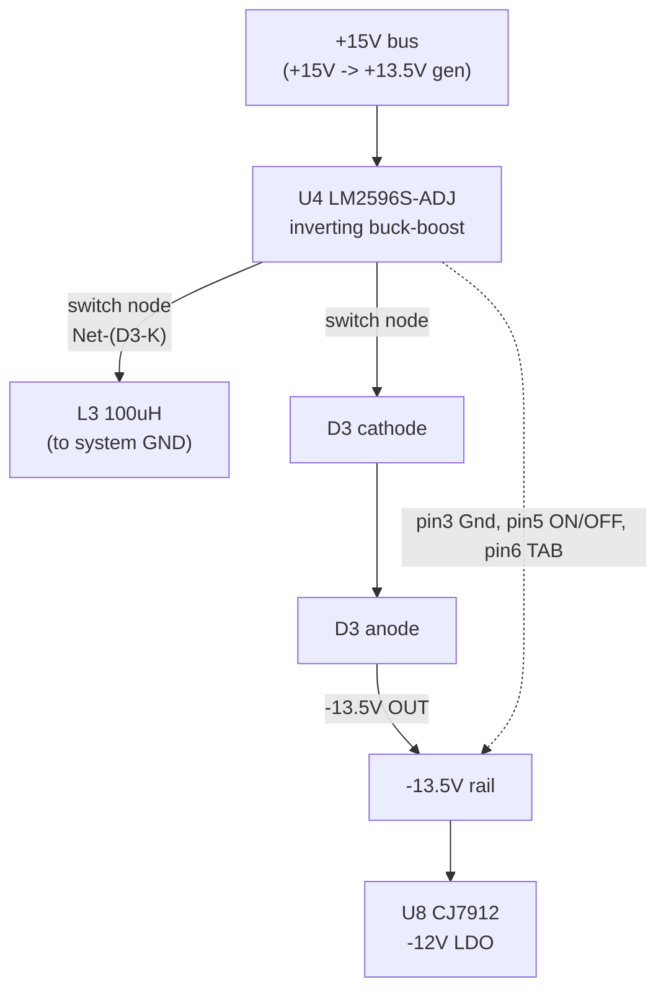
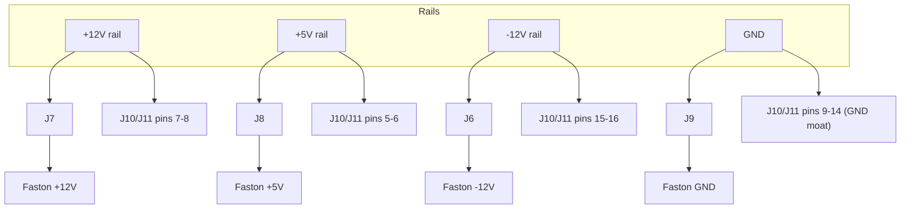

Datasheet-aware review of the circuitry that will carry forward into **Board B** of the
2-board split: `dc-dc-conversion.kicad_sch`, `linear-regulation.kicad_sch`, and
`output.kicad_sch`. Scope, method, and checklist follow
`.claude/skills/pd-schematic-review/SKILL.md` step 4. All connectivity below was derived
from a fresh `kicad-cli sch export netlist --format kicadxml` export of `zudo-pd.kicad_sch`
(root schematic, covers all hierarchical sheets) — never from symbol screen positions.

<Note>
**Findings are leads, not verdicts.** A static netlist pass cannot measure real voltages,
simulate loops, or judge thermals. Each item below gets an explicit verdict
(**OK-confirmed** / **lead-to-verify** / **blocker**) with the math and a source, but every
verdict should be treated as "what the schematic says," pending bench confirmation. See
[What this pass can and cannot catch](#what-this-pass-can-and-cannot-catch) at the end.
</Note>

## Summary

| # | Area | Verdict | One-line reason |
|---|------|---------|------------------|
| 1 | LM2596S-ADJ feedback dividers (U2/U3/U4) | OK-confirmed | All three recompute to the intended rail within rounding |
| 2 | U4 inverting buck-boost referencing | OK-confirmed | GND/`ON/OFF`/TAB correctly bootstrapped to −13.5V; D3/L3 orientation correct |
| 3a | L7812 dropout margin (+13.5→+12V @ 1.2A) | **Blocker** | 1.5V available &lt; 2V typ dropout at a *lower* test current than the actual load |
| 3b | L7805 dropout margin (+7.5→+5V @ 0.5A) | OK-confirmed | 2.5V available vs. an estimated ~1V need at half the test current |
| 3c | CJ7912 dropout margin (−13.5→−12V @ 0.8A) | OK-confirmed | 1.5V available vs. 1.1V typ at a higher test current; ~0.4–0.6V spare |
| 4 | Negative-rail decoupling network (C16/C19/C24/C25) | **Blocker** | Shared node has no GND reference, unlike the mirrored +12V/+5V networks |
| 5a | PTC1/PTC2/PTC3 hold current vs. rail load | OK-confirmed | 1.67×–2.2× headroom above each rail's rated load |
| 5b | TVS1/TVS3 (SMAJ15A) standoff vs. ±12V rails | OK-confirmed | 15V standoff vs. 12V rail, 25% headroom |
| 5c | TVS2 (SD05) standoff vs. +5V rail | lead-to-verify | 5V standoff = 5V rail nominal, zero margin; L7805 output tolerance alone reaches 5.2V |
| 6a | LM2596S-ADJ abs-max input vs. 20V edge case | OK-confirmed | 40V abs-max vs. 20V worst case |
| 6b | C9 rating vs. Vin-to-Vout(−13.5V) bridge voltage | **Blocker** | 28.5V nominal (33.5V @ 20V input) across a 25V-rated cap |
| 6c | C5/C7 input-cap margin vs. 20V edge case | lead-to-verify | Only 20% margin left (25V rated, 20V worst case) |
| 6d | C4/C22/C23 Value-field voltage rating | lead-to-verify | Schematic says "16V"; actual LCSC part is 10V-rated (still safe on its 5V/7.5V nets, but a BOM data-integrity issue) |
| 7a | J10/J11 Eurorack header pinout | OK-confirmed (structure) / lead-to-verify (physical key) | GND-moat/-12V placement matches community convention; physical key orientation not netlist-verifiable |
| 7b | J6–J9 Faston rail assignment | OK-confirmed | Unambiguous 1:1 rail mapping |

Three items are flagged **blocker**: the L7812 dropout margin, the floating negative-rail
decoupling node, and the C9 input-capacitor overvoltage. All three are derived directly from
schematic/datasheet facts (not load- or tolerance-dependent assumptions), so they are the
highest-priority items to resolve before Board B is finalized.

## 1. LM2596S-ADJ feedback dividers

Divider pairing identified from the `Net-(U2-Feedback)`, `Net-(U3-Feedback)`,
`Net-(U4-Feedback)` netlist entries (not assumed from reference-designator order):

| Converter | Rail | Top resistor (to output) | Bottom resistor (to GND) | Feedforward cap |
|-----------|------|---------------------------|---------------------------|------------------|
| U2 | +13.5V | R1 = 10k → FB | R2 = 1k, FB → GND | C31 (22nF) across R1 |
| U3 | +7.5V | R3 = 5.1k → FB | R4 = 1k, FB → GND | C32 (22nF) across R3 |
| U4 | −13.5V (inverting) | R6 = 1k, FB → −13.5V OUT | R5 = 10k, FB → GND | C33 (22nF) across R5 |

Formula (LM2596S-datasheet.pdf, p.10, "Programming Output Voltage"), Vref = 1.23V:

`Vout = 1.23 × (1 + Rtop / Rbottom)`

- **U2**: `1.23 × (1 + 10k/1k) = 1.23 × 11 = 13.53V` — target +13.5V. **OK-confirmed.**
- **U3**: `1.23 × (1 + 5.1k/1k) = 1.23 × 6.1 = 7.503V` — target +7.5V. **OK-confirmed.**
- **U4 (inverting)**: the datasheet's inverting-regulator section (p.12) states the IC's own
  ground pin bootstraps to the negative output, so the divider's "bottom" reference becomes
  system GND and its "top" (output-referenced) leg becomes the negative rail. Deriving the
  transfer function from a KCL divider between system GND (0V) and Vout (through the FB
  node, with the IC servoing `V_FB − V_local_GND = Vref`) gives the mirrored formula
  `|Vout| = 1.23 × (1 + R_gnd-side / R_output-side) = 1.23 × (1 + R5/R6) = 1.23 × (1 + 10k/1k)
  = 13.53V` — target −13.5V. **OK-confirmed.**
  <Note>
  The local `LM2596S-datasheet.pdf` (a non-TI reprint, "UMW" branding) describes the inverting
  topology qualitatively but its Figure 25 component-value table did not extract cleanly from
  the PDF (image-only). The magnitude match to the intended −13.5V rail, cross-checked by the
  feedforward cap (C33) landing on the GND-side resistor (R5) — the same position C31/C32
  occupy relative to U2/U3's respective "Rtop" — is treated as corroborating evidence rather
  than a datasheet-quoted formula. Recommend cross-checking against TI's AN-1197 ("Inverting
  Power Supplies Using the LM2574 and LM2596") if bench data disagrees.
  </Note>

FB tap is the divider midpoint (not shorted) for all three: confirmed each `Net-(U*-Feedback)`
has exactly the FB pin + two resistor pins + one feedforward-cap pin, no additional node.

## 2. U4 inverting buck-boost referencing

| Net | Connected pins (Ref.Pin) | Value/Note |
|-----|--------------------------|------------|
| `+15V -> +13.5V gen` | `U2.1 U3.1 U4.1 C5.1 C6.1 C7.1 C8.1 C9.1 C10.1` | Shared +15V input bus (post Q1 load switch); KiCad net name is a leftover label from U2's rail, not scope-limiting |
| `Net-(D3-K)` | `U4.2 D3.1 L3.1` | U4 switch node |
| `/DC-DC Conversion/-13.5V OUT` | `U4.3 U4.5 U4.6 D3.2 C9.2 C10.2 C11.2 C24.2` | U4's local GND (pin 3), `ON/OFF` (pin 5), and TAB (pin 6) all bootstrap here, not system GND |
| `GND` (relevant members) | `L3.2` | Inductor's other terminal — inductor is switch-node-to-GND, not switch-node-to-output as in a buck |

- **GND-pin bootstrap**: U4 pin 3 (`Gnd`), pin 5 (`~{ON}/OFF`), and pin 6 (`TAB`) all land on
  `/DC-DC Conversion/-13.5V OUT`, not on the `GND` net used by U2/U3. This matches
  LM2596S-datasheet.pdf p.12: "the circuit operates by bootstrapping the regulator's ground
  pin to the negative output voltage." **OK-confirmed.**
- **Catch diode (D3) + inductor (L3) orientation**: D3 cathode (pin 1) is at the switch node
  (shared with L3 pin 1 and U4's `Output` pin), D3 anode (pin 2) is at the negative rail;
  L3's other end (pin 2) goes to system `GND`. This is the standard inverting buck-boost
  topology (inductor references system GND, catch diode delivers charge to the negative
  output) — **OK-confirmed**, contrasted with U2/U3 where the inductor runs switch-node →
  output and the diode runs switch-node → GND (a standard buck).
- **`ON/OFF` pin level**: tied directly to U4's own local GND reference (same node as pin 3),
  i.e. 0V differential — below the ~1.3V threshold, so the regulator is unconditionally
  enabled. Per LM2596S-datasheet.pdf p.11/p.14 ("pulling below ~1.3V turns the regulator ON
  ... with the inverting configuration, some level shifting is required because the ground
  pin ... is now sitting at the negative output voltage level"), this is the correct way to
  hard-wire "always on" in this topology. **OK-confirmed.**

## 3. LDO dropout margins

Source: `L7812CD2T-datasheet.pdf` Table 15 (p.21, "Electrical characteristics of L7812C"),
`L7805ABD2T-datasheet.pdf` Table 3 (p.9, "Electrical characteristics of L7805A"),
`CJ7912-datasheet.pdf` p.1 (electrical characteristics table). Both ST files are the shared
L78xx-family datasheet; the L7812C and L7805A tables were matched by their quiescent-current
test-voltage ranges (`VI = 14.5 to 30V` → 12V variant; `VI = 7.5 to 20V` → 5V variant).

| LDO | Rail | Intermediate → output | Available margin | Datasheet `Vd` (typ) | Test current | Actual load | Verdict |
|-----|------|------------------------|-------------------|------------------------|---------------|--------------|---------|
| U6 L7812 | +12V | 13.5V → 12V | **1.5V** | 2.0V @ `IO = 1A, TJ = 25°C` | 1A | **1.2A** | **Blocker** |
| U7 L7805 | +5V | 7.5V → 5V | **2.5V** | 2.0V @ `IO = 1A, TJ = 25°C` | 1A | 0.5A | OK-confirmed |
| U8 CJ7912 | −12V | −13.5V → −12V | **1.5V** | 1.1V @ `Io=1A, 25°C` | 1A | 0.8A | OK-confirmed |

- **U6 (L7812)**: the datasheet's own typical dropout (2.0V) is measured at 1A — *less* current
  than this design's 1.2A load — and it already exceeds the 1.5V available on this board. Since
  dropout voltage increases with load current for this device family, the dropout at 1.2A will
  be higher than 2.0V, not lower. With only 1.5V of headroom, the LM7812 is expected to enter
  dropout under full load, and the output will likely track below the regulated 12V (into the
  11.4–12.6V spec window's floor or below it), especially as the +13.5V rail's own ±4%
  DC-DC tolerance and PTC1 series resistance are not included in this margin. **Blocker** —
  recommend bench-verifying U6's actual output voltage at 1.2A from a real 13.5V rail, or
  reworking the intermediate voltage (e.g. raising the DC-DC target above 13.5V) if the
  measurement confirms undervoltage.
- **U7 (L7805)**: 2.5V available vs. a 2.0V typ spec measured at *double* this design's 0.5A
  load. Dropout scales down with lower current, so the real dropout at 0.5A is expected well
  under 2.0V (rough linear extrapolation: ~1V), leaving roughly 1.5V of spare margin.
  **OK-confirmed.**
- **U8 (CJ7912)**: 1.5V available vs. a 1.1V typ spec measured at a *higher* current (1A) than
  this design's 0.8A load — so the real dropout at 0.8A is expected somewhat below 1.1V
  (extrapolating, ~0.9V), leaving roughly 0.4–0.6V of spare margin. Thinner than the +5V rail
  but not obviously in dropout. **OK-confirmed**, though with less margin than the other two
  rails — worth a bench check at full 0.8A load and elevated temperature, since no high-`TJ`
  dropout curve is given in the local (abbreviated, 3-page) CJ7912 datasheet.

## 4. Electrolytic polarity on the negative rail

Symbol-graphics pin polarity (from `symbols/zudo-pd.kicad_sym`, confirmed identically on both
the `RVT1E101M0607_C22383804` and `RVT1E471M1010-C3351` symbol bodies — a "+" mark and flat
plate icon sit next to pin 1, a curved-plate icon sits next to pin 2): **pin 1 = positive
(anode), pin 2 = negative (cathode)** for every electrolytic in this design.

| Net | Connected pins (Ref.Pin) | Value/Note |
|-----|--------------------------|------------|
| `/DC-DC Conversion/-13.5V OUT` (relevant) | `C16.1 C24.2` | U8 input-side caps, pin oriented toward the −13.5V rail |
| `Net-(U8-OUT)` (relevant) | `C19.1 C25.2` | U8 output-side caps, pin oriented toward the −12V rail |
| `Net-(C16-Pad2)` | `C16.2 C19.2 C24.1 C25.1` | **Not a member of `GND`** — isolated node shared by all four caps |

Compare with the mirrored +12V and +5V decoupling networks on the same sheet, where the
equivalent "far plate" pins connect **individually to `GND`**:

| Rail | Input-side far plate → | Output-side far plate → |
|------|--------------------------|----------------------------|
| +12V (U6) | `C14.2 → GND`, `C20.2 → GND` | `C21.2 → GND` |
| +5V (U7) | `C15.2 → GND`, `C22.2 → GND` | `C23.2 → GND` |
| −12V (U8) | `C16.2, C24.1 → Net-(C16-Pad2)` | `C19.2, C25.1 → Net-(C16-Pad2)` |

This asymmetry is a direct netlist fact — `Net-(C16-Pad2)` has exactly 4 members (all four
caps) and zero connection to `GND` or to U8's own GND pin. **Blocker**: the −12V LDO's
decoupling network appears to be missing its ground tie(s); the fix (matching the +12V/+5V
pattern) is almost certainly to route `C16.2`/`C24.1` and `C19.2`/`C25.1` to `GND` instead of
to each other.

<Warning>
A secondary, harder-to-confirm consequence: C24 (pin 1 = `Net-(C16-Pad2)`, pin 2 = `-13.5V
OUT`) requires the floating node to sit at or above −13.5V to stay correctly biased — true for
almost any plausible value. C25 (pin 1 = `Net-(C16-Pad2)`, pin 2 = `Net-(U8-OUT)` = −12V)
requires the floating node to sit at or above −12V. Because the floating node is bounded only
by two capacitive dividers (toward −13.5V through C16/C24, toward −12V through C19/C25, with no
resistive reference), it most plausibly settles somewhere *between* −12V and −13.5V — which
would put C25 in sustained reverse bias. This specific conclusion is a lead (it depends on the
undriven node's real DC bias, which a netlist pass cannot measure), but the underlying "missing
GND reference" fact is not.
</Warning>

`C16` and `C19` are ceramic (`470nF`/`100nF`, `C0603`/`C0805` footprints) and therefore
non-polarized — polarity does not apply to them, but they share the same missing-GND-reference
issue.

## 5. Protection stage

| Ref | Part (LCSC) | Hold current | Rating | Rail | Rated load | Margin | Verdict |
|-----|-------------|--------------|--------|------|------------|--------|---------|
| PTC1 | SMD1210P200TF (C20808) | 2.00A hold / 4.00A trip | voltage not confirmed | +12V | 1.2A | 1.67× | OK-confirmed (current); lead-to-verify (voltage) |
| PTC2 | mSMD110-33V (C70119) | 1.10A hold | 33V | +5V | 0.5A | 2.2× | OK-confirmed |
| PTC3 | BSMD1206-150-16V (C883133) | 1.50A hold | 16V | −12V | 0.8A | 1.875× | OK-confirmed |
| TVS1 | SMAJ15A (C571368) | — | VRWM 15V, `VBR` 16.7–18.5V, `Vc` 24.4V @ 1A | +12V | — | 25% standoff headroom | OK-confirmed |
| TVS3 | SMAJ15A (C571368) | — | same as TVS1 | −12V | — | 25% standoff headroom | OK-confirmed |
| TVS2 | SD05 (C502527) | — | VRWM 5V, `Vc` 14.5V | +5V | — | **0%** standoff headroom | lead-to-verify |

Sources: LCSC product-detail links embedded in the schematic's own `Datasheet` field for each
part (`SMD1210P200TF`/C20808 = "2.00A Self-healing type"; `mSMD110-33V`/C70119 = "1.10A 33V
Self-healing fuse"; `BSMD1206-150-16V`/C883133 confirmed via part-number convention and LCSC
listing; `SMAJ15A`/C571368 and `SD05`/C502527 confirmed via Bourns' SMAJ series datasheet
(`SMAJ-datasheet.pdf` p.2) and the schematic's own embedded "5V Unidirectional TVS Diode"
description for TVS2, respectively).

- **PTC hold currents** all clear their respective rated continuous loads by 1.67×–2.2×, so
  none should nuisance-trip under normal operation. **OK-confirmed.** PTC1's voltage rating
  could not be confirmed from the available sources (only current rating is documented in the
  search results found); 1210-size single-cell PPTC devices are typically rated well above
  +12V, but this should be confirmed against RUILON's own datasheet before production.
- **TVS1/TVS3 (SMAJ15A)** on the ±12V rails: 15V standoff (`VRWM`) vs. a 12V rail gives 25%
  headroom before any leakage/avalanche risk, with a `Vc` (clamping voltage at 1A surge) of
  24.4V — reasonable for protecting downstream Eurorack modules. **OK-confirmed.**
- **TVS2 (SD05)** on the +5V rail: `VRWM = 5V` is *exactly* the rail's nominal voltage — zero
  standoff margin. L7805ABD2T-datasheet.pdf Table 3 alone allows the +5V output to reach 5.2V
  under normal operating conditions (`VO` spec: `IO = 5 mA to 1 A, VI = 7.5 to 18 V` →
  4.8–5.2V), which is already 0.2V above the diode's rated standoff. **Lead-to-verify**:
  operating a TVS at or above its own `VRWM` continuously increases reverse leakage current and
  self-heating; recommend a part with a standoff voltage above the L7805's worst-case output
  (e.g. an SD6.5-class part) if this is confirmed on the bench.

## 6. Input margin (20V edge-case scenario)

Scenario: a PD source negotiates 20V instead of the intended 15V (the failure mode this
project's `/l-bump-version-x` note and the v3 postmortem both treat as a real possibility to
guard against).

- **LM2596S-ADJ abs-max input**: LM2596S-datasheet.pdf p.2 lists 40V max supply voltage for the
  non-HV "S" package used here (`LM2596S-ADJ`, confirmed via the `TO-263-5` footprint /
  ordering table). 20V is comfortably inside this. **OK-confirmed.**
- **C9 (100µF, `RVT1E101M0607`/LCSC C22383804, 25V rated — confirmed via
  `datasheet.lcsc.com/lcsc/.../RVT1E101M0607_C22383804.pdf`, "100µF 25V")**: this cap bridges
  `+15V -> +13.5V gen` (pin 1) to `/DC-DC Conversion/-13.5V OUT` (pin 2) — it is U4's own
  Vin-to-local-GND bypass cap, and per the inverting topology (see §2) that local GND sits at
  −13.5V, not 0V. Voltage across C9:
  - Nominal: `15V − (−13.5V) = 28.5V` — **already 3.5V (14%) over the 25V rating at nominal
    input**, before any edge case.
  - 20V edge case: `20V − (−13.5V) = 33.5V` — 8.5V (34%) over rating.

  This matches the exact stress pattern TI's own inverting reference design accounts for (its
  −5V example datasheet page recommends a 25V-tantalum or 50V-electrolytic input cap for a
  design whose Vin+|Vout| differential is far smaller, ~17V) — i.e. the *topology* (bridging
  Vin to Vout) is correct and expected, but *this specific cap's voltage rating* was not
  up-sized for the ~28.5–33.5V differential this design actually sees. **Blocker.**
- **C10 (100nF/50V ceramic, same net as C9)**: 50V rating comfortably covers the 33.5V
  worst case. **OK-confirmed** — not part of the C9 finding.
- **C5/C7 (100µF/25V, same `RVT1E101M0607` part, on U2/U3's Vin-to-system-GND nets)**: these
  see the input voltage directly (0V reference, not −13.5V), so nominal stress is just 15V
  (40% margin) but the 20V edge case leaves only 5V (20%) margin against the 25V rating.
  Not exceeded, but thinner than ideal. **Lead-to-verify.**
- **C3/C11 (470µF/25V, `RVT1E471M1010`, on the +13.5V/−13.5V DC-DC *outputs*, referenced to
  system `GND`)**: regulated to 13.5V magnitude regardless of input voltage, so the 20V edge
  case does not change their stress. 46% margin against the 25V rating. **OK-confirmed.**
- **C4/C22/C23 (labeled `470uF 16V` in the schematic's Value field, libpart
  `RVT1A471M0607_C335982`)**: LCSC's own listing for `C335982` (`RVT1A471M0607`) is a
  **10V-rated** part, not 16V — the schematic's Value string does not match the selected part's
  actual rating. On their actual nets (C4/C22 on the regulated 7.5V rail, C23 on the regulated
  5V rail — none of which see the 15–20V input swing), 10V is still safe (2.5V / 5V margin
  respectively), so this is not a functional blocker, but it is a **BOM/documentation
  data-integrity lead**: verify the intended part rating before reordering, and correct the
  schematic Value field to avoid a future reviewer trusting the (wrong) "16V" label.

## 7. Output connectors

### J10 / J11 — 2×8 Eurorack power headers

| Pin(s) | Net | Note |
|--------|-----|------|
| 1–2 | `GATE rail` | Isolated stub — only J10.1/2 + J11.1/2, no other component (no bus driver on this board) |
| 3–4 | `CV rail` | Isolated stub — only J10.3/4 + J11.3/4 |
| 5–6 | `+5V rail` | |
| 7–8 | `+12V rail` | |
| 9–14 | `GND` | Six-pin GND "moat" |
| 15–16 | `-12V rail` | |

This matches the widely-documented community convention for the 16-pin Eurorack/Doepfer power
header: a wide (6-pin) GND buffer separating `+12V` from `-12V`, with `-12V` placed at the far
end away from the CV/Gate/+5V pins — the rationale (per multiple community references,
e.g. modwiggler/synth-DIY discussions of the Doepfer A-100 standard) being that a one-pin
connector misalignment lands on GND rather than shorting `+12V` to `-12V` or to a signal line.
**OK-confirmed** for this structural property, derived directly from the netlist.

<Note>
Two things this netlist pass cannot confirm: (1) the exact published order of CV vs. Gate on
pins 1–4 (sources describe both signals as occupying pins 1–4 as a pair but the pin-by-pin
diagram on Doepfer's own site is an image, not text, so it could not be extracted here) — since
neither line is wired to anything else on this power-only board, this has no functional
consequence either way; (2) the physical key/polarization-slot orientation of the `2541WR-2X08P`
header footprint (i.e. whether pin 1 truly sits where the red-striped cable convention expects)
— that requires inspecting the footprint silkscreen/3D model or the physical board, not just
netlist connectivity. **Lead-to-verify** for both, structural placement (which is the safety-
relevant part) is confirmed.
</Note>

### J6–J9 — Faston rail terminals

| Ref | Net |
|-----|-----|
| J6 | `-12V rail` |
| J7 | `+12V rail` |
| J8 | `+5V rail` |
| J9 | `GND` |

Unambiguous 1:1 rail assignment, each connector's two pins tied to the same net (parallel
tabs on a single physical terminal). **OK-confirmed.**

## What this pass can and cannot catch

This is a static netlist/topology + datasheet-table review. It reliably catches wrong-net
connections, missing components, divider-math errors, reversed polarity by pin assignment, and
voltage-rating-vs-nominal-node mismatches — all of which surfaced real findings above. It
**cannot** catch: actual measured voltages under load, thermal behavior, loop stability/transient
response, layout/parasitic effects (trace resistance, ground bounce, EMI coupling), or
footprint-to-symbol pin mismatches (the class of bug that caused the v3 STUSB4500 failure — see
[v3 USB-PD Failure Diagnosis](v3-pd-failure-diagnosis.md) — is a physical-footprint issue, not a
schematic-netlist issue, and is out of scope for this pass). The three blocker-level findings above (L7812 dropout, the
negative-rail decoupling network, and the C9 overvoltage) are strong candidates for bench
verification before Board B's design is frozen.

## Reference

- Net tables above follow [Net-Table + Mermaid Convention](../how-to/net-table-convention.md).
- `.claude/skills/pd-schematic-review/SKILL.md` — the checklist this review implements.
- Raw netlist export used: `__inbox/zudo-pd-netlist.xml` (gitignored; regenerate with
  `kicad-cli sch export netlist --format kicadxml`).
