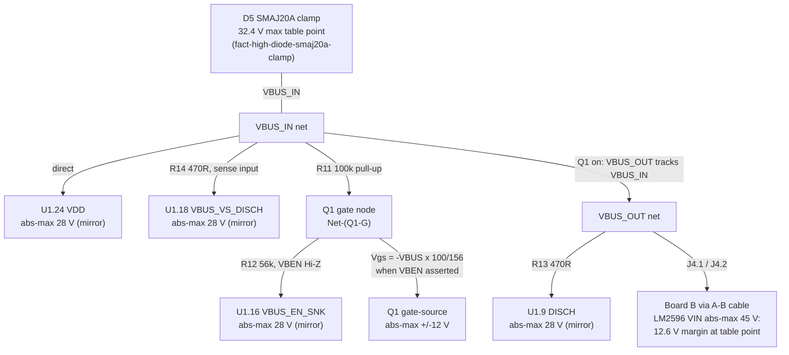
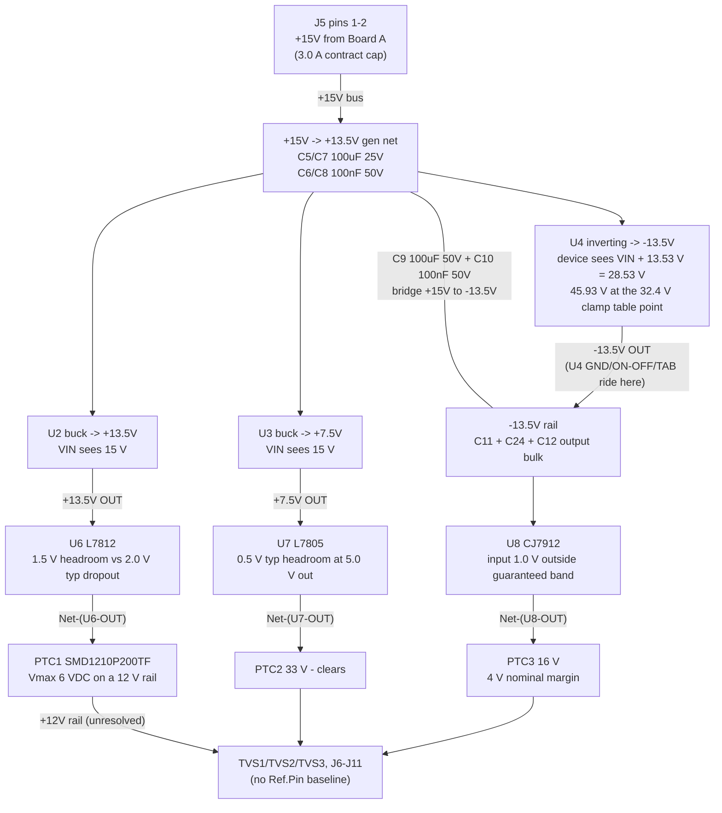

This page is the wave-5 evidence review of the two-board split (epic #86). Each board
section reviews the locked baseline connectivity against the full fact base: the 20
component bundles (`.claude/skills/component-*`), the 9 cross-component rules
(`.claude/skills/circuit-spec-integration/references/rules.json`), the board baselines
(`scripts/schgen/baselines/`), and the locked decisions in
[Board Split Decision](./board-split-decision.md) (#90).

<Note>

**Findings are leads, never verdicts** (pd-schematic-review method). Every finding cites
the fact IDs and locators behind it; a static connectivity-plus-fact-table pass cannot
measure a waveform, prove a limit, or clear a rail. No v4 board ever completed PD
negotiation, so every downstream electrical claim stays NEEDS BENCH by construction
(`rule-evidence-chain`). Locked #90 items are re-verified but not reopened here.

</Note>

## Board A

### Inputs reviewed

- `scripts/schgen/baselines/board-a.json` (netlist-derived doc-table baseline)
- `usb-pd-input.kicad_sch` in this worktree (the as-fixed sheet after the #93 edits)
- Bundles: `component-stusb4500qtr`, `component-umw-ao3401a-c347476`,
  `component-high-diode-smaj20a-c571370`, `component-usb-type-c-009-c456012`,
  `component-pesd24vs1ub-c85382`, `component-jst-b6b-xh-a`, `component-project-passives`
- Rules: `rule-q1-gate-drive-vs-contract`, `rule-tvs-clamp-vs-absmax`,
  `rule-ab-interface-current`, `rule-evidence-chain`
- Locked decisions: #90 fix list (A1–A6) and the A↔B interface contract

### Locked items re-verified — baseline, bundles, and schematic agree

Each row was checked against the baseline nets, the owner bundle's board-a facts, and
(where the property survives a text-level read) the as-fixed `usb-pd-input.kicad_sch`.
No locked item is reopened; contradictions that are conditional on a 20 V contract are
carried as leads BA-1/BA-4 for the wave-6 decision task.

| Locked item | Evidence checked | Result |
|---|---|---|
| A1 CC topology (CCDB↔CC 0R links, R17/R18 DNP) | Baseline `CC1`/`CC2`/`CC1DB`/`CC2DB` rows; `fact-stusb-cc-termination`; `fact-usb-type-c-009-cc-topology`; `int-stusb-cc-termination`; sch properties R17/R18 `dnp yes` + `in_bom no` (C23186), R19/R20 fitted 0 Ω (C21189); D4 has zero references left in the sheet | Consistent across all three sources. Wire-level rewiring of R19.2/R20.2 onto the CC nets is **not** netlist-verifiable in this pass (no `kicad-cli` on this machine) — see coverage limits |
| A3 pin-18 network (`VBUS_IN → R14 470 Ω → U1.18`, no divider) | Baseline `VBUS_VS_DISCH` row (`U1.18 R14.2 TP6.1`); `fact-stusb-pin18-path`; `fact-c23179-topology`; sch R14 Value `470ohm`/C23179; discharge current 15 V/470 Ω ≈ 32 mA and 20 V/470 Ω ≈ 43 mA, both inside the 50 mA cap (`fact-stusb-vbus-vs-disch`) | Consistent; matches the locked A3 text. Clamp-event corner carried in BA-8 |
| A2 D5 SMAJ20A on VBUS_IN | Baseline `VBUS_IN` row (`D5.1`) + `GND` row (`D5.2`); `fact-smaj20a-d5-nets` (cathode on VBUS_IN); sch D5 Value `SMAJ20A_C571370`, fitted | Present and oriented per the locked decision (cathode = pin 1 on VBUS_IN). Clamp/standoff arithmetic carried in BA-2/BA-4 |
| J4 interface contract (pins 1–2 +15V, 3 ATT, 4 PDOK, 5–6 GND) | Baseline `VBUS_OUT` (`J4.1 J4.2`), `ATT` (`U1.11 J3.6 J4.3`), `PDOK` (`U1.20 J3.7 J4.4`), `GND` (`J4.5 J4.6`); `fact-stusb-interface-flags`; `fact-jst-b6b-xh-a-locked-contract`; pin-map rows ATTACH=11, POWER_OK2=20 | Baseline conforms to the locked pinout exactly; both flags are open-drain with no on-board pull-up, per contract. J4 exists only in the baseline — the legacy sheet has J1/J2/J3 only, which matches the "no Board A KiCad project yet" state (`cov-stusb-board-a-netlist`) |
| NVM provisioning (J2 pogo, I2C pull-ups) | Baseline `SCL-pin1` (`U1.7 R15.1 J2.1`), `SDA-pin2` (`U1.8 R16.1 J2.2`), `GND` (`J2.3`); `fact-c23162-topology` (R15/R16 4.7 kΩ); `int-stusb-safe-power` | Wiring consistent; J2.4 NC per the Board A doc. The pull-up *rail choice* (VREG_2V7) is lead BA-6 |
| Decoupling set | Baseline: C1 (10 µF, C13585, 50 V) + C2 (100 nF, C1711, 50 V) on `VBUS_IN`/VDD; C30 (1 µF, C15849) on `VREG_2V7`; C34 (1 µF) on `Net-(U1-VREG_1V2)`; C35 (100 nF) on the gate node; all voltage-rating facts 50 Vdc (`fact-c13585-voltage`, `fact-c1711-voltage`, `fact-c15849-voltage`) | All present and connected; cap ratings clear the 15 V rail and the 32.4 V clamp table point. Conformance to DS12499's *required* decoupling values is not checkable — the bundle retains no such requirement fact (coverage limits). Value-label drift on C30/C34 is lead BA-9 |
| Unused-pin set | Baseline `GND` row vs pin-map: RESET(6, active-high) grounded = run; ADDR0/1(12/13) grounded = I2C 0x28; VSYS(22) grounded ("ground if unused"); EP(25) grounded. Floating: 3 (NC), 14 (POWER_OK3), 15 (GPIO), 17 (A_B_SIDE), 19 (ALERT) — all open-drain outputs, float-safe (`fact-stusb-pin-states`) | Safe as wired; no unconnected input found |

### Clamp-event stress topology

The single highest-leverage net on Board A is `VBUS_IN`: a D5 clamp event at the
32.4 V table point reaches the STUSB4500's high-voltage pins and the Q1 gate divider
through the paths below (which pins are exposed depends on the Q1/VBEN state — see
BA-2). This diagram is the net-level view behind findings BA-1/BA-2.

### Findings — leads ranked by severity

#### BA-1 — Q1 gate divider exceeds the Vgs abs-max at a 20 V contract (crossover ≈18.7 V); the factory-NVM 20 V window is unguarded in hardware (BLOCKER-class lead)

With VBEN asserted low, the R11/R12 divider sets `Vgs = -VBUS x R11/(R11+R12)` =
−VBUS × 0.641, crossing the ±12 V abs-max at VBUS ≈ 18.7 V (12 × 156/100):

- 15 V contract: **−9.62 V**, 2.38 V of margin to the ±12 V abs-max — legal.
- 20 V contract: **−12.82 V**, **0.82 V past the abs-max** — the deterministic
  BLOCKER fact.
- D5 clamp table point (32.4 V) while VBEN is asserted: **−20.77 V**, 8.77 V past
  abs-max (new arithmetic this pass — same divider, transient-class; companion to the
  already-recorded off-state VDS overage in BA-2).

Net-level analysis of when the 20 V case is reachable: VBEN asserts only on a live
contract, and a **factory-default (unprogrammed) STUSB4500 advertises PDO3 = 20 V/1 A
at highest priority** ([NVM Programming Setup](./nvm-programming.md), factory-defaults
table). Board A's build order is assemble → program NVM via J2 → use; on the first
plug-in of an unprogrammed board into a 20 V-capable charger, this divider exceeds Q1's
gate rating with **no hardware interlock** — the only guard is the procedural "use a
5 V-only charger for the programming session" instruction. The locked #90 warning
"do not touch the Q1 gate network — re-confirmed correct by #87/#89" holds **at the
15 V contract only**; this is not a reopen — the wave-6 20 V-contract decision task
owns the disposition (reprogram-before-first-attach gate, divider change, clamp, or
other mitigation).

Evidence: `fact-umw-ao3401a-vgs` (±12 V abs-max, PRIMARY-SPEC, page 1 abs-max table row
VGS), `fact-c25803-resistance` (100 kΩ) + `fact-c23206-resistance` (56 kΩ),
`fact-umw-ao3401a-gate-resistor-values` (sch instance values),
`fact-umw-ao3401a-vgs-pdo3-margin` (−0.8205 V margin, verdict "BLOCKER - deterministic
spec violation"), `rule-q1-gate-drive-vs-contract` / `calc-q1-vgs-margin-vben-low`
(reproduces −0.8205 at 20 V, +2.3846 at 15 V), `fact-high-diode-smaj20a-clamp` (32.4 V
table point), `fact-stusb-gate-network` (network topology).

#### BA-2 — a D5 clamp event reaches four distinct STUSB4500 high-voltage pins past the 28 V mirror-only abs-max (three at a time, by Q1 state), plus Q1 VDS (HIGH lead, mirror-conditioned)

`calc-tvs-d5-clamp-vs-stusb-vdd` records the 32.4 − 28 = **4.4 V overage** against VDD.
The net-level extension this pass adds: `VBUS_IN` reaches **U1.24 (VDD) directly** and
**U1.18 via R14** (high-impedance sense — no meaningful drop) in every state. The other
two exposures are state-dependent: with Q1 **off** (VBEN Hi-Z), **U1.16** floats to the
clamp voltage through R11+R12 (open-drain, no current); with Q1 **on** (VBEN actively
driven low — U1.16 itself safe), `VBUS_OUT` tracks `VBUS_IN` and reaches **U1.9 via
R13**. So each clamp event stresses three pins past the shared 28 V grouped abs-max
row, and four distinct pins are exposed across the two states. The off-state Q1 VDS overage (32.4 V vs −30 V,
2.4 V past) is `calc-tvs-d5-clamp-vs-q1-vds` and was **acknowledged as an accepted
residual in #90 A2 — but only for Q1**; the #90 residual text does not mention the
STUSB4500 28 V family at all. Downstream, the LM2596 keeps 12.6 V of margin at the
table point (`calc-tvs-d5-clamp-vs-lm2596-vin-absmax`).

Severity is capped at HIGH, not BLOCKER: the 28 V limit is **mirror-only evidence**
(see the cross-cutting caveat below), and 32.4 V is a 10/1000 µs table point at
12.3 A — not the installed surge waveform (`rule-tvs-clamp-vs-absmax`, verdict
UNSOURCED). Wave-6 input: either accept as transient-class residual with the mirror
caveat recorded, or pick a lower-clamp part during Board A layout (the #90 text itself
floats SMBJ20A as an upgrade).

Evidence: `fact-high-diode-smaj20a-clamp` (32.4 V, PRIMARY-SPEC),
`fact-stusb-vdd-absolute-max` + `fact-stusb-vbus-pin-absolute-max` (28 V, UNSOURCED
mirror), `fact-umw-ao3401a-vds` (−30 V, PRIMARY-SPEC), `calc-tvs-d5-clamp-vs-stusb-vdd`
(4.4), `calc-tvs-d5-clamp-vs-q1-vds` (2.4), baseline nets `VBUS_IN`, `VBEN`,
`Net-(Q1-G)`, `VBUS_OUT`, `Net-(U1-DISCH)`.

#### BA-3 — the Board A doc's "Electrical limits to respect" section contradicts the fact base (HIGH lead, doc defect — agent-found issue raised)

[Board A — USB-PD Core](../overview/board-a-usb-pd-core.md), reuse-guidance section,
states: "`VBUS_IN`/VDD abs-max is 22 V (DS12499)" and that D5's ≤32.4 V clamp was
chosen "specifically to sit under that ceiling with margin". Against the fact base,
both halves fail:

- 22 V is the top of VDD's **operating** range (`fact-stusb-supplies`, Table 21) and
  the **CC-pin** abs-max (`fact-stusb-cc-absolute-max`, Table 20); the VDD abs-max row
  is **28 V** (`fact-stusb-vdd-absolute-max`).
- 32.4 is greater than 28 is greater than 22 — the clamp table point sits **above**
  every one of those ceilings, not under any of them (`calc-tvs-d5-clamp-vs-stusb-vdd`).

The same section's reuse guidance says a reuse project may reprogram the NVM up to
20 V "as long as D5's 20 V standoff and Q1's ratings … still cover the new target
voltage", while listing only Q1's VDS/current rating — at 20 V the gate divider already
exceeds Q1's Vgs abs-max (BA-1) and D5's standoff margin is zero (BA-4), so the
guidance points a reuse reader at exactly the unsafe corner. This is a wave-3 doc
(#91), not a locked #90 decision, so it is a fixable doc defect, raised as agent-found
issue #130 rather than folded into the locked fix list.

Evidence: `fact-stusb-supplies`, `fact-stusb-cc-absolute-max`,
`fact-stusb-vdd-absolute-max`, `calc-tvs-d5-clamp-vs-stusb-vdd`,
`fact-umw-ao3401a-vgs-pdo3-margin`, `calc-tvs-d5-standoff-vs-pdo`; locator:
`doc/src/content/docs/overview/board-a-usb-pd-core.md`, "Electrical limits to respect"
and "NVM reconfiguration for other voltages" blocks.

#### BA-4 — D5 standoff has zero margin at a 20 V contract; minimum breakdown is only 2.2 V above it (MEDIUM lead)

`calc-tvs-d5-standoff-vs-pdo`: 5 V of standoff margin at the 15 V contract, **0 V at
20 V**. At exactly 20 V the part sits at its VRWM edge — leakage is specified at
precisely that voltage (5 µA, `fact-high-diode-smaj20a-leakage`) and any source
overshoot walks into the 22.2–24.5 V breakdown band
(`fact-high-diode-smaj20a-breakdown`). The #90 A2 justification "stays non-conducting
through the 20 V mis-contract edge case" is true only at exactly 20.0 V with zero
tolerance for overshoot — #90 itself flagged a 15 V-standoff part at 0% margin as "the
exact mistake #89 flagged for TVS2/SD05", and a 20 V contract reproduces that same 0%
condition one step up. Not a reopen (the fitted rail is 15 V by locked contract, where
the 33% margin claim holds); this is a numeric input to the wave-6 20 V-contract
decision alongside BA-1.

Evidence: `fact-high-diode-smaj20a-standoff` (20 V VRWM, PRIMARY-SPEC),
`fact-high-diode-smaj20a-breakdown`, `fact-high-diode-smaj20a-leakage`,
`calc-tvs-d5-standoff-vs-pdo` (0 V margin at vbus_v 20).

#### BA-5 — USB-C receptacle: 15 V contract is 3× the mirror's 5 V rating, 3 A is its zero-margin current cap, and the part identity is unsourced (MEDIUM lead, NEEDS BENCH)

The only voltage evidence for J1 (LCSC C456012) is a mirror approval spec's RATING row
of **5 V / 3 A** (`fact-usb-type-c-009-rating-voltage`,
`fact-usb-type-c-009-rating-current`, both UNSOURCED). The negotiated contract applies
15 V at up to 3 A: three times the voltage row, and exactly the current row with zero
margin (`fact-usb-type-c-009-pd-contract-stress`, NEEDS BENCH). The AC 100 V dielectric
test row suggests insulation headroom but is a test stress, not a working-voltage
rating (`fact-usb-type-c-009-dielectric`). Identity itself is degraded: the project MPN
label `USB-TYPE-C-009` matches no manufacturer or distributor document — the LCSC
catalog model is `TYPE-C 6P` — so the confirmed-distributor-identity lane is closed
(`fact-usb-type-c-009-distributor-binding`). The same 3 A cap is shared by the
A↔B interface's arithmetic (`rule-ab-interface-current`: 1.6× derated margin on J4's
paired contacts, but the receptacle itself carries 3 A at 1.0×). Bench engineering
acceptance at 15 V on the dead v4 boards is the stated gate.

Evidence: fact IDs above plus `rule-ab-interface-current` /
`calc-ab-derated-margin-ratio` (1.6) and `fact-jst-b6b-xh-a-current-derating-math`.

#### BA-6 — VREG_2V7 carries an external DC load DS12499 does not authorize (MEDIUM lead, NEEDS BENCH)

Pin 23 is documented as 2.7 V regulator **decoupling only**, yet the baseline hangs
R15/R16 (4.7 kΩ I2C pull-ups) and debug pad J3.3 on it (`fact-stusb-vreg2v7-load`,
`cov-stusb-vreg2v7-load`). Each asserted-low I2C line sinks ≈0.57 mA (2.7 V/4.7 kΩ)
from the internal regulator — ≈1.15 mA with both lines low, sustained during NVM
programming traffic. Open companions: whether the NVM jig (NUCLEO-F072RB, 3.3 V logic)
is happy with a 2.7 V pull-up rail (its VIH is ≈2.3 V — thin margin), and the SCL/SDA
pin abs-max, which the bundle does not retain at all. Wave-6/bench item: either confirm
the load empirically on a dead v4 board (the identical network is fitted there) or move
the pull-ups to a rail ST's reference designs use.

Evidence: `fact-stusb-vreg2v7-load` (NEEDS BENCH), `int-stusb-netlist` (UNSOURCED),
`fact-c23162-topology`/`fact-c23162-resistance`, baseline `VREG_2V7`/`SCL-pin1`/
`SDA-pin2` rows.

#### BA-7 — a fitted D6/D7 (PESD24VS1UB) clamps only above the CC pins' 22 V abs-max (LOW/MEDIUM lead, scope clarification)

The DNP CC-ESD provision's numbers: VRWM 24 V (`fact-pesd24vs1ub-standoff`), breakdown
26.5–27.5 V (`fact-pesd24vs1ub-breakdown`), clamp 36 V at 1 A / 70 V at 3 A
(`fact-pesd24vs1ub-clamp-1a`, `fact-pesd24vs1ub-clamp-3a`) — every conduction threshold
sits above the STUSB4500 CC-pin abs-max of 22 V (`fact-stusb-cc-absolute-max`,
mirror-only). This is *deliberate* per #90 A2 (the part must never become the weakest
link during a CC-short-to-VBUS fault) and is not a reopen — but the flip side deserves
recording: when fitted, D6/D7 provide **fast-ESD energy diversion only**; they cannot
hold any sustained overvoltage below the pin rating, and during a rated 8/20 µs surge
the CC pin still sees up to the 36 V clamp. CC-line protection therefore rests entirely
on U1's integrated structures in every DC/quasi-DC scenario, exactly as the fitted
(no-D6/D7) build does.

Evidence: fact IDs above plus `fact-pesd24vs1ub-dnp-provision` (DNP state, NEEDS
BENCH).

#### BA-8 — R13/R14 discharge-pulse dissipation is unspecified for the fitted 0.1 W parts (LOW lead, NEEDS BENCH)

Both 470 Ω resistors are 0603, 0.1 W rated (`fact-c23179-power`). During active
discharge with the rail still up, instantaneous dissipation is V²/470: **0.48 W at
15 V, 0.85 W at 20 V** — 4.8× to 8.5× the continuous rating. Discharge windows are
bounded (0x25 defaults: 800 ms to 0 V, 270 ms transition — `fact-stusb-discharge-registers`)
and the cap-bleed case is energy-trivial, but the resistor spec retains **no
installed-waveform pulse rating** — only the 5 s short-time-overload test
(`fact-c23179-pulse-caveat`, NEEDS BENCH). Current stays inside the pin's 50 mA cap at
both contract voltages (32 mA / 43 mA, `fact-stusb-vbus-vs-disch`); a discharge
coinciding with a clamp event would reach 69 mA (32.4 V/470 Ω), above the cap —
transient-class corner only. Bench scope note for the repeated attach/detach test.

Evidence: `fact-c23179-power`, `fact-c23179-resistance`, `fact-c23179-pulse-caveat`,
`fact-stusb-vbus-vs-disch`, `fact-stusb-discharge-registers`, baseline
`VBUS_VS_DISCH`/`Net-(U1-DISCH)` rows.

#### BA-9 — C30/C34 Value fields read "1uF 16V" but C15849 is a 50 V part (LOW lead, label drift)

The worktree `usb-pd-input.kicad_sch` carries `Value "1uF 16V"` on both C30 and C34
(LCSC C15849 = Samsung CL10A105KB8NNNC), while the primary-sourced rating is **50 Vdc**
(`fact-c15849-voltage`). Same class as the locked C4/C22/C23 value-label fix (#90 A5,
"prevents a future reviewer trusting the wrong label"), in the conservative direction
this time (label understates), electrically irrelevant on the 2.7 V/1.2 V nodes.
Netlist-neutral candidate for the same treatment at the next KiCad edit window — not
added to the locked #93 list by this review. The Board A doc's component table repeats
the 16 V label.

Evidence: `fact-c15849-voltage` (PRIMARY-SPEC); locator: `usb-pd-input.kicad_sch`
symbol property rows C30/C34; `doc/src/content/docs/overview/board-a-usb-pd-core.md`
component table.

#### BA-10 — the Board A doc still claims the fix list was never written back to KiCad (LOW lead, staleness — folded into agent-found issue #130)

[Board A — USB-PD Core](../overview/board-a-usb-pd-core.md) (net-table preamble) says
the #90 deltas were "applied on paper … none of this was written back into the KiCad
file". The as-fixed sheet in this worktree now carries them: D4 deleted (zero
references), D5 fitted as `SMAJ20A_C571370`/C571370, R17/R18 DNP + excluded from BOM,
R19/R20 fitted 0 Ω. The sentence predates #93 landing and now misleads a reader about
which artifact is authoritative.

Evidence: property-level reads of `usb-pd-input.kicad_sch` (this pass); locator:
`doc/src/content/docs/overview/board-a-usb-pd-core.md`, "Net-connectivity table (fixed
circuit)" intro paragraph.

### Cross-cutting caveat — every STUSB4500 limit above is mirror-only

Direct manufacturer-primary retrieval of DS12499 and UM2650 from st.com failed on both
attempt dates (2026-08-02, 2026-08-14); the retained bytes are reproducible mirrors
(`fact-stusb-ds12499-primary-attempt`, `fact-stusb-um2650-primary-attempt`, both
UNSOURCED). Every 28 V / 22 V abs-max and 4.1–22 V operating claim in BA-1 through BA-7
inherits that status: the arithmetic is deterministic, but the limits it compares
against are not primary-confirmed. This is why no finding above escalates past
BLOCKER-class *lead*.

### What this pass can and cannot catch

**Can catch (and did):** baseline-vs-bundle-vs-doc connectivity disagreements;
deterministic arithmetic on retained fact values (divider ratios, margins, overages);
locked-decision conformance of the baseline (J4 pinout, CC topology, pin-18 path);
property-level schematic state (DNP flags, BOM exclusion, Value/LCSC fields, symbol
presence/absence); doc text contradicting retained facts; unconnected-pin safety from
pin-function tables.

**Cannot catch:**

- **Wire-level netlist truth of the as-fixed sheet.** No `kicad-cli` exists on this
  machine, so the R19/R20 rewiring, D5 pin-to-net orientation, and every other
  geometry-borne connection in `usb-pd-input.kicad_sch` were verified only at the
  property level plus the (older, 2026-07-05) netlist-derived doc tables. A fresh
  netlist export diffed against `board-a.json` (`scripts/schgen/check_baseline.py`)
  remains open.
- **Anything bench-stage.** No rail has ever been energized from a negotiated contract
  (`rule-evidence-chain`: PCB orientation, BOM/CPL, as-built, programmed, and bench
  stages all OPEN). Waveforms — gate soft-start, clamp events, discharge pulses,
  inrush — are all unmeasured.
- **Mirror-limit truth.** BA-1/BA-2/BA-7's comparison ceilings are mirror-only; a
  primary DS12499 retrieval could move them.
- **Facts the bundles do not retain:** STUSB4500 SCL/SDA pin abs-max; DS12499's
  required decoupling values; the USB-PD CC-line capacitance budget (relevant to the
  J3.1/J3.2 debug stubs and a fitted D6/D7's 50 pF); NVM write endurance
  (`fact-stusb-endurance`); receptacle CC-pad continuity (a ranked v4 root-cause
  candidate, bench-gated).
- **Layout-phase items:** pogo-pad adjacency risk (J3.4 carries raw VBUS one pad away
  from the 2.7 V VREG_2V7 pad J3.3 — a probe slip is an unfused 15 V-into-2.7 V
  event), footprint geometry, thermal copper. Board A has no layout yet.

## Board B

### Inputs reviewed

- `scripts/schgen/baselines/board-b.json` (netlist-derived doc-table baseline; its
  output-stage nets are deliberately `unresolved` — see coverage limits)
- `dc-dc-conversion.kicad_sch`, `linear-regulation.kicad_sch`, `output.kicad_sch` in
  this worktree (as-fixed after the #93 edits, commit `1e053e1`)
- Bundles: `component-lm2596s-adj-c347423`, `component-l7812cd2t-c13456`,
  `component-l7805abd2t-c86206`, `component-cj7912-c94173`,
  `component-ptc-smd1210p200tf-c20808`, `component-ptc-msmd110-33v-c70119`,
  `component-ptc-bsmd1206-150-16v-c883133`, `component-sd05-c502527`,
  `component-smaj15a-c571368`, `component-ss34-c8678`,
  `component-cya1265-100uh-c19268674`, `component-project-passives`,
  `component-faston-c591344`, `component-hdr-2541wr-2x08p-c5383092`,
  `component-jst-b6b-xh-a`
- Rules: `rule-rail-envelope`, `rule-u4-inverting-stress`, `rule-ldo-dropout-chain`,
  `rule-pptc-vmax-vs-rail`, `rule-tvs-clamp-vs-absmax`,
  `rule-inverting-startup-vs-pd-source`, `rule-ab-interface-current`,
  `rule-evidence-chain`
- Locked decisions: #90 A5/A6 (Board B dispositions and #93 rows 6–8) and the A↔B
  interface contract

### Locked items re-verified — baseline, bundles, schematic, and fix-commit agree

| Locked item | Evidence checked | Result |
|---|---|---|
| DC-DC feedback dividers (13.53 / 7.503 / −13.53 V setpoints) | Sch values R1 `10k`/R2 `1k`, R3 `5.1k`/R4 `1k`, R5 `10k`/R6 `1k` (property reads, all matching `fact-lm2596-u2-r1` … `fact-lm2596-u4-r6`); `Vout = 1.23 × (1 + Rtop/Rbottom)` reproduces 13.53 / 7.503 / 13.53-magnitude (`fact-lm2596-u2-vout-setpoint`, `fact-lm2596-u3-vout-setpoint`, `fact-lm2596-u4-vout-setpoint-magnitude`); setpoint-vs-target errors +0.03 / +0.003 / −0.03 V (`calc-rail-u2/u3/u4-setpoint-error`); feedforward caps C31/C32/C33 22 nF placed across each high-side divider leg (`fact-c1729-topology`, baseline FB rows) | Consistent everywhere; all three magnitudes inside the 1.2–37 V ADJ range (`fact-lm2596-vout-adjust-range`). Rail truth stays NEEDS BENCH per `rule-rail-envelope` — tolerance-stack corners feed BB-5 |
| U4 inverting referencing (LOCKED — verify only) | Baseline `-13.5V OUT` row (`U4.3 U4.5 U4.6 D3.2 C9.2 C10.2 C11.2 R6.2 …`), `GND` row (`L3.2`), `Net-(D3-K)` (`U4.2 D3.1 L3.1`); `fact-lm2596-u4-inverting-nets`; ON/OFF at 0 V relative to the device GND pin = ON (`fact-lm2596-onoff-thresholds`, `fact-lm2596-onoff-inverting-note`); catch-diode sense D3.1 = K on the switch node, D3.2 = A on the negative output — the manufacturer-documented inverting arrangement (`fact-lm2596-inverting-topology-support`) | Verified, not reopened. Inductor-to-system-GND / diode-to-output arrangement is the mirror of U2/U3, exactly as the sheet doc states |
| #93 row 6 — `Net-(C16-Pad2)` → GND merge | Commit `1e053e1` message + diff (adds GND power symbol `#PWR054` to `linear-regulation.kicad_sch`); baseline `GND` row carries `C16.2 C24.1 C19.2 C25.1`; board-b-synth-power.md "Negative-rail decoupling" note | Applied at commit-diff + property level. Wire-level attach of all four plates is netlist-borne — open (no `kicad-cli`, see coverage limits) |
| #93 row 7 — C9 swap to 100 µF 50 V | Sch C9 Value `100uF 50V`, `LCSC Part` C970687, Datasheet `lcsc.com/datasheet/C970687.pdf`, Footprint `CAP-SMD_BD8.0-L8.3-W8.3-LS9.0-FD` (the 8×10.2 can) | Applied in full. The placed lib_id string still reads `RVT1E101M0607_C22383804` (the replaced 25 V part's name) — cosmetic drift, folded into BB-14 |
| #93 row 8 — C4/C22/C23 Value fix | All three read `470uF 10V` (property reads) | Applied. The deeper LCSC-field/drawn-symbol identity tangle is recorded by the bundle (`fact-c22383803-canonical-choice`) — BB-14 |
| J5 A↔B interface contract | Pinout tables in board-split-decision.md, board-a-usb-pd-core.md, and board-b-synth-power.md are byte-identical (md5-verified this pass); J5 absent from every sheet, matching the "connector does not exist in the netlist yet" doc state; 1.6× derated margin arithmetic reproduced by `calc-ab-derated-margin-ratio` | Conformant. Margin stays NEEDS BENCH (`rule-ab-interface-current`: harness unbuilt, derating assumed) |
| Output stage — Faston assignment + J10/J11 GND moat | Doc tables only: J6=−12V, J7=+12V, J8=+5V, J9=GND (`fact-faston-rail-assignment`); J10/J11 pins 9–14 six-pin GND moat, −12V on 15–16 far from signals (`fact-hdr-pin-pair-assignment`, `fact-hdr-gnd-moat-interactions`, `fact-hdr-misalignment-safety-note`) | Structure conforms to the Doepfer convention at doc level. **Not baselined**: every output-stage net is in `board-b.json`'s `unresolved` list, so no Ref.Pin verification exists — carried as a standing gap (coverage limits), with header key orientation NEEDS BENCH (`fact-hdr-keying-not-netlist-verifiable`) |
| Electrolytic polarity on the resolved nets | Baseline pin sides: C21.1/C25.2 on the ±12 V outputs, C21.2/C25.1 on GND; C24.2 on `-13.5V OUT`, C24.1 on GND; C11.2 on `-13.5V OUT`; C12.2 on `-13.5V OUT`, C12.1 on GND (decision `neg-rail-cap-bank`, mirrors C24) | Positive-plate-to-higher-potential convention holds on every resolved electrolytic, including the negative-rail mirror pattern |

### The two highest-leverage nets — +15 V input bus and the −13.5 V loop

Board B's stress concentrates on the shared +15 V input bus (three converters, the
C9/C10 bridge, and the only path a Board A clamp event can take into Board B) and on
the −13.5 V loop, where U4's bootstrapped ground makes every voltage additive. This
diagram is the net-level view behind BB-3/BB-5/BB-6/BB-7.

### Findings — leads ranked by severity

#### BB-1 — PTC1's 6 VDC maximum voltage sits on the +12 V rail: −6 V margin under normal operation, replacement required before any rail power-on (BLOCKER-class lead)

The fitted RUILON `SMD1210P200TF` (LCSC C20808) is rated **Vmax 6 VDC** — the
unsuffixed family member — while it protects the +12 V output. A tripped PPTC absorbs
its full rail voltage, so every trip applies twice its rating; the datasheet's own
cautions name arcing/flame as the exceed-Vmax failure mode. This is deterministic and
primary-sourced on both sides (`fact-ptc1-vmax`, PRIMARY-SPEC, RUILON SMD1210 spec
table + LCSC listing text; `fact-ptc1-vmax-margin` = −6 V, "BLOCKER - deterministic
spec violation"; `calc-pptc1-vmax-margin` reproduces −6). The rule's refusal is
explicit: *replace PTC1 with a part rated at or above the +12 V rail before any rail
power-on* (`rule-pptc-vmax-vs-rail`). The passthrough corner is worse than nominal: a
tripped PTC1 with U6 out of regulation can see up to ≈13.5 V.

Replacement leads already in evidence: the same RUILON datasheet lists 16 V-suffixed
siblings of adjacent current ratings (`SMD1210P150TF/16`, `SMD1210P110TF/16` — bundle
SKILL.md, suffixed-variants note), and the legacy `components/ptc-12v.md` page (since
deleted; the content now lives in `overview/board-b-synth-power.md`'s Protection Stage
table) *already documented* the P150TF/16 (see BB-10). Trade-off to carry into wave-6: P150TF/16's 1.5 A hold leaves
0.3 A of margin over the 1.2 A rail rating (vs the P200TF's 0.8 A,
`fact-ptc1-ihold-margin`) and its 85 °C derated hold will sit proportionally lower
(the P200TF's own 85 °C figure is 0.98 A, `fact-ptc1-hold-85c` — already below the
1.2 A rail rating; see BB-8). Wave-6 owns the part pick; this pass records that **no
currently-fitted-part disposition exists** — #90's protection-stage text predates the
Vmax confirmation and the board-b doc still calls it an open data gap.

Evidence: `fact-ptc1-vmax`, `fact-ptc1-vmax-margin`, `fact-ptc1-ihold`,
`fact-ptc1-ihold-margin`, `fact-ptc1-hold-85c`, `calc-pptc1-vmax-margin`,
`rule-pptc-vmax-vs-rail` (refusal text); sch property read PTC1 =
`SMD1210P200TF`/C20808, fitted; locator: bundle SKILL.md suffixed-sibling paragraph.

#### BB-2 — TVS2 SD05 stands off exactly 5 V on a rail whose guaranteed band tops at 5.2 V: zero margin at nominal, −0.2 V inside normal regulation (BLOCKER-class lead, locked deferral re-verified)

`fact-sd05-standoff` (5 V, PRIMARY-SPEC) against the L7805's guaranteed output band
(min 4.8 / max 5.2 V, `fact-l7805abd2t-vout-band`): margin is 0 V at 5.0 V and
**−0.2 V at the 5.2 V band top** (`calc-tvs-sd05-standoff-vs-plus5`,
`fact-sd05-plus5-margin` = 0, BLOCKER verdict) — the TVS can conduct inside normal
regulation, with breakdown starting at 6 V min (`fact-sd05-breakdown`). The #90
deferral ("replace with a ≥6 V-standoff part in the Board B design phase") is
re-verified, not reopened: TVS2 is still fitted in the legacy sheet (property read,
`dnp no`), which is consistent with the deferral scope. Three dated replacement
candidates are already primary-sourced in the bundle (all retrieved 2026-08-14):

| Candidate | LCSC | Standoff | Breakdown min | Margin at 5 V | Leakage at VRWM | Stock |
|---|---|---|---|---|---|---|
| MDD SMF6.0A | C123790 | 6 V | 6.67 V | 1.0 V | 400 µA | 148,360 |
| Brightking SMAJ6.5A | C87267 | 6.5 V | 7.22 V | 1.5 V | 500 µA | 8,450 |
| FOSAN SMAJ6.0A | C5353156 | 6 V | 6.67 V | 1.0 V | 800 µA | 6,400 |

All three clear the 5.2 V band top with their breakdown minimum. Note for the wave-6
pick: every candidate leaks 40–80× more than the SD05's 10 µA (`fact-sd05-leakage`) —
a real but budgetable trade on a 500 mA rail.

Evidence: fact IDs above plus `fact-cand-smf6-0a-*`, `fact-cand-smaj6-5a-*`,
`fact-cand-smaj6-0a-*` (standoff/breakdown/clamp/leakage/stock rows),
`rule-tvs-clamp-vs-absmax` (SD05 clause in conditions + refusal).

#### BB-3 — a Board A clamp event puts U4's effective input 0.93 V past its 45 V absolute maximum; the #90 A2 justification "clamp stays inside the LM2596S abs-max (40 V)" does not hold for U4 and mislabels the 40 V operating maximum (HIGH lead, table-point-conditioned)

U4's bootstrapped ground makes its device-seen input `VBUS + |VOUT|`
(`fact-lm2596-u4-effective-input-setpoint` = 28.53 V nominal). Across the VBUS
envelope (`calc-u4-effective-input-envelope` / `calc-u4-absmax-margin-envelope`):
28.53 V at the 15 V contract (16.47 V of margin), 33.53 V at a 20 V mis-contract
(11.47 V), and **45.93 V at the D5 SMAJ20A 32.4 V clamp table point — −0.93 V past
the 45 V absolute maximum** (`fact-lm2596-vin-absmax`, PRIMARY-SPEC;
`fact-high-diode-smaj20a-clamp`, PRIMARY-SPEC). Both compared values are
primary-sourced; what keeps this a lead rather than a verdict is the waveform: 32.4 V
is a 10/1000 µs table point, not the installed surge (`rule-u4-inverting-stress`,
NEEDS BENCH).

The #90 A2 text justifies the SMAJ20A with "the ≤32.4 V clamp stays inside the
LM2596S abs-max (40 V)". Two defects, neither a reopen: (a) 40 V is the *operating*
maximum (`fact-lm2596-vin-operating-max`); the absolute maximum is 45 V; (b) the
comparison is correct for U2/U3 (VIN-to-GND sees 32.4 V directly, 12.6 V under 45 V,
`calc-tvs-d5-clamp-vs-lm2596-vin-absmax`) but wrong in kind for U4, whose stress adds
the output magnitude. This mirrors BA-2's finding shape (the #90 residual text audits
one victim and misses another). C9/C10 (50 V, `fact-c970687-voltage`,
`fact-c1711-voltage`) keep 4.07 V of margin at the same table point — thin but
positive. Wave-6 input alongside BA-2's clamp-part options: a lower-clamp Board A part
(SMBJ20A is already floated in #90) shrinks this overage at its source.

Evidence: fact and calc IDs above; `fact-lm2596-u4-absmax-margin` (nominal 16.5 V),
`rule-u4-inverting-stress` (conditions + refusal), #90 A2 justification text
(board-split-decision.md, "Why a 20 V standoff" bullet).

#### BB-4 — U4's inverting startup can demand ~4.5 A for ≥2 ms against a source capped at 3.0 A, and the datasheet's own mitigations are not designed in (HIGH lead)

The LM2596 datasheet documents that inverting startup can draw input current up to
the device current limit (typ 4.5 A, guaranteed up to 6.9 A at 25 °C,
`fact-lm2596-current-limit`) for 2 ms or more, warns that **current-limited sources
may not start correctly**, and recommends a delayed-startup circuit and enlarged CIN
(`fact-lm2596-inverting-startup-current`, PRIMARY-SPEC). The project's source is
capped at exactly the kind of limit the warning names: 3.0 A PD contract, shared by
the receptacle and the A↔B interface (`fact-usb-type-c-009-rating-current`,
`rule-inverting-startup-vs-pd-source`, `calc-inverting-startup-overdraw` = 1.5 A
over). Neither mitigation exists in the sheets: U4's ON/OFF is hard-bootstrapped to
its output rail (always-on, no delayed-enable node — baseline `-13.5V OUT` row), and
the input bulk is C5‖C7 = 200 µF nominal with no sizing evidence against this event.
Whether a real adapter folds back, hard-resets the contract, or rides through is
source-dependent and unmeasured — no v4 board ever reached a live contract, so this
failure mode has never been exercised. The testable prediction for the bench plan: a
Board B that runs from a bench supply but fails or resets on a compliant 3 A PD
source, worst with load attached, is this mechanism until proven otherwise. Note the
closest historical record is v1's generic inrush scope note; no project doc records
an observed instance, so this stays a forward-looking lead, not a diagnosis.

Evidence: fact/calc IDs above; `rule-inverting-startup-vs-pd-source` (refusal);
baseline rows `+15V -> +13.5V gen` (C5.1/C7.1), `-13.5V OUT` (U4.5);
`fact-c22383804-capacitance`.

#### BB-5 — the LDO dropout chain fails typical-value arithmetic at one node, has zero guaranteed margin at a second, and operates outside the guaranteed input band at the third; tolerance stacking makes all three worse (HIGH lead, NEEDS BENCH ×3 — locked deferral re-verified, math presented)

Per `rule-ldo-dropout-chain` (all three depend on unverified upstream setpoints):

- **U6 L7812 (+13.5 → +12 at 1.2 A):** headroom 1.5 V minus the 2.0 V typical 1 A
  dropout = **−0.5 V** (`calc-ldo-7812-typ-dropout-deficit`), and DS0422 specifies
  *no dropout at all* at the 1.2 A project load (`fact-l7812cd2t-dropout-1a2`).
  Tolerance stack this pass adds: the LM2596's ±4 % line/load tolerance
  (`fact-lm2596-output-tolerance`) puts the rail as low as 12.99 V, and the guaranteed
  VFB minimum alone (1.193 V, `fact-lm2596-fb-vref-min`) gives 13.12 V — deficits of
  −1.0 to −0.9 V against typical dropout. The 1.2 A setpoint decision stays **NEEDS
  BENCH per the locked A5#1 deferral** — this is arithmetic input to that bench gate,
  not a reopen.
- **U7 L7805 (+7.5 → +5 at 0.5 A):** 0.5 V of headroom above the 2.0 V typical 1 A
  dropout at the 5.0 V nominal output, shrinking to **0.3 V at the 5.2 V guaranteed
  band top**, with no dropout maximum and no 0.5 A dropout row in DS0422
  (`calc-ldo-7805-typ-dropout-headroom`, `fact-l7805abd2t-dropout-05a`) — zero
  *guaranteed* input margin at 7.5 V. The plausible-but-unprovable half-current
  benefit is exactly what the rule refuses to promote.
- **U8 CJ7912 (−13.5 → −12 at 0.8 A):** the −13.5 V input sits **1.0 V outside** the
  −14.5 to −27 V guaranteed operation band (`calc-ldo-cj7912-guarantee-shortfall`,
  `fact-cj7912-vi-guarantee-band`); the 1.1 V typical dropout
  (`fact-cj7912-dropout-typ`) is the only evidence it regulates at all, and the same
  ±4 % stack (U4 rail at −12.99 V) eats even that typical margin (12 + 1.1 = 13.1 &gt;
  12.99). Thermals compound it: 1.2 W at full load (`fact-cj7912-pd-full-load-mw`)
  across R-th-JA 100 °C/W (`fact-cj7912-rthja`) is a **120 °C rise — Tj ≈ 145 °C
  free-air at a 25 °C ambient, past the 125 °C operating top**
  (`fact-cj7912-tj-rise-full-load`, `fact-cj7912-tj-operating-range`). Board B's
  layout must budget copper relief, and that copper carries the −13.5 V net: the
  TO-252 tab is the IN terminal (`fact-cj7912-pinout`, tab = pin 2 = IN; U8.2 on
  `-13.5V OUT` in the baseline). Stability of the project cap network is also
  unprovable from the Rev 2.0 datasheet (`fact-cj7912-stability-project-network`,
  `fact-cj7912-esr-window-not-specified`).

Evidence: fact/calc IDs above; `rule-ldo-dropout-chain` (conditions + refusal);
board-b-synth-power.md LDO table (whose "OK" verdicts for U7/U8 are typical-value
claims this arithmetic conditions).

#### BB-6 — C5/C7 (25 V) on the +15 V bus: 10 V of margin at contract, 5 V at the 20 V edge, exceeded by 7.4 V at the clamp table point — and no ripple rating is retained for the bus they filter (MEDIUM lead)

The two 100 µF input electrolytics (ACMECON, 25 V — `fact-c22383804-voltage`,
`fact-c22383804-topology`) hold 10 V of margin at the 15 V contract
(`fact-c22383804-rail-margin`) and 5 V at the 20 V mis-contract edge (#89 lead 6c,
"lead-to-verify, no fix scheduled" — re-verified, still open). At the D5 32.4 V clamp
table point that reaches Board B through the on-state Q1 path
(`calc-tvs-d5-clamp-vs-lm2596-vin-absmax` conditions), the applied stress exceeds the
rating by 7.4 V — transient-class, cap surge behavior unspecified. Their ripple duty
is also unevidenced: the bus feeds two discontinuous-input-current bucks plus the
inverting converter's switch-current pulses, and the bundle retains **no ripple-current
fact at any frequency** for this part. Wave-6/layout option: the 35 V FOLLON 470 µF
(C22387780) already used at five positions is a same-family upgrade path.

Evidence: fact IDs above; sch property reads C5/C7 (`100uF`, C22383804);
`rule-tvs-clamp-vs-absmax` (clamp-path conditions).

#### BB-7 — the −13.5 V output capacitors carry ≈0.81 A RMS of discontinuous 150 kHz ripple; the exceedance found on the as-built two-can bank is resolved by a third parallel can (MEDIUM lead, NEEDS BENCH ×5)

In an inverting buck-boost the output capacitors see the full catch-diode current
minus the DC load — discontinuous, unlike U2/U3's LC-smoothed outputs (0.09 / 0.25 A
p-p triangle, `fact-cya1265-ripple-13v5` / `fact-cya1265-ripple-7v5`). Conditioned
arithmetic (ideal CCM steady state, nominal setpoints), crediting both the SS34
catch-diode drop (`fact-ss34-vf`) and the LM2596's own switch saturation voltage
(`fact-lm2596-vsat`, 1.16 V typ):

D = (13.53 + 0.55) ÷ (15 − 1.16 + 13.53 + 0.55) ≈ **0.504**, giving output-cap RMS
ripple ≈ Iout × sqrt(D/(1−D)) ≈ **0.807 A at the 0.8 A rated load**. The 0.8 A figure is
the published −12 V rail contract, deliberately retained rather than shaved to a
smaller "expected" draw — see decision `neg-rail-cap-bank` in
`scripts/schgen/decisions.json`.

<Warning title="Updated by issue #150 — the ≈1.0 A rating the original review relied on was wrong">

The C11 figure the original arithmetic used (≈1.0 A at 120 Hz, from a partial PDF extraction) was **wrong by
~4×**. Reading the hash-locked HRK datasheet directly gives 240 mA rms at 120 Hz/105 °C,
with a published frequency multiplier of ×1.30 at 10 kHz and above — so the real rating
at the LM2596's 150 kHz is **312 mA** (`fact-c2983319-ripple-hf-derate`). The recorded
ESR was wrong too: ~0.035 Ω against a tan-δ-implied **~0.51 Ω**
(`fact-c2983319-esr-120hz`), ~14× out. Both errors ran in the non-conservative direction.

</Warning>

With the FOLLON line's own ESR/ripple facts added (issue #155), the as-built two-can
bank (C11‖C24) turned out to be at or over rating: dividing the then-current ≈0.77 A
(the earlier Vsat-free basis — these two as-built figures are left on it) by the two
parts' 1/ESR gave **C11 ≈362 mA against its 312 mA rating (≈1.16× over)** and **C24
≈408 mA against its 403 mA rating (≈1.01×, at the limit)**
(`fact-c22387780-installed-ripple-exceedance`). C9's 146 mA rating is a separate,
120 Hz line-frequency figure (`fact-c970687-ripple`) and is not part of this split.

Ripple-identity coverage across the board's five electrolytic groups — C3/C11, C9,
C4/C22/C23, C5/C7, and C14/C20/C21/C24/C25 — is still partial, which is what the
heading's NEEDS BENCH ×5 counts: the C2983319 and C22387780 lines now carry real
150 kHz-derated ratings (issues #150/#155), but **C335982 (C4/C22/C23) retains no
ripple fact at all, and C970687 (C9)'s 146 mA is a 120 Hz line-frequency figure**
(`fact-c970687-ripple`) with no switching-frequency bound — those gaps remain open.

<Tip title="Resolved by decision neg-rail-cap-bank — a third can added in parallel">

The −13.5 V output bank is now **C11 ‖ C24 ‖ C12** (C12 = a second FOLLON C22387780,
470 µF/35 V, added in parallel on the rail; C11 is unchanged on its Φ8 land — see
`fact-c2983319-case-size` and issue #150). The same 1/ESR split, now over three cans
and on the Vsat-inclusive 0.807 A basis, puts **C11 at 248.28 mA = 79.6 % of its
312 mA rating** and **C24 = C12 at 279.31 mA = 69.3 % of their 403 mA rating**
(`fact-c2983319-c11-ripple-share-3can`, `fact-c22387780-can-ripple-share-3can`) — both
inside the 85 % sizing bar. Output bulk on the rail rises 940 µF → 1410 µF.

The bench caveat carried with the original split is unchanged and still applies: the
split uses 120 Hz max-ESR because neither datasheet publishes ESR at 150 kHz.
Aluminium-electrolytic ESR falls and flattens with frequency, so the absolute Ω values
are pessimistic while the ratio between two same-technology, similar-size cans is the
trustworthy part. This is a resize against retained ratings, not a bench measurement —
the installed ripple at C11/C24/C12 is still **NEEDS BENCH** (issue #155).

</Tip>

<Note title="Issue #171 resolved — the model now credits the LM2596 switch">

The earlier D ≈ 0.48 derivation credited the SS34 catch-diode drop but assumed a
zero-volt switch, and no LM2596 switch-saturation fact was retained. Reading the
hash-locked UMW datasheet's Electrical Characteristics 10.2 table gives **Saturation
Voltage `VSAT` = 1.16 V typical at `IOUT` = 3 A** (Notes 7/8), with a guaranteed
maximum of 1.4 V at 25 °C and 1.5 V over the full operating temperature range — now
retained as `fact-lm2596-vsat` and `fact-lm2596-vsat-max`.

Folding it in moved D from ≈0.484 to ≈0.504 and the ripple from 0.775 A to **0.807 A**,
which is what the shares above are computed on. At the guaranteed **maximum** Vsat the
ripple reaches 0.817 A, putting C11 at 80.6 % and C24 = C12 at 70.2 % — still inside
the bar the 85 % target set. C11 is the binding member of the bank: at typical Vsat the
+15 V input would have to sag to **13.29 V** before C11 hits 85 % (C24/C12 not until
10.36 V). No retained fact bounds the +15 V rail low, so no low-line number is asserted
here; that axis rides with the existing bench item rather than an assumed figure. The
remaining neglected term is the inductor ripple, which is far smaller and runs the
conservative way.

</Note>

Evidence: fact IDs above; `fact-lm2596-oscillator-frequency` (150 kHz);
`fact-lm2596-vsat` / `fact-lm2596-vsat-max` (switch saturation voltage);
baseline `-13.5V OUT` row (C11.2, C24.2, C12.2); decision `neg-rail-cap-bank`
(`scripts/schgen/decisions.json`); arithmetic conditions stated inline.

#### BB-8 — PTC3's 85 °C guaranteed hold (0.77 A) is below the 0.8 A rail rating, PTC2 retains no derating fact at all, and PTC3's voltage margin thins to 2.5 V in the passthrough corner (MEDIUM lead)

Hold-current margins pass at 25 °C (0.8 / 0.6 / 0.7 A — `fact-ptc1-ihold-margin`,
`fact-ptc2-ihold-margin`, `fact-ptc3-ihold-margin`), but the retained derating rows
cross the rail budgets inside the rated ambient range: PTC3 holds only **0.77 A at
85 °C** (`fact-ptc3-hold-85c`) vs its 0.8 A rail — linear interpolation puts the
crossing near 82 °C, and CJ7912's 1.2 W dissipation is a local heat source next to it.
PTC1's derated figure (0.98 A vs 1.2 A, crossing ≈72 °C) transfers to whatever
replacement BB-1 selects. PTC2 has **no derating fact retained** (coverage gap).
Enclosure ambient is unbounded by any spec — NEEDS BENCH (`fact-ptc3-cycling` also
records ~33 % resistance shift after thermal shock and hold-current loss after
repeated trips). On voltage, PTC3 passes: 4 V of margin vs nominal
(`calc-pptc3-vmax-margin`) and ≈2.5 V against the worst passthrough corner (tripped
with U8 passing its −13.5 V input through). PTC2's 28 V margin
(`calc-pptc2-vmax-margin`) is untouched by any corner here.

Evidence: fact/calc IDs above; `rule-pptc-vmax-vs-rail` (85 °C derating clause in
conditions).

#### BB-9 — TVS1/TVS3 margins re-derived at the guaranteed band edges: 2.4 V at the L7812 12.6 V band top; TVS3's orientation on the −12 V rail is not locked by any spec artifact (MEDIUM lead)

The recorded 3 V / 25 % standoff margin for the SMAJ15A pair
(`fact-smaj15a-margin-plus12`, `fact-smaj15a-margin-percent`) is computed at the
12.0 V nominal. At the L7812's guaranteed band top (12.6 V,
`fact-l7812cd2t-vout-band`) the margin is 2.4 V (19 %) — still clear, unlike the
SD05's negative equivalent, and the breakdown minimum (16.7 V,
`fact-smaj15a-breakdown`) stays 4.1 V above the band top. The open item is TVS3:
its unidirectional orientation on a *negative* rail (cathode to 0 V, anode to −12 V)
is "not yet locked by a generator spec" (`fact-smaj15a-tvs3-orientation`, NEEDS
BENCH), and the output-stage baseline gap (coverage limits) means no Ref.Pin row
exists to check it against — a reversed TVS3 would be forward-biased at −12 V. This
is a required lock-point for the Board B schgen spec, not a detected defect.

Evidence: fact IDs above; `fact-smaj15a-clamp` (24.4 V at 1 A);
`rule-tvs-clamp-vs-absmax` (SMAJ15A clause).

#### BB-10 — the PTC1 component doc page documents the 16 V sibling part, masking the 6 V blocker; two more protection-stage doc rows are stale in the same direction (MEDIUM lead, doc defect — agent-found issue #131 raised)

`components/ptc-12v.md` was titled and specified as **SMD1210P150TF/16** (C7529589,
1.5 A hold, V_max **16 V**) — a different orderable than the fitted
SMD1210P200TF/C20808, and its 16 V row answered the exact question a reviewer would
ask about BB-1 with the wrong part's number. `overview/board-b-synth-power.md`'s
protection table still called PTC1's rating "not confirmed … open data gap" (stale:
the bundle has primary-confirmed 6 VDC), and `components/ptc-12v-neg.md` was titled
`JK-nSMD100/16V` while the fitted PTC3 is BSMD1206-150-16V/C883133. All three were
wave-3-or-earlier doc artifacts, not locked #90 decisions — fixable defects, raised
as agent-found issue #131 rather than folded into the locked fix list. (Update:
`components/ptc-12v.md` and `components/ptc-12v-neg.md` were deleted in the
components-docs-restructure purge, #136; `overview/board-b-synth-power.md`'s
Protection Stage table now carries the corrected PTC1/PTC3 figures directly.)

Evidence: `fact-ptc1-vmax` vs `doc/src/content/docs/components/ptc-12v.md` (deleted,
see above) part table + Electrical Specifications rows; board-b-synth-power.md
Protection Stage PTC1 row; ptc-12v-neg.md (deleted) frontmatter title; sch property
reads (PTC1/PTC3 identities).

#### BB-11 — the doc net tables and baseline omit D1.2/D2.2 (the buck catch-diode ground returns) from every net row: two more pins in the never-guess gap, not flagged by the baseline's own unresolved list (LOW/MEDIUM lead, connectivity-record defect)

For a buck, the catch diode's anode returns to GND. The board-b doc's U2/U3 GND rows
list `U2.3 U2.5 U2.6 R2.1 C5.2 C6.2` (and the U3 mirror) but never place D1.2 or
D2.2 on any net; the baseline reproduces the omission (its `GND` array has no D1/D2
member, and `Net-(D1-K)`/`Net-(D2-K)` carry only pin 1). The baseline's own
`unresolved` note 7 already flags five DC-DC pins as implied-but-unlisted (C3.2,
C4.2, C11.1, R5.2, C33.2) — D1.2/D2.2 belong on that list and are absent from it.
Contrast: U4's table row *does* place D3.2 (on `-13.5V OUT`), so the inverting
converter's diode is recorded while the two bucks' are not. No mis-wiring is
suspected (the pin-1 = K sense is consistent with the KiCad net names, and the DC-DC
stage has no failure history) — the defect is that the canonical connectivity record
is silently incomplete, which `check_baseline.py` will surface as "extra pins" the
first time a real Board B spec wires them correctly.

Evidence: board-b-synth-power.md U2/U3 net tables; `board-b.json` `GND` array +
`unresolved` note 7; `inventory.json` line-c8678 placements (D1/D2/D3, fitted);
sch property reads D1/D2 (`SS34`/C8678).

#### BB-12 — the C11 rail discrepancy resolves toward the −13.5 V rail on three independent reads; inventory.json's function text is the outlier (LOW lead) — **RESOLVED**

<Note title="Resolved — the fix this lead names has been applied">

The "netlist-neutral fix candidate" below has been taken up: `board_b_spec.py`'s `NETS`
is the source of truth for placement and puts `C11.2` on `/DC-DC Conversion/-13.5V OUT`
with `C3.1` on `/DC-DC Conversion/+13.5V OUT`, giving a fourth independent read
agreeing with the doc table, the baseline, and the geometry probe. The
`line-c2983319` function text now names both refdes and their rails,
`fact-c2983319-c11-net-discrepancy` records the resolution and no longer blocks, and
the `c11-rail-assignment` coverage domain is COVERED. Pin-1/pin-2 **polarity** is a
separate question and stays UNCONFIRMED.

</Note>

`fact-c2983319-c11-net-discrepancy` (NEEDS BENCH) records the conflict: the doc's U4
net table and the baseline put C11.2 on `/DC-DC Conversion/-13.5V OUT`, while
`inventory.json` (line-c2983319) describes both C3 and C11 as "+13.5V DC-DC output
bulk filter". This pass adds a geometry-adjacency probe of
`dc-dc-conversion.kicad_sch`: C11 sits at (199.4, 97.8) — beside L3 (207.0, 88.9),
D3 (215.9, 99.1), U4 (246.4, 91.4) and the `-13.5V OUT` label (174.0, 110.5) — while
C3 sits at (82.6, 63.5) in U2's output area near the `+13.5V OUT` label. Adjacency
is indication, not netlist proof (coverage limits), but doc + baseline + placement
all agree against the inventory free-text, whose function string is accurate for C3
only. The 11.5 V margin fact is unaffected (it was already computed against −13.5 V,
`fact-c2983319-rail-margin`), and C11's polarity in the baseline matches the
negative-rail mirror convention. Netlist-neutral fix candidate: correct the
`line-c2983319` function text (or split per-refdes) at the next bundle edit window.

Evidence: fact IDs above; baseline `-13.5V OUT` row; sheet coordinate reads
(this pass); `inventory.json` line-c2983319 placements block.

#### BB-13 — the placed LED symbol is uniform (pin 1 = cathode on all three), so the bundle's green-reversal warning applies to an unplaced library symbol; LED wiring is absent from the baseline entirely (LOW lead)

`fact-c2289-polarity-note` warns the green LED symbol's pin numbering is reversed vs
blue/red — but the placed instances (LED2 Green/C2289 on +12 V, LED3 Blue/C2288 on
+5 V, LED4 Red/C2286 on −12 V) all use the **same** lib symbol
`zudo-pd:19-217_GHC-YR1S2_3T`, whose pins read C = 1 / A = 2
(`symbols/zudo-pd.kicad_sym`, symbol block at line 5120), with footprint
`zudo-pd:LED0603-RD` (present in `zudo-power.pretty`, unlike the missing `LED0603-FD`
the note names). So no cross-instance asymmetry exists in the schematic; the residual
risks are (a) whether each *physical* LED's cathode matches the shared symbol's pin-1
convention — a BOM/CPL-rotation-stage check, per the note's own advice — and (b) that
no LED or R7/R8/R9 far-end pin appears anywhere in the baseline (LED anode/cathode
wiring, including LED4's orientation on the negative rail, is unverifiable in this
pass). Drive currents sit below every luminous test point (9.9 mA vs 20 mA red/green,
1.9 mA vs 5 mA blue — `fact-c2289-drive-current`, `fact-c2288-drive-current`,
`fact-c2286-drive-current`, all NEEDS BENCH for brightness matching).

Evidence: fact IDs above; sch property reads LED2/LED3/LED4 + R7/R8/R9; library pin
read (this pass); baseline `Net-(U6/U7/U8-OUT)` rows (R7.1/R8.1/R9.1 only).

#### BB-14 — symbol-name and identity drift across seven positions: ordering fields are consistent, lib_id strings are not (LOW lead, label drift)

Same class as BA-9 (a future reviewer trusting the wrong label), netlist-neutral,
candidates for the next KiCad edit window — none added to the locked #93 list:

- **C9**: lib_id still `RVT1E101M0607_C22383804` (the replaced 25 V part's name)
  while Value/LCSC/Datasheet/Footprint are all correctly swapped to C970687/50 V.
- **R8**: lib_id `zudo-pd:0805W8F3300T5E` — a 330 Ω part-number-named symbol — with
  Value `1k` and LCSC C17513 (1 kΩ, matching R7/R9's `0805W8J0102T5E`).
- **C14/C20/C21/C24/C25**: lib_id `RVT1E471M1010-C3351` (a 25 V part's name) with
  `LCSC Part` C22387780 (FOLLON 35 V, `fact-c22387780-voltage`); C3/C11 carry the
  same symbol name plus a Datasheet link to C3351 while ordering C2983319.
- **C4/C22/C23**: drawn symbol `RVT1A471M0607_C335982` (ROQANG 10 V) vs `LCSC Part`
  C22383803 (ACMECON, actually 16 V per the current listing) — the bundle's canonical
  pick resolves the direction (C335982 canonical, C22383803 alias;
  `fact-c22383803-canonical-choice`, `fact-c22383803-schematic-lcsc-field`).
- **J6–J9**: the Faston symbol embeds a hidden `LCSC Part` C305825 from its import
  source vs the instances' C591344 (`fact-faston-symbol-lcsc-mismatch`).

BOM/JLCPCB ordering reads the per-instance `LCSC Part` field, so none of this changes
what gets built; the risk is review-time, exactly how the C4/C22/C23 16 V label once
survived until #93. Evidence: sch property + lib_id reads (this pass) and the fact
IDs above.

### What this pass can and cannot catch

**Can catch (and did):** deterministic arithmetic on retained primary facts (PPTC/TVS
margins, effective-input envelopes, dropout deficits, tolerance stacks, derating
crossings); baseline-vs-bundle-vs-doc-vs-inventory disagreements; property-level
schematic state (values, LCSC fields, fitted/DNP, footprints, lib_id drift);
fix-commit-diff evidence for the #93 rows; doc pages contradicting confirmed facts;
gaps in the connectivity record itself (BB-11).

**Cannot catch:**

- **Wire-level netlist truth.** No `kicad-cli` on this machine (same limit as the
  Board A pass): the #93 row-6 GND merge is verified only at commit-diff + symbol
  level, the C11 rail assignment only by doc/baseline/adjacency agreement, and every
  geometry-borne connection in the three sheets remains unproven. A fresh netlist
  export diffed via `scripts/schgen/check_baseline.py` remains open.
- **The entire output stage.** PTC1.2/PTC2.2/PTC3.2, TVS1–TVS3 pin nets, J6–J11,
  LED2–LED4 and R7–R9 far ends are all in `board-b.json`'s `unresolved` list — no
  Ref.Pin record exists, so this pass could assert nothing about post-PTC wiring,
  TVS3 orientation (BB-9), the GND moat's physical pins, or J10-vs-J11 identity.
  That gap is itself a carried finding: the Board B schgen spec must resolve these
  before `check_baseline.py` can gate anything downstream.
- **Anything bench-stage.** `rule-evidence-chain`: every stage from PCB orientation
  through bench is OPEN; no rail has ever been energized from a negotiated contract.
  Startup transients (BB-4), 150 kHz ripple heating (BB-7), dropout at real loads
  (BB-5), clamp waveforms (BB-3), and enclosure-ambient derating (BB-8) are all
  unmeasured.
- **Facts the bundles do not retain:** PTC2 derating vs ambient; any electrolytic
  ripple rating at 150 kHz; the LM2596 Figure 26 inverting output-current-capability
  curve values; a CJ7912 output-voltage tolerance band (PTC3/TVS3 margins are
  computed against the −12 V nominal only); SS34 VF-vs-temperature; primary ratings
  for the Faston terminals (family 20 A figure UNVERIFIED) and the 2541WR header
  (every electrical rating UNSOURCED).
- **Layout-phase items.** Board B has no layout: CJ7912 copper relief on a tab that
  carries −13.5 V (BB-5), TO-263 pours, PTC placement vs heat sources (BB-8), header
  key orientation vs the red-stripe convention, and the A↔B harness build are all
  future-plan scope.

## Decisions

Locked 2026-08-14 by the wave-6 decision task (#123). The machine-consumable source
of truth is `scripts/schgen/decisions.json` (validated by
`scripts/schgen/check_decisions.py`); issue bodies #124/#125/#126 mirror the deltas.
Each row below is a one-line projection — the JSON carries the full rationale,
runner-up analysis, and evidence IDs.

| Key | Decision | Status |
|---|---|---|
| (a) TVS2 | Replace SD05 (C502527) with **Brightking SMAJ6.5A, C87267** (SMA/DO-214AC, fitted): largest standoff/breakdown clearance over the 5.2 V band top (the exact BB-2 failure mode), same D-FLAT footprint family as TVS1/TVS3/D5, 400 W fully-specified waveform; 500 µA leakage trade accepted per BB-2; stock 8,450 (2026-08-14) | LOCKED → #125 |
| (b) Topology label | Canonical wording: **"LM2596S-ADJ inverting buck-boost"** — schematic authoritative; "LM2586SX-ADJ" wrong chip, "inverted SEPIC" wrong topology. Resolves the question in #46; doc edits in #126 | LOCKED → #126 |
| (c) 470 µF canonical | **C335982 (ROQANG, 10 V) canonical** for C4/C22/C23; C22383803 (ACMECON — actually 16 V, low-stock) is the alias. Reverses the original #117 assumption. `LCSC Part` property migration is Board B spec scope | LOCKED → #125 |
| (d) C5/C7 | **Swap to FOLLON 470 µF/35 V C22387780** (line already at five positions): clamp-point margin −7.4 V → +2.6 V, 20 V-edge 5 V → 15 V, input bulk 200 → 940 µF toward the BB-4 enlarged-CIN mitigation. Not conditional on (e). Stock 935 (2026-08-14) — re-verify at order time | LOCKED → #125 |
| (e) Q1 20 V guard | **Fitted gate-source zener clamp D8** (Vz 10.4–11.6 V window, BZT52C11-class, SOD-123-class pads) across Q1 G-S in the Board A spec; exact orderable picked in #124 under TVS2-grade evidence discipline. DNP would be absent in exactly the unprogrammed-board window BA-1 flags, and only a fitted clamp bounds the −20.77 V clamp-event transient. NVM stays locked ≤15 V; program-before-first-attach note → #126 | LOCKED → #124 |
| (f) L7812 margin | **NO spec change** — R1 stays 10 k / rail 13.53 V. Math recorded (−0.5 V typical deficit; −0.88 to −1.01 V under tolerance stack); the R1 10 k→11 k candidate stays NEEDS BENCH per locked A5#1 | NO SPEC CHANGE |
| (g) PTC1 | Replace SMD1210P200TF (C20808, 6 VDC — BLOCKER) with **RUILON SMD1210P150TF/16, C7529589** (16 V, 1.5 A hold, 1210, fitted): +4 V nominal / +2.5 V passthrough-corner margin, hold 1.5 ≥ 1.2 A (0.3 A margin, trade vs P200TF's 0.8 A accepted — no 16 V 1210 with higher hold exists at LCSC; 2 A/16 V is 1812-only, C20812, recorded fallback). Stock 6,025 (2026-08-14) | LOCKED → #125 |
| P1 form | **P1 = `PogoPad_1x04`, bare pads** (no fitted part, out of BOM): 1 = ATT (J5.3), 2 = PDOK (J5.4), 3 = GND probe return, 4 = no-connect. Flags stay open-drain, no on-board pull-up | LOCKED → #125 |
| TVS3 orientation | Board B spec must lock TVS3 (SMAJ15A) as **cathode → GND, anode → −12 V rail**, as explicit pin-to-net rows (closes the BB-9 lock-point; reversed = forward-biased short) | LOCKED → #125 |
| BB-3 (U4 clamp overage) | **Accepted transient-class residual** — the −0.93 V abs-max overage exists only at the 10/1000 µs table point; (e) does not bound it (gate-side only), (d) restores input-cap margin at the same point. Bench scope + revisit only if a lower-clamping D5 lands at Board A layout | DISPOSITION |
| BA-2 (D5 clamp vs STUSB 28 V) | **D5 stays SMAJ20A** (locked #90 — no BLOCKER contradiction: the 28 V ceiling is mirror-only and the stress is a table point). SMBJ20A (same 20 V standoff, lower real clamp) recorded as the Board A layout-phase upgrade path; primary DS12499 retrieval remains open | DISPOSITION |

Doc-defect dispositions: BA-3/BA-10 stay tracked in agent-found issue #130 and BB-10 in
#131; decision (g) resolves BB-10's `ptc-12v.md` half in the doc's favor (the page
already documents the winning part), leaving #131's remaining items
(board-b-synth-power.md protection row, ptc-12v-neg.md title) for the docs pass.
