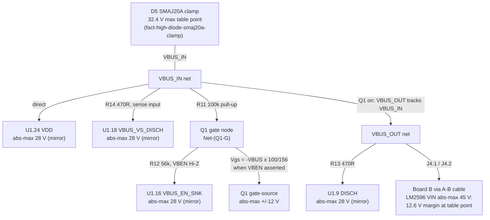

This page is the wave-5 evidence review of the two-board split (epic #86). Each board
section reviews the locked baseline connectivity against the full fact base: the 20
component bundles (`.claude/skills/component-*`), the 9 cross-component rules
(`.claude/skills/circuit-spec-integration/references/rules.json`), the board baselines
(`scripts/schgen/baselines/`), and the locked decisions in
[Board Split Decision](./board-split-decision.md) (#90).

<Note>

**Findings are leads, never verdicts** (pd-schematic-review method). Every finding cites
the fact IDs and locators behind it; a static connectivity-plus-fact-table pass cannot
measure a waveform, prove a limit, or clear a rail. No v4 board ever completed PD
negotiation, so every downstream electrical claim stays NEEDS BENCH by construction
(`rule-evidence-chain`). Locked #90 items are re-verified but not reopened here.

</Note>

## Board A

### Inputs reviewed

- `scripts/schgen/baselines/board-a.json` (netlist-derived doc-table baseline)
- `usb-pd-input.kicad_sch` in this worktree (the as-fixed sheet after the #93 edits)
- Bundles: `component-stusb4500qtr`, `component-umw-ao3401a-c347476`,
  `component-high-diode-smaj20a-c571370`, `component-usb-type-c-009-c456012`,
  `component-pesd24vs1ub-c85382`, `component-jst-b6b-xh-a`, `component-project-passives`
- Rules: `rule-q1-gate-drive-vs-contract`, `rule-tvs-clamp-vs-absmax`,
  `rule-ab-interface-current`, `rule-evidence-chain`
- Locked decisions: #90 fix list (A1–A6) and the A↔B interface contract

### Locked items re-verified — baseline, bundles, and schematic agree

Each row was checked against the baseline nets, the owner bundle's board-a facts, and
(where the property survives a text-level read) the as-fixed `usb-pd-input.kicad_sch`.
No locked item is reopened; contradictions that are conditional on a 20 V contract are
carried as leads BA-1/BA-4 for the wave-6 decision task.

| Locked item | Evidence checked | Result |
|---|---|---|
| A1 CC topology (CCDB↔CC 0R links, R17/R18 DNP) | Baseline `CC1`/`CC2`/`CC1DB`/`CC2DB` rows; `fact-stusb-cc-termination`; `fact-usb-type-c-009-cc-topology`; `int-stusb-cc-termination`; sch properties R17/R18 `dnp yes` + `in_bom no` (C23186), R19/R20 fitted 0 Ω (C21189); D4 has zero references left in the sheet | Consistent across all three sources. Wire-level rewiring of R19.2/R20.2 onto the CC nets is **not** netlist-verifiable in this pass (no `kicad-cli` on this machine) — see coverage limits |
| A3 pin-18 network (`VBUS_IN → R14 470 Ω → U1.18`, no divider) | Baseline `VBUS_VS_DISCH` row (`U1.18 R14.2 TP6.1`); `fact-stusb-pin18-path`; `fact-c23179-topology`; sch R14 Value `470ohm`/C23179; discharge current 15 V/470 Ω ≈ 32 mA and 20 V/470 Ω ≈ 43 mA, both inside the 50 mA cap (`fact-stusb-vbus-vs-disch`) | Consistent; matches the locked A3 text. Clamp-event corner carried in BA-8 |
| A2 D5 SMAJ20A on VBUS_IN | Baseline `VBUS_IN` row (`D5.1`) + `GND` row (`D5.2`); `fact-smaj20a-d5-nets` (cathode on VBUS_IN); sch D5 Value `SMAJ20A_C571370`, fitted | Present and oriented per the locked decision (cathode = pin 1 on VBUS_IN). Clamp/standoff arithmetic carried in BA-2/BA-4 |
| J4 interface contract (pins 1–2 +15V, 3 ATT, 4 PDOK, 5–6 GND) | Baseline `VBUS_OUT` (`J4.1 J4.2`), `ATT` (`U1.11 J3.6 J4.3`), `PDOK` (`U1.20 J3.7 J4.4`), `GND` (`J4.5 J4.6`); `fact-stusb-interface-flags`; `fact-jst-b6b-xh-a-locked-contract`; pin-map rows ATTACH=11, POWER_OK2=20 | Baseline conforms to the locked pinout exactly; both flags are open-drain with no on-board pull-up, per contract. J4 exists only in the baseline — the legacy sheet has J1/J2/J3 only, which matches the "no Board A KiCad project yet" state (`cov-stusb-board-a-netlist`) |
| NVM provisioning (J2 pogo, I2C pull-ups) | Baseline `SCL-pin1` (`U1.7 R15.1 J2.1`), `SDA-pin2` (`U1.8 R16.1 J2.2`), `GND` (`J2.3`); `fact-c23162-topology` (R15/R16 4.7 kΩ); `int-stusb-safe-power` | Wiring consistent; J2.4 NC per the Board A doc. The pull-up *rail choice* (VREG_2V7) is lead BA-6 |
| Decoupling set | Baseline: C1 (10 µF, C13585, 50 V) + C2 (100 nF, C1711, 50 V) on `VBUS_IN`/VDD; C30 (1 µF, C15849) on `VREG_2V7`; C34 (1 µF) on `Net-(U1-VREG_1V2)`; C35 (100 nF) on the gate node; all voltage-rating facts 50 Vdc (`fact-c13585-voltage`, `fact-c1711-voltage`, `fact-c15849-voltage`) | All present and connected; cap ratings clear the 15 V rail and the 32.4 V clamp table point. Conformance to DS12499's *required* decoupling values is not checkable — the bundle retains no such requirement fact (coverage limits). Value-label drift on C30/C34 is lead BA-9 |
| Unused-pin set | Baseline `GND` row vs pin-map: RESET(6, active-high) grounded = run; ADDR0/1(12/13) grounded = I2C 0x28; VSYS(22) grounded ("ground if unused"); EP(25) grounded. Floating: 3 (NC), 14 (POWER_OK3), 15 (GPIO), 17 (A_B_SIDE), 19 (ALERT) — all open-drain outputs, float-safe (`fact-stusb-pin-states`) | Safe as wired; no unconnected input found |

### Clamp-event stress topology

The single highest-leverage net on Board A is `VBUS_IN`: one D5 clamp event at the
32.4 V table point reaches every STUSB4500 high-voltage pin and the Q1 gate divider
simultaneously. This diagram is the net-level view behind findings BA-1/BA-2.

### Findings — leads ranked by severity

#### BA-1 — Q1 gate divider exceeds Vgs abs-max at any VBUS above ~14.7 V margin point; the factory-NVM 20 V window is unguarded in hardware (BLOCKER-class lead)

With VBEN asserted low, the R11/R12 divider sets `Vgs = -VBUS x R11/(R11+R12)` =
−VBUS × 0.641:

- 15 V contract: **−9.62 V**, 2.38 V of margin to the ±12 V abs-max — legal.
- 20 V contract: **−12.82 V**, **0.82 V past the abs-max** — the deterministic
  BLOCKER fact.
- D5 clamp table point (32.4 V) while VBEN is asserted: **−20.77 V**, 8.77 V past
  abs-max (new arithmetic this pass — same divider, transient-class; companion to the
  already-recorded off-state VDS overage in BA-2).

Net-level analysis of when the 20 V case is reachable: VBEN asserts only on a live
contract, and a **factory-default (unprogrammed) STUSB4500 advertises PDO3 = 20 V/1 A
at highest priority** ([NVM Programming Setup](./nvm-programming.md), factory-defaults
table). Board A's build order is assemble → program NVM via J2 → use; on the first
plug-in of an unprogrammed board into a 20 V-capable charger, this divider exceeds Q1's
gate rating with **no hardware interlock** — the only guard is the procedural "use a
5 V-only charger for the programming session" instruction. The locked #90 warning
"do not touch the Q1 gate network — re-confirmed correct by #87/#89" holds **at the
15 V contract only**; this is not a reopen — the wave-6 20 V-contract decision task
owns the disposition (reprogram-before-first-attach gate, divider change, clamp, or
other mitigation).

Evidence: `fact-umw-ao3401a-vgs` (±12 V abs-max, PRIMARY-SPEC, page 1 abs-max table row
VGS), `fact-c25803-resistance` (100 kΩ) + `fact-c23206-resistance` (56 kΩ),
`fact-umw-ao3401a-gate-resistor-values` (sch instance values),
`fact-umw-ao3401a-vgs-pdo3-margin` (−0.8205 V margin, verdict "BLOCKER - deterministic
spec violation"), `rule-q1-gate-drive-vs-contract` / `calc-q1-vgs-margin-vben-low`
(reproduces −0.8205 at 20 V, +2.3846 at 15 V), `fact-high-diode-smaj20a-clamp` (32.4 V
table point), `fact-stusb-gate-network` (network topology).

#### BA-2 — one D5 clamp event stresses four STUSB4500 high-voltage pins past the 28 V mirror-only abs-max, plus Q1 VDS (HIGH lead, mirror-conditioned)

`calc-tvs-d5-clamp-vs-stusb-vdd` records the 32.4 − 28 = **4.4 V overage** against VDD.
The net-level extension this pass adds: `VBUS_IN` reaches **U1.24 (VDD) directly**,
**U1.18 via R14** (high-impedance sense — no meaningful drop), and **U1.16 via
R11+R12** (Hi-Z open-drain when off — no current, so the pin floats to the clamp
voltage); with Q1 on, `VBUS_OUT` tracks `VBUS_IN` and reaches **U1.9 via R13**. All
four pins share the same 28 V grouped abs-max row, so a single clamp event is a
four-pin excursion, not a one-pin one. The off-state Q1 VDS overage (32.4 V vs −30 V,
2.4 V past) is `calc-tvs-d5-clamp-vs-q1-vds` and was **acknowledged as an accepted
residual in #90 A2 — but only for Q1**; the #90 residual text does not mention the
STUSB4500 28 V family at all. Downstream, the LM2596 keeps 12.6 V of margin at the
table point (`calc-tvs-d5-clamp-vs-lm2596-vin-absmax`).

Severity is capped at HIGH, not BLOCKER: the 28 V limit is **mirror-only evidence**
(see the cross-cutting caveat below), and 32.4 V is a 10/1000 µs table point at
12.3 A — not the installed surge waveform (`rule-tvs-clamp-vs-absmax`, verdict
UNSOURCED). Wave-6 input: either accept as transient-class residual with the mirror
caveat recorded, or pick a lower-clamp part during Board A layout (the #90 text itself
floats SMBJ20A as an upgrade).

Evidence: `fact-high-diode-smaj20a-clamp` (32.4 V, PRIMARY-SPEC),
`fact-stusb-vdd-absolute-max` + `fact-stusb-vbus-pin-absolute-max` (28 V, UNSOURCED
mirror), `fact-umw-ao3401a-vds` (−30 V, PRIMARY-SPEC), `calc-tvs-d5-clamp-vs-stusb-vdd`
(4.4), `calc-tvs-d5-clamp-vs-q1-vds` (2.4), baseline nets `VBUS_IN`, `VBEN`,
`Net-(Q1-G)`, `VBUS_OUT`, `Net-(U1-DISCH)`.

#### BA-3 — the Board A doc's "Electrical limits to respect" section contradicts the fact base (HIGH lead, doc defect — agent-found issue raised)

[Board A — USB-PD Core](../overview/board-a-usb-pd-core.md), reuse-guidance section,
states: "`VBUS_IN`/VDD abs-max is 22 V (DS12499)" and that D5's ≤32.4 V clamp was
chosen "specifically to sit under that ceiling with margin". Against the fact base,
both halves fail:

- 22 V is the top of VDD's **operating** range (`fact-stusb-supplies`, Table 21) and
  the **CC-pin** abs-max (`fact-stusb-cc-absolute-max`, Table 20); the VDD abs-max row
  is **28 V** (`fact-stusb-vdd-absolute-max`).
- 32.4 is greater than 28 is greater than 22 — the clamp table point sits **above**
  every one of those ceilings, not under any of them (`calc-tvs-d5-clamp-vs-stusb-vdd`).

The same section's reuse guidance says a reuse project may reprogram the NVM up to
20 V "as long as D5's 20 V standoff and Q1's ratings … still cover the new target
voltage", while listing only Q1's VDS/current rating — at 20 V the gate divider already
exceeds Q1's Vgs abs-max (BA-1) and D5's standoff margin is zero (BA-4), so the
guidance points a reuse reader at exactly the unsafe corner. This is a wave-3 doc
(#91), not a locked #90 decision, so it is a fixable doc defect, raised as agent-found
issue #130 rather than folded into the locked fix list.

Evidence: `fact-stusb-supplies`, `fact-stusb-cc-absolute-max`,
`fact-stusb-vdd-absolute-max`, `calc-tvs-d5-clamp-vs-stusb-vdd`,
`fact-umw-ao3401a-vgs-pdo3-margin`, `calc-tvs-d5-standoff-vs-pdo`; locator:
`doc/src/content/docs/overview/board-a-usb-pd-core.md`, "Electrical limits to respect"
and "NVM reconfiguration for other voltages" blocks.

#### BA-4 — D5 standoff has zero margin at a 20 V contract; minimum breakdown is only 2.2 V above it (MEDIUM lead)

`calc-tvs-d5-standoff-vs-pdo`: 5 V of standoff margin at the 15 V contract, **0 V at
20 V**. At exactly 20 V the part sits at its VRWM edge — leakage is specified at
precisely that voltage (5 µA, `fact-high-diode-smaj20a-leakage`) and any source
overshoot walks into the 22.2–24.5 V breakdown band
(`fact-high-diode-smaj20a-breakdown`). The #90 A2 justification "stays non-conducting
through the 20 V mis-contract edge case" is true only at exactly 20.0 V with zero
tolerance for overshoot — #90 itself flagged a 15 V-standoff part at 0% margin as "the
exact mistake #89 flagged for TVS2/SD05", and a 20 V contract reproduces that same 0%
condition one step up. Not a reopen (the fitted rail is 15 V by locked contract, where
the 33% margin claim holds); this is a numeric input to the wave-6 20 V-contract
decision alongside BA-1.

Evidence: `fact-high-diode-smaj20a-standoff` (20 V VRWM, PRIMARY-SPEC),
`fact-high-diode-smaj20a-breakdown`, `fact-high-diode-smaj20a-leakage`,
`calc-tvs-d5-standoff-vs-pdo` (0 V margin at vbus_v 20).

#### BA-5 — USB-C receptacle: 15 V contract is 3× the mirror's 5 V rating, 3 A is its zero-margin current cap, and the part identity is unsourced (MEDIUM lead, NEEDS BENCH)

The only voltage evidence for J1 (LCSC C456012) is a mirror approval spec's RATING row
of **5 V / 3 A** (`fact-usb-type-c-009-rating-voltage`,
`fact-usb-type-c-009-rating-current`, both UNSOURCED). The negotiated contract applies
15 V at up to 3 A: three times the voltage row, and exactly the current row with zero
margin (`fact-usb-type-c-009-pd-contract-stress`, NEEDS BENCH). The AC 100 V dielectric
test row suggests insulation headroom but is a test stress, not a working-voltage
rating (`fact-usb-type-c-009-dielectric`). Identity itself is degraded: the project MPN
label `USB-TYPE-C-009` matches no manufacturer or distributor document — the LCSC
catalog model is `TYPE-C 6P` — so the confirmed-distributor-identity lane is closed
(`fact-usb-type-c-009-distributor-binding`). The same 3 A cap is shared by the
A↔B interface's arithmetic (`rule-ab-interface-current`: 1.6× derated margin on J4's
paired contacts, but the receptacle itself carries 3 A at 1.0×). Bench engineering
acceptance at 15 V on the dead v4 boards is the stated gate.

Evidence: fact IDs above plus `rule-ab-interface-current` /
`calc-ab-derated-margin-ratio` (1.6) and `fact-jst-b6b-xh-a-current-derating-math`.

#### BA-6 — VREG_2V7 carries an external DC load DS12499 does not authorize (MEDIUM lead, NEEDS BENCH)

Pin 23 is documented as 2.7 V regulator **decoupling only**, yet the baseline hangs
R15/R16 (4.7 kΩ I2C pull-ups) and debug pad J3.3 on it (`fact-stusb-vreg2v7-load`,
`cov-stusb-vreg2v7-load`). Each asserted-low I2C line sinks ≈0.57 mA (2.7 V/4.7 kΩ)
from the internal regulator — ≈1.15 mA with both lines low, sustained during NVM
programming traffic. Open companions: whether the NVM jig (NUCLEO-F072RB, 3.3 V logic)
is happy with a 2.7 V pull-up rail (its VIH is ≈2.3 V — thin margin), and the SCL/SDA
pin abs-max, which the bundle does not retain at all. Wave-6/bench item: either confirm
the load empirically on a dead v4 board (the identical network is fitted there) or move
the pull-ups to a rail ST's reference designs use.

Evidence: `fact-stusb-vreg2v7-load` (NEEDS BENCH), `int-stusb-netlist` (UNSOURCED),
`fact-c23162-topology`/`fact-c23162-resistance`, baseline `VREG_2V7`/`SCL-pin1`/
`SDA-pin2` rows.

#### BA-7 — a fitted D6/D7 (PESD24VS1UB) clamps only above the CC pins' 22 V abs-max (LOW/MEDIUM lead, scope clarification)

The DNP CC-ESD provision's numbers: VRWM 24 V (`fact-pesd24vs1ub-standoff`), breakdown
26.5–27.5 V (`fact-pesd24vs1ub-breakdown`), clamp 36 V at 1 A / 70 V at 3 A
(`fact-pesd24vs1ub-clamp-1a`, `fact-pesd24vs1ub-clamp-3a`) — every conduction threshold
sits above the STUSB4500 CC-pin abs-max of 22 V (`fact-stusb-cc-absolute-max`,
mirror-only). This is *deliberate* per #90 A2 (the part must never become the weakest
link during a CC-short-to-VBUS fault) and is not a reopen — but the flip side deserves
recording: when fitted, D6/D7 provide **fast-ESD energy diversion only**; they cannot
hold any sustained overvoltage below the pin rating, and during a rated 8/20 µs surge
the CC pin still sees up to the 36 V clamp. CC-line protection therefore rests entirely
on U1's integrated structures in every DC/quasi-DC scenario, exactly as the fitted
(no-D6/D7) build does.

Evidence: fact IDs above plus `fact-pesd24vs1ub-dnp-provision` (DNP state, NEEDS
BENCH).

#### BA-8 — R13/R14 discharge-pulse dissipation is unspecified for the fitted 0.1 W parts (LOW lead, NEEDS BENCH)

Both 470 Ω resistors are 0603, 0.1 W rated (`fact-c23179-power`). During active
discharge with the rail still up, instantaneous dissipation is V²/470: **0.48 W at
15 V, 0.85 W at 20 V** — 4.8× to 8.5× the continuous rating. Discharge windows are
bounded (0x25 defaults: 800 ms to 0 V, 270 ms transition — `fact-stusb-discharge-registers`)
and the cap-bleed case is energy-trivial, but the resistor spec retains **no
installed-waveform pulse rating** — only the 5 s short-time-overload test
(`fact-c23179-pulse-caveat`, NEEDS BENCH). Current stays inside the pin's 50 mA cap at
both contract voltages (32 mA / 43 mA, `fact-stusb-vbus-vs-disch`); a discharge
coinciding with a clamp event would reach 69 mA (32.4 V/470 Ω), above the cap —
transient-class corner only. Bench scope note for the repeated attach/detach test.

Evidence: `fact-c23179-power`, `fact-c23179-resistance`, `fact-c23179-pulse-caveat`,
`fact-stusb-vbus-vs-disch`, `fact-stusb-discharge-registers`, baseline
`VBUS_VS_DISCH`/`Net-(U1-DISCH)` rows.

#### BA-9 — C30/C34 Value fields read "1uF 16V" but C15849 is a 50 V part (LOW lead, label drift)

The worktree `usb-pd-input.kicad_sch` carries `Value "1uF 16V"` on both C30 and C34
(LCSC C15849 = Samsung CL10A105KB8NNNC), while the primary-sourced rating is **50 Vdc**
(`fact-c15849-voltage`). Same class as the locked C4/C22/C23 value-label fix (#90 A5,
"prevents a future reviewer trusting the wrong label"), in the conservative direction
this time (label understates), electrically irrelevant on the 2.7 V/1.2 V nodes.
Netlist-neutral candidate for the same treatment at the next KiCad edit window — not
added to the locked #93 list by this review. The Board A doc's component table repeats
the 16 V label.

Evidence: `fact-c15849-voltage` (PRIMARY-SPEC); locator: `usb-pd-input.kicad_sch`
symbol property rows C30/C34; `doc/src/content/docs/overview/board-a-usb-pd-core.md`
component table.

#### BA-10 — the Board A doc still claims the fix list was never written back to KiCad (LOW lead, staleness — folded into agent-found issue #130)

[Board A — USB-PD Core](../overview/board-a-usb-pd-core.md) (net-table preamble) says
the #90 deltas were "applied on paper … none of this was written back into the KiCad
file". The as-fixed sheet in this worktree now carries them: D4 deleted (zero
references), D5 fitted as `SMAJ20A_C571370`/C571370, R17/R18 DNP + excluded from BOM,
R19/R20 fitted 0 Ω. The sentence predates #93 landing and now misleads a reader about
which artifact is authoritative.

Evidence: property-level reads of `usb-pd-input.kicad_sch` (this pass); locator:
`doc/src/content/docs/overview/board-a-usb-pd-core.md`, "Net-connectivity table (fixed
circuit)" intro paragraph.

### Cross-cutting caveat — every STUSB4500 limit above is mirror-only

Direct manufacturer-primary retrieval of DS12499 and UM2650 from st.com failed on both
attempt dates (2026-08-02, 2026-08-14); the retained bytes are reproducible mirrors
(`fact-stusb-ds12499-primary-attempt`, `fact-stusb-um2650-primary-attempt`, both
UNSOURCED). Every 28 V / 22 V abs-max and 4.1–22 V operating claim in BA-1 through BA-7
inherits that status: the arithmetic is deterministic, but the limits it compares
against are not primary-confirmed. This is why no finding above escalates past
BLOCKER-class *lead*.

### What this pass can and cannot catch

**Can catch (and did):** baseline-vs-bundle-vs-doc connectivity disagreements;
deterministic arithmetic on retained fact values (divider ratios, margins, overages);
locked-decision conformance of the baseline (J4 pinout, CC topology, pin-18 path);
property-level schematic state (DNP flags, BOM exclusion, Value/LCSC fields, symbol
presence/absence); doc text contradicting retained facts; unconnected-pin safety from
pin-function tables.

**Cannot catch:**

- **Wire-level netlist truth of the as-fixed sheet.** No `kicad-cli` exists on this
  machine, so the R19/R20 rewiring, D5 pin-to-net orientation, and every other
  geometry-borne connection in `usb-pd-input.kicad_sch` were verified only at the
  property level plus the (older, 2026-07-05) netlist-derived doc tables. A fresh
  netlist export diffed against `board-a.json` (`scripts/schgen/check_baseline.py`)
  remains open.
- **Anything bench-stage.** No rail has ever been energized from a negotiated contract
  (`rule-evidence-chain`: PCB orientation, BOM/CPL, as-built, programmed, and bench
  stages all OPEN). Waveforms — gate soft-start, clamp events, discharge pulses,
  inrush — are all unmeasured.
- **Mirror-limit truth.** BA-1/BA-2/BA-7's comparison ceilings are mirror-only; a
  primary DS12499 retrieval could move them.
- **Facts the bundles do not retain:** STUSB4500 SCL/SDA pin abs-max; DS12499's
  required decoupling values; the USB-PD CC-line capacitance budget (relevant to the
  J3.1/J3.2 debug stubs and a fitted D6/D7's 50 pF); NVM write endurance
  (`fact-stusb-endurance`); receptacle CC-pad continuity (a ranked v4 root-cause
  candidate, bench-gated).
- **Layout-phase items:** pogo-pad adjacency risk (J3.4 carries raw VBUS one pad away
  from the 2.7 V VREG_2V7 pad J3.3 — a probe slip is an unfused 15 V-into-2.7 V
  event), footprint geometry, thermal copper. Board A has no layout yet.

## Board B

*(Pending — filled by the Board B evidence-review sub-issue.)*
