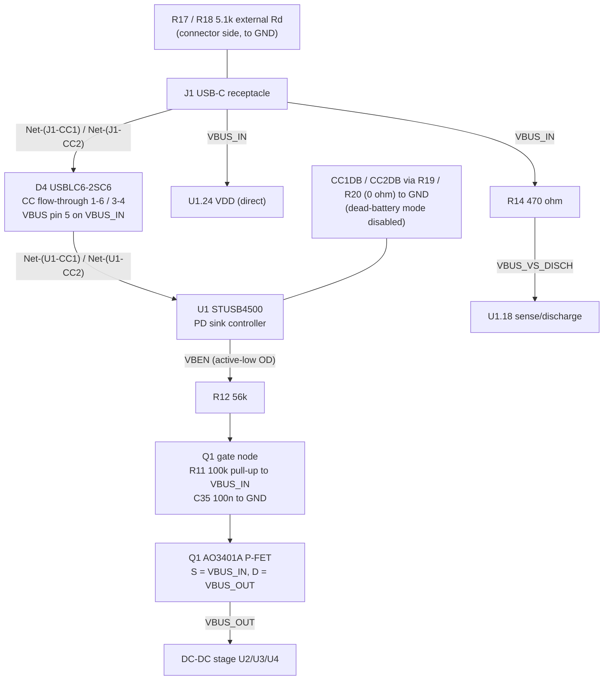

The v4 (0.4.0) board still fails USB-PD even though the v3 pin-18 bug is fixed and the
NVM is programmed for 15 V. This page ranks root-cause candidates for the v4 failure
from a datasheet-aware review of the USB-PD front end (`usb-pd-input.kicad_sch`), and
gives a bench procedure that discriminates between the candidates on the dead v4 boards.

**Method.** Every connectivity claim below was generated from the real KiCad netlist
(`kicad-cli sch export netlist --format kicadxml`, exported 2026-07-05 from this repo),
never from symbol screen positions. Datasheet claims cite ST DS12499 Rev 4 (STUSB4500)
and the ST USBLC6-2 datasheet; USB Type-C spec values are labeled for verification where
the primary table could not be fetched.

<Note>

Findings in this page are **leads to verify on the bench, not verdicts**. A static
netlist review cannot measure voltages, observe protocol timing, or prove which of
several stacked defects actually produced the observed failure. The discrimination
procedure below exists precisely because more than one verified defect can explain the
symptoms.

</Note>

## The v4 symptom set collapses to one observable

Reported v4 symptoms: no PD negotiation, VBUS_EN_SNK never asserts, all rails dead.

The NVM on the v4 boards was programmed with `POWER_ONLY_ABOVE_5V = 1`
(see [NVM Programming Setup](./nvm-programming.md)). Per DS12499 Rev 4 Table 10
("VBUS_EN_SNK pin behavior"), with `POWER_ONLY_ABOVE_5V = 1b` the VBUS_EN_SNK pin stays
**Hi-Z at 5 V even in Attached.SNK**, and only asserts (open-drain pulls **low**) when
VBUS operates under PDO2 or PDO3. VBUS_EN_SNK is **active-low open-drain**
(DS12499 Table 1, pin 16): asserted = pulled low = Q1 P-FET on.

Therefore "VBUS_EN_SNK never asserts" and "rails dead" are the *expected downstream
consequences* of a single failure: **no 15 V contract is ever established (or never
survives)**. The diagnosis only has to explain the missing/collapsing 15 V contract.

<Warning>

A fast contract-then-collapse is indistinguishable from "no negotiation" on a DMM. A PD
contract, the 5 V to 15 V transition, an overcurrent event, and the source's protective
shutdown all complete within a few hundred ms. Only a scope on VBUS_IN and CC (procedure
below) can tell these apart.

</Warning>

## Verified front-end topology (from the 2026-07-05 netlist export)

<Note>

In this export the ground net is named `RST`: the `RST` label on U1 pin 6 (RESET,
active-high input, correctly strapped to ground) was absorbed as the name of the whole
GND net. Everywhere `RST` appears below, read **GND**.

</Note>

### Net table — USB-PD Input sheet (front-end nets)

| Net | Connected pins (Ref.Pin) | Value/Note |
|-----|--------------------------|------------|
| `VBUS_IN` | `J1.A9 J1.B9 U1.24 D4.5 Q1.2 R11.2 R14.1 C1.2 C2.2 J3.4` | Receptacle VBUS. U1.24 = VDD (direct). **D4.5 = USBLC6-2 VBUS pin — candidate 2.** C1 10 µF, C2 100 nF decoupling |
| `Net-(J1-CC1)` | `J1.A5 D4.1 R17.1` | Connector-side CC1. R17 5.1 kΩ external Rd to GND |
| `Net-(U1-CC1)` | `D4.6 U1.2` | Chip-side CC1. **Only joined to the connector through D4's internal 1↔6 flow-through — candidate 3** |
| `Net-(J1-CC2)` | `J1.B5 D4.3 R18.1` | Connector-side CC2. R18 5.1 kΩ external Rd to GND |
| `Net-(U1-CC2)` | `D4.4 U1.4` | Chip-side CC2, via D4 internal 3↔4 |
| `CC1DB` | `U1.1 R19.1 J3.1` | Dead-battery pin, R19 (0 Ω) to GND — dead-battery mode disabled |
| `CC2DB` | `U1.5 R20.1 J3.2` | Dead-battery pin, R20 (0 Ω) to GND |
| `VBUS_VS_DISCH` | `U1.18 R14.2 TP6.1` | Pin-18 sense/discharge node; R14.1 is on `VBUS_IN` → **the v3 fix is present** (470 Ω series from VBUS_IN) |
| `VBEN` | `U1.16 R12.1 J3.8` | VBUS_EN_SNK, active-low open-drain, series R12 56 kΩ to gate node |
| `Net-(Q1-G)` | `Q1.1 R11.1 R12.2 C35.1` | Q1 gate. R11 100 kΩ pull-up to VBUS_IN (gate off = FET off), C35 100 nF to GND |
| `VBUS_OUT` | `Q1.3 R13.1 TP1.1 C5.1 C7.1 C9.1 C6.1 C8.1 C10.1 U2.1 U3.1 U4.1` | Switched rail feeding the DC-DC stage |
| `Net-(U1-DISCH)` | `U1.9 R13.2` | DISCH pin → R13 470 Ω → VBUS_OUT (power-system-side discharge) |
| `VREG_2V7` | `U1.23 C30.2 R15.2 R16.2 J3.3` | 2.7 V regulator, 1 µF decap, I2C pull-up rail |
| `Net-(U1-VREG_1V2)` | `U1.21 C34.1` | 1.2 V regulator, 1 µF decap |
| `SCL-pin1` / `SDA-pin2` | `U1.7 R15.1 J2.1` / `U1.8 R16.1 J2.2` | I2C to J2 pogo pads |
| `RST` (= GND) | `U1.6 U1.10 U1.12 U1.13 U1.22 U1.25 D4.2 J1.A12 J1.B12 J1.7 R17.2 R18.2 R19.2 R20.2 C30.1 C34.2 C35.2 J2.3 J3.5` (front-end members) | RESET, GND, ADDR0/1 (I2C 0x28), VSYS, EP all correctly strapped |

### Block diagram

## Ranked root-cause candidates

### 1. External Rd in parallel with the powered chip's internal Rd — CC termination out of spec the moment U1 boots

**Severity: blocker (design defect, present on every board). Symptom fit: high, charger-dependent.**

**Net evidence.** `Net-(J1-CC1) = J1.A5 D4.1 R17.1` with `R17.2` on GND (5.1 kΩ), and
`Net-(U1-CC1) = D4.6 U1.2` — the external Rd and U1's CC1 pin sit on the same electrical
node (through D4's flow-through). Same for CC2 via R18. `CC1DB`/`CC2DB` are grounded
through R19/R20 (0 Ω), so dead-battery mode is disabled and the external resistors are
the **only** termination while U1 is unpowered.

**Datasheet basis.** DS12499 Rev 4 §7.3 Table 22: the STUSB4500 presents
**Rd = 5.1 kΩ ±10% pull-down on the CC pins** in operation (`RINCC` = 200 kΩ applies only
with "Terminations off", i.e. during reset — §2.2.1 "CC1 and CC2 are HiZ during reset").
The STUSB4500 is an auto-run sink controller; internal Rd cannot be disabled by NVM.
So once VBUS powers VDD (U1.24 is tied to VBUS_IN directly) and the chip loads its NVM
(TLOAD = 30 ms, Table 22), the source sees **5.1 kΩ ∥ 5.1 kΩ ≈ 2.55 kΩ** — below the
USB Type-C sink Rd window of 5.1 kΩ ±20% (4.08–6.12 kΩ; verify against USB Type-C
spec R2.0 §4.11.2 / Table 4-33). The v2 debug page itself computed this case and marked
it "below spec" — see the re-examination section below.

**Failure mechanism.** Source-perspective CC detection windows (USB Type-C R2.0
Table 4-36 — values below reconstructed from implementation datasheets, e.g. onsemi
FUSB3307 places its source-side Ra-vs-Rd comparator for 3 A Rp between 0.75 and 0.85 V;
label: verify against the spec table):

| Source Rp | Rp current | V(CC) with 5.1 kΩ (chip unpowered) | V(CC) with 2.55 kΩ (chip powered) | Rd-detect floor (vRd-Connect min) |
|---|---|---|---|---|
| Default USB | 80 µA ±20% | 0.41 V — valid | **0.20 V — below the 0.25 V floor, reads as Ra/undefined** | 0.25 V |
| 1.5 A | 180 µA ±8% | 0.92 V — valid | **0.46 V — barely above the 0.45 V floor** | 0.45 V |
| 3.0 A | 330 µA ±8% | 1.68 V — valid | **0.84 V — inside the 0.75–0.85 V undefined band** | 0.85 V |

Sequence on every cold plug: the unpowered board presents a clean 5.1 kΩ → the source
debounces, attaches, applies vSafe5V → U1's VDD comes up, and ~30–50 ms later the
internal Rd lands in parallel → the source's CC voltage drops by half, **right when the
source is about to send Source_Capabilities**. A source whose comparator now reads
"Rd removed / Ra" treats the sink as detached or invalid: it never negotiates, or
removes VBUS — which unpowers U1, restores 5.1 kΩ, and re-attaches in a loop. Because
0.84 V sits inside a 100 mV undefined band, resistor and Rp tolerances make the outcome
**charger-dependent and even board-dependent** — consistent with a design that fails
across multiple revisions while looking "almost right".

Note the sink side is marginal too: U1's own attach threshold VTH0.2 (min CC voltage
for a connected sink) is 0.15–0.25 V (Table 22), so on a default-Rp charger (0.20 V at
the chip) even U1's source-detection is a coin flip.

**Why v3's "stable 5 V + live I2C" does not contradict this.** The programming sessions
used USB-A-to-C or dumb 5 V chargers (per the NVM setup page), which supply VBUS without
sink-detection gymnastics. The failure window only opens on a spec-compliant PD source.

### 2. D4 (USBLC6-2SC6) VBUS pin on the 15 V rail — absolute-rating violation at the exact moment a contract succeeds

**Severity: blocker (hard datasheet violation). Symptom fit: high *if* negotiation ever completes; also explains permanently-dead boards afterward.**

**Net evidence.** `VBUS_IN = ... D4.5 ...` — the USBLC6-2's VBUS pin (pin 5) sits
directly on the receptacle VBUS rail, which carries **15 V after a successful contract**.

**Datasheet basis.** ST USBLC6-2 datasheet (Rev 2 text verified; later revisions list
5.25 V): reverse stand-off voltage **VRM = 5 V**, breakdown **VBR = 6 V min at 1 mA
between VBUS and GND**, clamping 12 V at 1 A (8/20 µs). The functional diagram
(Figure 1) shows a zener between pin 5 (VBUS) and pin 2 (GND). This part is designed for
5 V USB — it is never rated for a 15 V rail.

**Failure mechanism.** The instant the source transitions VBUS to 15 V, D4's VBUS-GND
zener goes into hard breakdown (15 V ≫ 6 V), sinking whatever the source can deliver
(up to 3 A). The source hits overcurrent protection within ms and shuts down, hiccups,
or hard-resets the port. On a DMM this reads as "no negotiation, rails dead" (see the
warning above). Depending on the energy delivered, D4 dies short (VBUS_IN then loaded
even at 5 V → the board looks completely dead on subsequent plugs) or survives to repeat
the cycle. **Boards already tested against a 15 V charger may therefore carry a damaged
D4 right now** — the bench procedure checks this first.

Note the interaction with candidate 1: if candidate 1 blocks negotiation on a given
charger, 15 V never arrives and D4 survives — the two candidates mask each other, which
is why the bench order below lifts D4 pin 5 *before* any test that could produce 15 V.

### 3. CC continuity through D4's internal flow-through — the netlist relies on a part-internal join

**Severity: blocker if broken (as-built defect, not a schematic defect). Symptom fit: complete if present.**

**Net evidence.** `Net-(U1-CC1) = D4.6 U1.2` and `Net-(U1-CC2) = D4.4 U1.4` — two-pin
nets. The only path from connector CC to U1's CC pins runs through D4's package-internal
pin 1↔6 and 3↔4 connections. The USBLC6-2 datasheet Figure 1 (functional diagram) does
show pins 1/6 and 3/4 as internally common nodes (flow-through routing), so the
**schematic is electrically valid** — but any substitution, rotation, or footprint
mismatch at D4 silently opens both CC lines to the chip while leaving the connector-side
external Rd intact.

**Failure mechanism.** With the flow-through open: the source still sees R17/R18
(connector side) → attaches → applies 5 V → U1 powers via VDD and I2C works — but U1's
CC pins float, it never sees the source's BMC signaling, never answers
Source_Capabilities, and the source falls back to Type-C 5 V-only. Every v3/v4
observation (stable 5 V, live I2C, no contract, VBUS_EN_SNK stays Hi-Z because
`POWER_ONLY_ABOVE_5V = 1`) is reproduced exactly. The v2 boards measured 0 Ω across
D4 pins 1↔6 (see [PCBA v2 Debug Report](./pcba-v2-debug.md)), but v4 is a different
assembly run — re-verify. (The as-built part-substitution audit is a separate task;
here only the electrical validity and the bench check are in scope.)

### 4. NVM configuration on the failed boards — `SNK_PDO_NUMB` / `POWER_ONLY_ABOVE_5V` read-back

**Severity: marginal (shapes symptoms rather than blocking PD). Symptom fit: partial but cheap to eliminate.**

**Evidence.** Not a netlist item. The intended configuration is `SNK_PDO_NUMB = 2`,
PDO2 = 15 V/3 A, `POWER_ONLY_ABOVE_5V = 1` ([NVM Programming Setup](./nvm-programming.md)).
Two failure shapes worth eliminating by read-back on the *dead* boards:

- The setup page itself warns `POWER_ONLY_ABOVE_5V` "sometimes doesn't save on the first
  write". Other bits can fail the same way. A partial write (e.g. `SNK_PDO_NUMB` still 1,
  or PDO2 voltage not 15 V) produces a sink that negotiates a **5 V-only PD contract** —
  with `POWER_ONLY_ABOVE_5V = 1` the result is symptom-identical to "no negotiation"
  on a DMM (VBUS_EN_SNK stays Hi-Z per DS12499 Table 10).
- VBUS monitoring windows (DS12499 §3.4.1, Table 22: VMONUSBH/VMONUSBL, default
  −20%/+15% at attach) are NVM-programmable; a corrupted shift coefficient could make
  the chip reject valid VBUS. Default values are safe — verify they are still default.

### 5. Re-confirmed items — verified OK in this pass (no action)

| Item | Net evidence (this export) | Verdict |
|---|---|---|
| Pin-18 network (the v3 root cause) | `VBUS_VS_DISCH = U1.18 R14.2 TP6.1`, `R14.1` on `VBUS_IN`, R14 = 470 Ω | **OK.** Matches DS12499 Table 1 pin 18 "From VBUS, receptacle side". Table 22 (IDISUSB) specifies discharge "through external resistor connected to VBUS_VS_DISCH pin", ≤50 mA: 15 V / 470 Ω ≈ 32 mA — inside the rating. The v3 fix is present and correctly valued |
| Q1 gate drive | `Net-(Q1-G) = Q1.1 R11.1 R12.2 C35.1`; R11 100 kΩ → VBUS_IN, R12 56 kΩ → VBEN | **OK.** VBEN asserted (low): V(gate) = VBUS × 56/156 → Vgs ≈ −0.64 × VBUS = −3.2 V at 5 V, −9.6 V at 15 V — both enhance the AO3401A well and stay inside its ±12 V Vgs limit (verify against the AOS AO3401A datasheet). VBEN released: R11 pulls Vgs to 0 V, FET off |
| RESET / ADDR / VSYS / EP | `U1.6 U1.12 U1.13 U1.22 U1.25` all on GND | **OK.** RESET is active-high (DS12499 §2.2.3) so ground = run; ADDR = 0x28; VSYS grounded is correct for VDD-only supply (Table 1) |
| Decoupling | VDD: C1 10 µF + C2 100 nF on `VBUS_IN`; VREG_2V7: C30 1 µF; VREG_1V2: C34 1 µF | **OK.** Matches DS12499 Table 1 typical connections (1 µF typ. on each regulator) |
| VDD rating | U1.24 direct on `VBUS_IN` (15 V contract) | **OK.** VDD range 4.1–22 V (DS12499 Features/§7); 15 V is fine. U1's CC pins carry 22 V short-to-VBUS protection — U1 itself does not need D4 to survive CC faults |
| I2C | `SCL-pin1`/`SDA-pin2` with 4.7 kΩ pull-ups to VREG_2V7 | **OK.** Proven working on v3 hardware |

## Re-examination of the v2 "CC1DB chip-internal short" conclusion

The entire external-Rd topology (candidate 1) exists because of the v2 diagnosis
([PCBA v2 Debug Report](./pcba-v2-debug.md)): CC1 measured 0 Ω to GND on two boards,
the empty pad measured open after hot-air removal of U1, and the conclusion was
"CC1DB internally shorted — batch defect", fixed by grounding the DB pins and adding
external Rd. Re-reading that evidence against DS12499:

**What holds up.** The asymmetry was real on those chips: CC2 (wired CC2DB↔CC2 in v2)
measured 5.1 kΩ unpowered while CC1 measured 0 Ω, and removing U1 removed the short.
Something genuinely differed between pin 1 and pin 5 on those two v2 chips.

**What does not hold up.**

- The 5.1 kΩ read on CC2 was **not** "chip-internal Rd works" as the v2 page says — an
  unpowered STUSB4500 presents no Rd on CC2 itself. What was measured was the
  **dead-battery termination through CC2DB behaving exactly as designed**
  (DS12499 §3.5: the DB path "presents a pull-down termination on its CC pins ... even
  if the device is not supplied").
- A dead-battery termination is an unpowered depletion-type pull-down, characterized
  only by its behavior at Rp currents (80–330 µA). Its small-signal resistance under a
  DMM's test current is **not specified** by ST — a low-ohms reading on an unpowered DB
  pin is not, by itself, proof of a defect. The v2 measurement never recorded DMM test
  polarity or current, never compared a known-good reference chip measured the same
  way, and never confirmed the "short" at operating conditions. "0 Ω" on an autoranging
  DMM can be anything below tens of ohms.
- Even granting a genuine CC1DB defect on that one LCSC batch, the v3 response traded an
  unproven single-batch defect for a **permanent spec violation**: the v2 page's own
  table computes "good chip + ext 5.1 kΩ → 2.55 kΩ — below spec" and even states the
  proper fix is to remove the external Rd once the chip's Rd is known healthy. The v3/v4
  chips demonstrably run (I2C alive, NVM programmable), so their internal Rd is active,
  and 2.55 kΩ is the operating condition on every powered attach — candidate 1.
- DS12499 §3.5 says dead-battery mode "is also used in systems that are powered through
  the VBUS only" — i.e. ST's intended topology for exactly this board is CCxDB↔CCx with
  **no** external Rd (as used by the SparkFun board, STEVAL-ISC005V1, and datasheet
  Figure 10). For a VBUS-only sink, "ground the DB pins" (the no-dead-battery option)
  plus external Rd is structurally self-contradictory: the external Rd is mandatory for
  the unpowered attach, but out of spec the moment the chip runs.

**Verdict: the v2 chips may or may not have been defective — the evidence is
inconclusive — but the redesign built on that conclusion is itself a defect.** The v5
fix should return to the ST reference wiring (CC1DB↔CC1, CC2DB↔CC2, no external Rd,
optionally keeping DNP footprints for R17/R18 as rework insurance), pending the bench
result of test B4 below.

## Bench discrimination procedure (dead v4 boards, cheapest first)

Equipment: DMM with diode mode, fine probes, soldering iron + hot air, a scope
(≥10 MHz is plenty for attach dynamics; CC BMC bursts just need to be *seen*, not
decoded), the 15 V/3 A PD charger that failed, a USB-A-to-C cable, the NVM programming
rig ([NVM Programming Setup](./nvm-programming.md)).

<Warning>

Do all Stage A checks before ever plugging the PD charger in again, and do the D4
pin-5 lift (test C1) **before** any test that could let a 15 V contract succeed.
Candidates 1 and 2 mask each other: fixing the CC termination without lifting D4 pin 5
feeds the first successful 15 V contract straight into a 6 V zener.

</Warning>

### Stage A — unpowered continuity and damage survey (DMM only, 10 minutes)

| # | Test | Expected if OK | Outcome branches |
|---|---|---|---|
| A1 | Continuity `J1.A5` ↔ `U1.2` (probe at R17 pad 1 vs D4 pin 6 or the U1.2 QFN edge) and `J1.B5` ↔ `U1.4` (R18 pad 1 vs D4 pin 4) | ≈ 0 Ω both lines | Open or high on either line → **candidate 3 confirmed as the blocker** (as-built D4 issue: wrong variant, rotation, bad joint). Stop, fix D4, retest attach. Both ≈ 0 Ω → candidate 3 eliminated on this board |
| A2 | Diode-mode D4 pin 5 (`VBUS_IN`) to GND, both polarities | One direction ≈ 0.6–1.1 V drop (zener forward), other direction open below the DMM test voltage | Short both ways → **D4 already destroyed → strong evidence a 15 V contract DID complete at least once** (negotiation works; candidate 2 is the killer, candidates 1/3 were not blocking on this charger). Replace/remove D4 before further tests |
| A3 | Resistance CC1→GND and CC2→GND at the connector (board unpowered) | ≈ 5.1 kΩ each (external Rd only; DB pins are grounded so no chip termination) | ≈ 2.5 kΩ → unexpected unpowered termination, investigate U1/D4 damage. ≈ 0 Ω → damaged D4 or U1 CC pin, or solder fault |
| A4 | Resistance `VBUS_IN` (J3 pad 4) ↔ TP6 | ≈ 470 Ω (R14) | Open or ≫ 470 Ω → pin-18 path broken as-built despite correct schematic — would gate VBUS_EN_SNK even after a good contract (DS12499 Table 10 conditions run on the VBUS_VS_DISCH pin) |
| A5 | Continuity J3 pad 1 (`CC1DB`) → GND and J3 pad 2 (`CC2DB`) → GND | ≈ 0 Ω (R19/R20) | Open → R19/R20 missing; a floating DB pin is out of ST's two sanctioned options (DS12499 §2.2.2 warning) |

### Stage B — powered observation (USB-A-to-C first, then scope the PD attach)

| # | Test | Expected / branches |
|---|---|---|
| B1 | USB-A-to-C 5 V source (no CC negotiation involved): J3 pad 4 ≈ 5 V, J3 pad 3 ≈ 2.7 V, I2C detect at 0x28 | Fails → chip supply problem, stop and fix first (see decision tree in the NVM page). Passes → chip runs; proceed |
| B2 | While on the 5 V source, **read back the full NVM** and diff against target (`SNK_PDO_NUMB = 2`, PDO2 = 15 V/3 A, `POWER_ONLY_ABOVE_5V`, monitor coefficients at default) | Any mismatch → **candidate 4**: rewrite, verify, retest attach before any hardware surgery |
| B3 | Scope CC1 (at R17 pad 1) and CC2 (R18 pad 1) plus `VBUS_IN`, then plug the failing 15 V/3 A PD charger. Watch the first 2 s | See branch table below — this single capture separates candidates 1, 2, 3 |
| B4 | Repeat B3 on the *other* CC line if the cable orientation put activity on CC2 | Same branches |

**B3 branch table** (assuming the charger idles with 3 A Rp; scale by the table in
candidate 1 for other Rp values):

| Observation on the active CC line | Reading |
|---|---|
| CC ≈ 1.68 V after plug, drops to ≈ 0.84 V within ~100 ms of VBUS rising, then VBUS cycles off/on at roughly 0.5–2 Hz | **Candidate 1 confirmed on this charger**: internal Rd landed in parallel, source read "Rd removed", detached, chip lost power, loop |
| CC ≈ 1.68 V, drops to ≈ 0.84 V, VBUS stays 5 V, BMC bursts visible but no 15 V step | Source tolerates 2.55 kΩ but PD exchange dies — look for missing GoodCRC (candidate 3 partially open? U1 dead to PD?); capture longer, and observe `ATTACH` on J3 pad 6 — note it is open-drain with **no pull-up on this board** (net `ATT` = `U1.11 J3.6` only), so first add a temporary 10 kΩ pull-up from J3 pad 6 to VREG_2V7 (J3 pad 3); asserted = pulled low |
| CC ≈ 1.68 V and **stays** ≈ 1.68 V after VBUS rises (no halving), no PD | U1's Rd never appeared on the connector: chip-side CC is disconnected (**candidate 3**) even though A1 passed at DC — re-probe A1 warm, inspect D4 joints |
| VBUS steps toward 15 V then collapses hard, possibly with an audible/thermal event at D4, charger retries or latches off | **Negotiation works; candidate 2 is the blocker.** Confirm with A2 afterward (D4 likely now damaged) |
| CC attach fine, VBUS solid 5 V, `ATTACH` asserts low, BMC visible both directions, contract to 15 V never requested | Re-check B2 (NVM) — this is the candidate-4 shape |

### Stage C — bodge tests (only after A/B, in this order)

| # | Bodge | Validity condition | Expected |
|---|---|---|---|
| C1 | **Lift D4 pin 5** from its pad (leave pins 1/2/3/4/6 soldered — flow-through and GND stay intact, only the 6 V zener rail disconnects). Alternative: remove D4 entirely and bridge pads 1↔6 and 3↔4 with fine wire | Valid on its own — removes candidate 2 without touching CC continuity. ESD protection on CC is degraded at the bench (acceptable: U1's CC pins are rated 22 V short-to-VBUS, DS12499 features) | If B3 showed the 15 V-collapse branch: retest now brings full 15 V and live rails → **done, candidate 2 was the (final) blocker**. Otherwise proceed to C2 |
| C2 | **Restore the ST reference termination**: remove R17 and R18 (kills the external Rd) **and** remove R19 and R20 **and** wire CC1DB↔CC1 (J3 pad 1 → R17 pad 1) and CC2DB↔CC2 (J3 pad 2 → R18 pad 1) | **Removing R17/R18 alone is NOT a valid test** — with DB pins grounded there would be no unpowered Rd at all, the source would never apply VBUS, and the board would look dead for an unrelated reason. The DB rewire must be part of the same bodge so the dead-battery termination replaces the external Rd (DS12499 §2.2.2/§3.5) | Plug the PD charger (with C1 already done): attach via DB termination, CC sits at single-Rd voltage (≈ 1.68 V at 3 A Rp) with **no halving step**, PD negotiates, VBUS → 15 V, VBUS_EN_SNK pulls low, rails live → **candidate 1 confirmed as the v4 blocker and the v5 fix is validated** |
| C3 | If C2 instead shows CC1 dragged to ≈ 0 V and no attach | This is the one outcome that would **rehabilitate the v2 "bad CC1DB" conclusion for this batch too** | Swap U1 with a known-good STUSB4500 (e.g. from a SparkFun breakout) and repeat C2; also measure the removed chip's CC1DB/CC2DB to GND with recorded polarity/current for the record |
| C4 | After any success: verify the full chain at 15 V — TP6 ≈ 15 V, VBUS_OUT ≈ 15 V, Q1 gate ≈ 5.4 V (Vgs ≈ −9.6 V), +12/−12/+5 rails up | Confirms no second-order blockers downstream of the front end |

## What this pass can and cannot catch

This was a static netlist-plus-datasheet review. It **can** catch: wrong-net wiring,
missing/parallel terminations, component ratings violated by design voltages, pin-role
misunderstandings, and invalid bench tests. It **cannot** catch: as-built substitutions
or rotations (only bench A1/A2 and the separate assembly-audit task can), solder
defects, whether the NVM on the dead boards actually contains what the docs say it does
(B2), actual charger behavior inside the CC undefined bands (implementation-specific by
definition), chip authenticity, or dynamic/protocol-timing failures. The USB Type-C
Table 4-36 window values above were cross-checked only against implementation
datasheets, not the spec text itself — verify before treating a marginal reading as
in- or out-of-window. Candidates 1 and 2 are verified *defects*; whether each is *the*
defect that produced the observed v4 symptoms is exactly what Stages A–C decide.

## References

- ST DS12499 Rev 4, STUSB4500 datasheet — Table 1 (pin list; pin 16 "active low";
  pin 18 "From VBUS, receptacle side"), §2.2.1/§2.2.2 (CC HiZ during reset; DB warning),
  §3.4.1–3.4.3 + Table 10 (VBUS monitoring, discharge, VBUS_EN_SNK behavior vs
  `POWER_ONLY_ABOVE_5V`), §3.5 (dead-battery mode, VBUS-only systems), §7.3 Table 22
  (Rd 5.1 kΩ ±10%, RINCC, VTH0.2, IDISUSB 50 mA via external resistor, VMONUSB, TLOAD)
  — [st.com PDF](https://www.st.com/resource/en/datasheet/stusb4500.pdf)
- ST USBLC6-2 datasheet — Table 3 (VRM 5 V, VBR 6 V min at 1 mA VBUS-GND, VCL 12 V at
  1 A; later revisions list VRWM 5.25 V), Figure 1 (functional diagram: 1↔6 / 3↔4
  flow-through, VBUS-GND zener) — [st.com PDF](https://www.st.com/resource/en/datasheet/usblc6-2.pdf)
- USB Type-C Cable and Connector Specification R2.0 — §4.11.2 (Rd 5.1 kΩ ±20%),
  Table 4-36 (source-perspective CC windows; verify — reconstructed here via the onsemi
  FUSB3307/FUSB301 datasheets' source comparator bands)
- [PCBA v2 Debug Report](./pcba-v2-debug.md) — the original CC1DB evidence re-examined above
- [v3 USB-PD Failure Diagnosis](./v3-pd-failure-diagnosis.md) — pin-18 root cause, fixed in v4 and re-confirmed here
- [NVM Programming Setup](./nvm-programming.md) — programmed values, read-back procedure
- [STUSB4500 pinout guide](./stusb4500-pinout.md) — pin-by-pin reference
