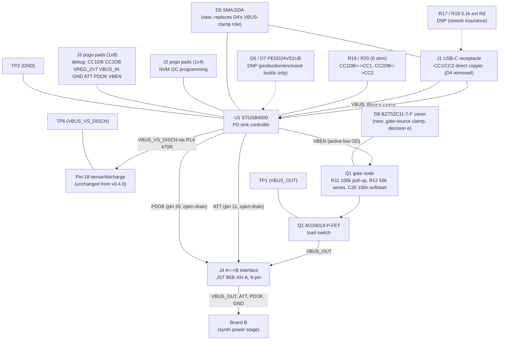
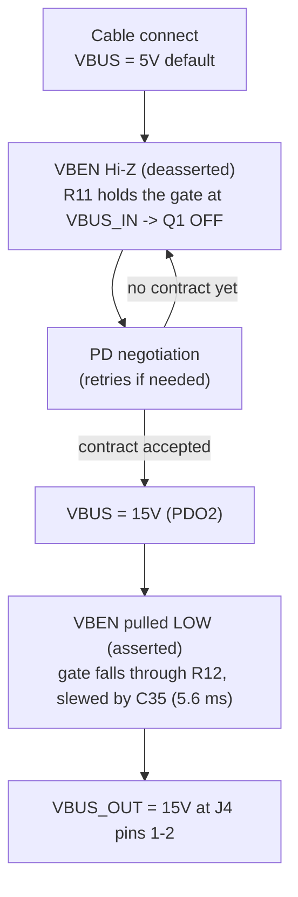

Board A is the USB-PD front end split out of the single-board zudo-pd design (epic
[#86](https://github.com/Takazudo/zudo-pd/issues/86)). It negotiates a 15 V/3 A USB-PD
contract with a STUSB4500, load-switches it, and hands the switched rail to Board B (the
synth power stage) over a 6-pin cable connector. This page documents the **fixed**
circuit — the front end after the [board-split decision](../inbox/board-split-decision.md)
(#90) fix list is applied — not the failed v4 circuit described in
[v4 USB-PD Failure Diagnosis](../inbox/v4-pd-failure-diagnosis.md).

## Purpose

- **Cheap, re-orderable debug surface.** The STUSB4500 front end was the source of two
  failed JLCPCB orders (v3's pin-18 bug, v4's CC-termination and D4-rating defects — see
  the diagnosis page). Splitting it onto its own small board means a bring-up failure
  only costs a re-spin of this board, not the whole multi-stage power supply.
- **Reusable USB-PD 15 V sink module.** Nothing on Board A or its output connector is
  synth-specific: it is a generic "negotiate 15 V over USB-PD, switch it, expose GND +
  two status flags" module, usable in any other project that needs a PD-negotiated DC
  rail.
- **NVM-programmable.** The same board carries the I2C pogo pads used to write the
  STUSB4500's PDO configuration — see [NVM Programming Setup](../inbox/nvm-programming.md).

<Note>

Board A now has a real, generated KiCad project: `boards/board-a/board-a.kicad_sch`,
built by the `schgen` toolchain from `scripts/schgen/board_a_spec.py` — not hand-drawn,
and not written back into the legacy `usb-pd-input.kicad_sch` sheet. The spec module is
the source of truth; regenerate with `python3 scripts/schgen/gen_schematic.py
board_a_spec` after editing it (see `scripts/schgen/README.md`). PCB layout for Board A
has not started yet. Reference designators below (U1, Q1, J1-J4, R11-R20,
C1/C2/C30/C34/C35, D5-D8, TP1/TP2/TP6) match the spec module: the original
`usb-pd-input.kicad_sch` sheet plus the #90 fix list, one new connector (J4), and the
wave-6 D8 gate-clamp addition (decision (e), documented below).

</Note>

## Block diagram

## Net-connectivity table (fixed circuit)

Per [Net-Table + Mermaid Convention](../how-to/net-table-convention.md). Read directly
from `scripts/schgen/board_a_spec.py`'s `NETS` table — the spec module that generates
`boards/board-a/board-a.kicad_sch` — so, unlike the wave-3 version of this page, the #90
fix-list deltas (D4 removed; R17/R18 DNP; R19/R20 rewired; D5-D7 added; J4 added as
Board A's new A↔B interface connector) plus the wave-6 D8 gate-clamp addition **are**
written into a real KiCad file; they are just not written back into the legacy
`usb-pd-input.kicad_sch` sheet, which stays the as-built v4 reference (see root
`CLAUDE.md`, "Legacy root KiCad project").

| Net | Connected pins (Ref.Pin) | Value/Note |
|-----|--------------------------|------------|
| `VBUS_IN` | `J1.A9 J1.B9 U1.24 C1.2 C2.2 R14.1 R11.2 Q1.2 J3.4 D5.1 D8.1` | Receptacle VBUS (5 V pre-contract, 15 V post-contract). `U1.24` = VDD (operating range up to 22 V; abs-max is 28 V — mirror-only, see the caveat below). `C1` 10 µF + `C2` 100 nF decoupling. `D5.1` (cathode) = new SMAJ20A VBUS clamp — **replaces D4**, which sat here as a 6 V-rated zener (abs-max violation on a 15 V rail). `D8.1` (cathode) = new wave-6 BZT52C11-7-F gate-source clamp, sourced from `VBUS_IN` (= Q1 source) |
| `CC1` (merges the former `Net-(J1-CC1)` + `Net-(U1-CC1)`) | `J1.A5 U1.2 R17.1 R19.2 D6.1` | Connector CC1 to `U1.2` is now **plain copper** (D4's internal 1↔6 flow-through is gone). `R17` (5.1 kΩ) = **DNP** (footprint kept, excluded from BOM/CPL). `R19` (0 Ω, fitted) now lands its GND-side pin here — restores `CC1DB↔CC1`. `D6` = PESD24VS1UB, **DNP**, fit only for enclosed/production builds |
| `CC2` (merges the former `Net-(J1-CC2)` + `Net-(U1-CC2)`) | `J1.B5 U1.4 R18.1 R20.2 D7.1` | Mirror of CC1. `R18` DNP. `R20` (0 Ω, fitted) restores `CC2DB↔CC2`. `D7` = PESD24VS1UB, DNP |
| `CC1DB` | `U1.1 R19.1 J3.1` | Dead-battery pin. `R19` (0 Ω) now bridges this to the `CC1` net (was grounded pre-fix) — ST reference VBUS-only-sink topology (DS12499 §3.5) |
| `CC2DB` | `U1.5 R20.1 J3.2` | Mirror; `R20` bridges to `CC2` |
| `VBUS_VS_DISCH` | `U1.18 R14.2 TP6.1` | Pin-18 sense/discharge node. **Unchanged** — `R14` 470 Ω series from `VBUS_IN`; the v3 fix stays as-is (A3, locked, no divider) |
| `VBEN` | `U1.16 R12.1 J3.8` | VBUS_EN_SNK, active-low open-drain. `R12` 56 kΩ series to the gate node |
| `Net-(Q1-G)` | `Q1.1 R11.1 R12.2 C35.1 D8.2` | Q1 gate. `R11` 100 kΩ pull-up to `VBUS_IN` (default OFF). `C35` 100 nF soft-start to GND (τ ≈ 56 kΩ × 100 nF ≈ 5.6 ms). `D8.2` (anode) = wave-6 gate-source zener clamp, Vz window 10.4–11.6 V — bounds |Vgs| against the 20 V-contract / clamp-event overages the wave-6 review found on this node (decision (e); R11/R12 values and topology untouched) |
| `VBUS_OUT` (current netlist label `+15V -> +13.5V gen`; renamed for Board A since it now terminates at the interface connector instead of a DC-DC stage) | `Q1.3 R13.1 TP1.1 J4.1 J4.2` | Switched output of the load switch — Board A's reusable "switched 15 V sink" rail. Feeds `J4` pins 1–2 (paired for current sharing) instead of the DC-DC sheet |
| `Net-(U1-DISCH)` | `U1.9 R13.2` | DISCH pin → `R13` 470 Ω → `VBUS_OUT` (system-side discharge). Unchanged |
| `VREG_2V7` | `U1.23 C30.2 R15.2 R16.2 J3.3` | 2.7 V internal regulator / I2C pull-up rail. `C30` 1 µF decap |
| `Net-(U1-VREG_1V2)` | `U1.21 C34.1` | 1.2 V internal digital-core regulator. `C34` 1 µF decap |
| `SCL-pin1` | `U1.7 R15.1 J2.1` | NVM programming clock. `R15` 4.7 kΩ pull-up to `VREG_2V7`. `J2` pogo pad 1 |
| `SDA-pin2` | `U1.8 R16.1 J2.2` | NVM programming data. `R16` 4.7 kΩ pull-up. `J2` pogo pad 2 |
| `ATT` | `U1.11 J3.6 J4.3` | ATTACH flag, open-drain active-low, **no on-board pull-up**. Routed to debug pad `J3.6` and to the A↔B interface `J4` pin 3 |
| `PDOK` | `U1.20 J3.7 J4.4` | POWER_OK2 flag (asserts on a live PDO2/15 V contract), open-drain active-low, no on-board pull-up. Debug pad `J3.7` and interface `J4` pin 4 |
| `GND` (current netlist label `RST` — the RESET-pin label was absorbed as the whole ground net's name) | `U1.6 U1.10 U1.12 U1.13 U1.22 U1.25 J1.7 J1.A12 J1.B12 C1.1 C2.1 C30.1 C34.2 C35.2 R17.2 R18.2 TP2.1 J2.3 J3.5 D5.2 D6.2 D7.2 J4.5 J4.6` | Common ground. `U1.6` RESET (active-high, grounded = run), `U1.12/13` ADDR0/1 (→ I2C address `0x28`), `U1.22` VSYS (grounded, correct for VDD-only supply), `U1.25` EP (thermal/electrical ground). `D5.2` = SMAJ20A anode; `D6.2`/`D7.2` = DNP CC-ESD anodes; `J4.5/6` = interface connector's paired GND return |
| Unused U1 pins (unchanged, intentionally floating/grounded) | `U1.3` NC, `U1.14` POWER_OK3 (float), `U1.15` GPIO (float), `U1.17` A_B_SIDE (float), `U1.19` ALERT (float) | See [STUSB4500 pinout guide](../inbox/stusb4500-pinout.md) for the per-pin rationale |
| `J2` pad 4 | `J2.4` | Unconnected (NC), per [NVM Programming Setup](../inbox/nvm-programming.md) |

<Warning>

`D4` (USBLC6-2SC6, C7519) does **not** appear anywhere in this table — it is removed
entirely (decision A2). Do not reintroduce it or relocate it elsewhere on Board A; its VBUS
role is replaced by D5, and its CC-ESD role is covered by U1's own 22 V-rated integrated
protection (with the D6/D7 DNP footprints as an opt-in upgrade).

The reason it cannot simply be moved: D4's **VBUS pin (pin 5)** is a zener to GND rated
`VRM = 5 V` (later datasheet revisions list 5.25 V) with a breakdown minimum of only
**6 V at 1 mA** — anywhere on this board that pin lands on a rail that reaches 15 V by
contract, which is an absolute-rating violation the instant negotiation succeeds, not a
fault-only exposure. Its other job, CC-line ESD, is one ST's own reference designs do not
ask for: they place nothing between the receptacle and the chip on CC, because the
STUSB4500 already integrates 22 V-rated CC protection. See
[v4 USB-PD Failure Diagnosis](../inbox/v4-pd-failure-diagnosis.md) §2 for the full
datasheet trail.

</Warning>

## Deltas vs the current single-board circuit

Board A's schematic is `usb-pd-input.kicad_sch` (the current single-board design) plus
exactly these changes — the same list locked in
[board-split-decision.md](../inbox/board-split-decision.md) §A6, items 1–5 (items 6–8 of
that list are `linear-regulation.kicad_sch`/`dc-dc-conversion.kicad_sch` edits that belong
to Board B, not Board A):

**Removed**

- `D4` (USBLC6-2SC6, C7519) — deleted entirely, not relocated. Its VBUS-clamp role was a
  hard abs-max violation (6 V-rated zener on a 15 V rail); its CC-ESD role duplicated U1's
  own integrated 22 V-rated protection while adding a silent-failure class (candidate 3:
  CC continuity relying on a part-internal flow-through).

**Set DNP (footprint kept, not populated, excluded from BOM/CPL)**

- `R17` / `R18` (5.1 kΩ external Rd) — kept as rework insurance only. Fitting them in
  parallel with U1's own always-on internal 5.1 kΩ Rd puts the CC termination out of the
  USB Type-C sink window the moment U1 powers up (2.55 kΩ effective) — the v4 blocker.

**Rewired**

- `R19` pin 2: `GND` → `CC1` (restores `CC1DB↔CC1` dead-battery termination, ST's reference
  topology for a VBUS-only sink).
- `R20` pin 2: `GND` → `CC2` (restores `CC2DB↔CC2`).
- CC1/CC2 connector-to-chip path: now direct copper (previously routed through D4's
  internal pin 1↔6 / 3↔4 flow-through).

**Added**

- `D5` = SMAJ20A (SMA, unidirectional TVS), cathode on `VBUS_IN`, anode on `GND`. Clones
  the existing `SMAJ15A_C571368` symbol/footprint pattern (used by TVS1/TVS3 on the
  linear-regulation sheet) into a new `SMAJ20A_C571370` entry.
- `D6` / `D7` = Nexperia PESD24VS1UB (SOD-523), **DNP**, one per CC line to GND. Layout
  provision only — fit for enclosed/production builds, not the bring-up/debug build.
- `J4` = the new Board A ↔ Board B interface connector (JST B6B-XH-A, 6-pin) — see below.
  This did not exist on the single-board design (the front end fed the DC-DC sheet
  directly through the shared `VBUS_OUT` net); Board A terminates that net at `J4` instead.
- `D8` = BZT52C11-7-F (SOD-123-class, LCSC C92321), zener across Q1's gate-source: cathode
  on `VBUS_IN` (Q1 source), anode on `Net-(Q1-G)`. Wave-6 addition (decision (e),
  `scripts/schgen/decisions.json`) — a fitted hardware guard for the case where an
  **unprogrammed** STUSB4500 (factory NVM advertises PDO3 = 20 V/1 A at highest priority)
  is first plugged into a 20 V-capable charger: without a clamp, the R11/R12 divider drives
  Q1's Vgs to −12.82 V, 0.82 V past the ±12 V abs-max, with no hardware interlock. The
  zener's 10.4–11.6 V Vz window sits below its knee at the legal 15 V contract (|Vgs|
  9.62 V) and clamps the gate-source voltage in every reachable state, including the
  −20.77 V transient a D5 clamp event can otherwise reach. R11/R12 values and topology are
  untouched — this is purely additive. See
  [Programming order and the D8 gate clamp](#programming-order-and-the-d8-gate-clamp)
  below and [NVM Programming Setup](../inbox/nvm-programming.md) for the companion
  procedural guard.

**Unchanged (re-confirmed correct, do not touch)**

- Pin-18 network: `VBUS_IN → R14 (470 Ω) → U1 pin 18` (the v3 fix).
- Q1 gate network (`R11`/`R12`/`C35`).
- VDD/VREG decoupling (`C1`/`C2`/`C30`/`C34`/`C35`).
- I2C NVM programming path (`J2`, `R15`/`R16`).
- Debug pogo block `J3`.
- Test points `TP1`/`TP2`/`TP6`.

## Load switch: Q1 gate network and soft-start

`Q1` (AO3401A, UMW LCSC C347476) is the high-side pass element between `VBUS_IN` and
`VBUS_OUT`. Three parts shape its gate, all sitting on `Net-(Q1-G)` per
`scripts/schgen/board_a_spec.py`:

| Ref | Value | Purpose |
|-----|-------|---------|
| R11 | 100 kΩ | Gate pull-up to `VBUS_IN` — holds Q1 **off** by default |
| R12 | 56 kΩ | Gate series resistor from `VBEN` (U1.16); with R11 it sets the driven Vgs |
| C35 | 100 nF | Gate-to-GND soft-start capacitor |

<Warning title="Refdes collision with Board B">

On Board A these are `R11`/`R12`/`C35`. Older writing about this circuit calls them
`R1`/`R2`/`C5`, which in this repository are **different components on a different
board**: `R1`/`R2` are U2's +13.5 V feedback divider and `C5` is a U2 input electrolytic,
all on Board B (`scripts/schgen/board_b_spec.py`). Never carry the `R1`/`R2`/`C5` naming
into Board A work.

</Warning>

### Soft-start time constant

τ = R12 × C35 = 56 kΩ × 100 nF = **5.6 ms**

`C35` slows the gate's fall when U1 asserts `VBEN`, limiting dV/dt on `VBUS_OUT` at
turn-on and so limiting inrush into Board B's input bulk capacitance (940 µF total after
the wave-6 C5/C7 swap — see [Board B](./board-b-synth-power.md#dc-dc-conversion-stage)).

### Conduction loss and the package ceiling

| Quantity | Value | Source |
|----------|-------|--------|
| Rds(on), max at Vgs = −10 V, Id = −4.2 A | 50 mΩ | `fact-umw-ao3401a-rdson` |
| Rds(on), max at Vgs = −4.5 V, Id = −4 A | 65 mΩ | `fact-umw-ao3401a-rdson` |
| Driven gate-source magnitude at the 15 V contract | 9.62 V | R11/R12 divider: 15 V × 100 k / 156 k |
| RθJA steady state / TJ max | 125 °C/W / 150 °C | `fact-umw-ao3401a-thermal` |

At the PD contract's 3.0 A cap the conduction loss `P = I² × Rds(on)` lands between
**0.45 W** (3² × 50 mΩ) and **0.59 W** (3² × 65 mΩ). The bracket is not a rounding
detail: the driven gate sits at 9.62 V, just short of the datasheet's −10 V test point,
so the 50 mΩ number is not guaranteed here and the −4.5 V point is the conservative
bound. The steady-state package ceiling is (150 °C − 25 °C) / 125 °C/W ≈ **1.0 W** at
25 °C ambient, leaving roughly 1.7× margin in the worst case — enough, but thin enough
to be worth a thermal check once Board A's copper pour exists.

<Warning title="Do not reuse the AOS-branded AO3401A figures">

Figures of 44 mΩ Rds(on), a 0.4 W conduction loss, and a 1.4 W package limit circulate
for the **AOS** AO3401A. The fitted part is UMW's AO3401A (LCSC C347476), whose evidence
bundle (`.claude/skills/component-umw-ao3401a-c347476`) explicitly excludes AOS data as a
same-name/different-manufacturer source. The 1.4 W figure is additionally the `t ≤ 10 s`
thermal resistance (90 °C/W) read as though it were a steady-state limit.

</Warning>

### Why a P-channel high-side switch

| Switch type | Position | Gate drive | Cost of that drive |
|-------------|----------|------------|--------------------|
| **P-channel** | High-side | Simple — gate referenced to `VBUS_IN` | Low |
| N-channel | High-side | Needs a charge pump or bootstrap | High |
| N-channel | Low-side | Simple | Breaks the ground path |

P-channel is what lets U1's open-drain `VBEN` pin drive the gate directly through `R12`
against the `R11` pull-up, with no charge pump anywhere on the board — and it keeps the
A↔B ground return unbroken at `J4` pins 5–6, which a low-side switch would not.

## Power sequencing (VBUS_EN_SNK)

U1 sequences the load switch itself through `VBUS_EN_SNK` (pin 16, net `VBEN` —
active-low open-drain), so `VBUS_OUT` only rises after a contract exists. This is what
keeps Board B's input bulk capacitance from drawing inrush during negotiation, when the
port is still at 5 V and the source is still deciding.

Because Q1 stays off until `VBEN` asserts, `TP1` (`VBUS_OUT`) reads 0 V during NVM
programming — that is correct behavior, not a fault. See the bring-up tip under
[Test points](#test-points).

## Component list, LCSC parts, and rough cost

All LCSC part numbers below are read from the current schematic's netlist export (source
of truth), not from the general [BOM](./bom.md) page, which has drifted on a few passive
LCSC numbers since this front end was last exported. Prices are rough JLCPCB catalog
estimates — re-verify at order time.

| Ref | Part | LCSC | Package | Role | Approx. unit cost |
|-----|------|------|---------|------|--------------------|
| U1 | STUSB4500QTR | C2678061 | QFN-24 | PD sink controller | ~$2.50 |
| Q1 | AO3401A | C347476 | SOT-23 | Load switch (P-FET) | ~$0.02 |
| J1 | USB-C receptacle, 6P | C456012 | SMD | USB-PD input | ~$0.05 |
| D5 | SMAJ20A (new) | C571370 (alt: C1973455) | SMA | VBUS TVS clamp | ~$0.15 (SMAJ-family estimate) |
| D8 | BZT52C11-7-F (new, wave-6) | C92321 | SOD-123-class | Q1 gate-source zener clamp | ~$0.05 (C92321 catalog, 20pcs) |
| C1 | 10 µF 50V | C13585 | 1206 | VDD bulk decouple | ~$0.02–0.03 |
| C2 | 100 nF 50V | C1711 | 0805 | VDD HF decouple | ~$0.002 |
| C30 | 1 µF 50V | C15849 | 0603 | VREG_2V7 decouple | ~$0.001 |
| C34 | 1 µF 50V | C15849 | 0603 | VREG_1V2 decouple | ~$0.001 |
| C35 | 100 nF 50V | C1711 | 0805 | Gate soft-start | ~$0.002 |
| R11 | 100 kΩ | C25803 | 0603 | Gate pull-up | ~$0.0005 |
| R12 | 56 kΩ | C23206 | 0603 | Gate divider | ~$0.0005 |
| R13 | 470 Ω | C23179 | 0603 | DISCH resistor | ~$0.0005 |
| R14 | 470 Ω | C23179 | 0603 | Pin-18 series R | ~$0.0005 |
| R15 | 4.7 kΩ | C23162 | 0603 | I2C SCL pull-up | ~$0.0005 |
| R16 | 4.7 kΩ | C23162 | 0603 | I2C SDA pull-up | ~$0.0005 |
| R19 | 0 Ω | C21189 | 0603 | CC1DB↔CC1 link (fitted) | ~$0.0005 |
| R20 | 0 Ω | C21189 | 0603 | CC2DB↔CC2 link (fitted) | ~$0.0005 |
| J2 | Pogo pads, 1x4 | — (bare copper, no part) | Custom SMD | NVM I2C programming | $0 |
| J3 | Pogo pads, 1x8 | — (bare copper, no part) | Custom SMD | Debug pads | $0 |
| TP1, TP2, TP6 | Test point pads | — | `TestPoint_Pad_D1.5mm` | VBUS_OUT / GND / VBUS_VS_DISCH probes | ~$0.001 each |
| J4 | JST B6B-XH-A(LF)(SN) | C144397 | THT, 2.5 mm pitch | A↔B interface connector | ~$0.08 (estimate; verify at order time) |

**DNP (footprint only, not populated — no per-board cost):**

| Ref | Part | LCSC | Package | Note |
|-----|------|------|---------|------|
| R17, R18 | 5.1 kΩ | C23186 | 0603 | External Rd, rework insurance |
| D6, D7 | PESD24VS1UB | C85382 | SOD-523 | CC ESD, enclosed/production builds only |

**Rough per-board total (fitted parts only): ~$2.90.** U1 alone is ~86% of that — this is
an inherent cost of the STUSB4500, not something Board A's split-out changes. What the
split *does* change: this board has roughly a quarter of the single-board design's unique
Extended-part count (U1, J1, J4, D5, D8 vs. the full board's ~20), so JLCPCB's per-unique-part
setup/Extended fees amortize much faster on a small reorder batch — the actual point of
"cheap, re-orderable." Fabrication, stencil, setup, and Extended-part fees are separate
from the component total above; see [BOM](./bom.md) for the general JLCPCB fee structure
(those figures describe the full single-board order, not Board A alone).

### J1 substitution options

If `C456012` is out of stock, these 6-pin power-only USB Type-C receptacles were screened
as candidates:

| LCSC | Part | Stock at screening |
|------|------|--------------------|
| C2927029 | USB-TYPE-C-009 (the part an earlier order used) | 22,140 |
| C668623 | TYPE-C 6P(073) | 133,479 |
| C5156600 | TYPE-C 6PLTH6.8-DJ | 43,224 |
| C36936554 | UC17-0B06F68011 (3 A rated) | 38,214 |

Stock figures are from that screening pass, not current — re-check at order time. **Verify
the pad map before substituting.** Board A's footprint (`TYPE-C-SMD_TYPE-C-6P`) expects
`A5` = CC1, `B5` = CC2, `A9`/`B9` = VBUS, and `A12`/`B12` plus the four shell tabs (all
numbered `7`) = GND — see `fact-usb-type-c-009-cc-pins` and the net table above. Most
6-pin power-only receptacles follow the same GND–VBUS–CC1 / CC2–VBUS–GND arrangement, but
it is the pad *numbering* that has to match, not the physical order. A full 24-pin
receptacle carries the same power and CC contacts and would work electrically, but it
needs its own footprint; the 6-pin part is chosen for cost on a power-only port.

## A↔B interface contract (LOCKED — copied verbatim from #90)

<Note>

Everything in this subsection is copied byte-for-byte from the
[board-split decision](../inbox/board-split-decision.md) (#90). Do not edit the wording —
the wave-4 confirm pass diff-checks this block against the same block in the Board B doc.

</Note>

**Connector (both boards):** JST **B6B-XH-A(LF)(SN)** — 6-pin top-entry shrouded THT header, 2.5 mm pitch, **LCSC C144397** (genuine JST; stock listed 2026-07-05, re-verify at order time). Rated 3 A/contact (AWG #22), 250 V. **Cable:** commodity pre-crimped 6-way XH↔XH, AWG 22, 80–150 mm (or JST XHP-6 housings + SXH-001T-P0.6 contacts — verify stock at order time; cable-side parts are not on the PCBA BOM).

| Pin | Signal | Direction | Notes |
|-----|--------|-----------|-------|
| 1 | +15V | A → B | Board A `VBUS_OUT` (post Q1 load switch), PD-contract 15 V |
| 2 | +15V | A → B | Paired with pin 1 (current sharing) |
| 3 | ATT | A → B, open-drain, active-low | STUSB4500 pin 11 (ATTACH). No pull-up on Board A; Board B (or any host) pulls up 10–100 kΩ to a local rail ≤5 V if used. May be left unconnected |
| 4 | PDOK | A → B, open-drain, active-low | STUSB4500 pin 20 (POWER_OK2): asserts when the PDO2 (15 V) contract is live. Same pull-up rule as ATT. May be left unconnected |
| 5 | GND | — | Paired return |
| 6 | GND | — | Paired return |

**Current-rating math:** worst case = PD contract cap **3.0 A @ 15 V** (computed steady draw ≈2.5 A at the rated 26.5 W output budget). XH contact nameplate 3.0 A; 80% continuous derate → 2.4 A/contact. 2 contacts per power rail → 4.8 A derated capacity; at 3.0 A each contact carries 1.5 A = 50% of nameplate → **1.6× derated margin (2.0× nameplate)**. GND identical (2 contacts, symmetric return). Cable drop ≈16 mV round trip at 3 A (2× AWG 22 per leg, 100 mm) — negligible.

**Keying/foolproofing:** XH shrouded housing is mechanically polarized (reversed insertion blocked). Uniqueness rule: the 6-pin XH is the ONLY 6-position XH on either board. Pin 1 silkscreened on both boards.

**Mechanical (LOCKED):** side-by-side, cable-linked. Stacking rejected: USB-C must reach the enclosure wall, Board A's J2 pogo pads need face access for the NVM rig, Board B's TO-263 regulators need top-side copper/airflow, and a stack fixes relative orientation (hurts reuse). Each board carries its own 4× M3 (3.2 mm) mounting holes; no shared hole pattern.

**Genericity:** nothing synth-specific on the connector — 15 V power, GND, two generic open-drain status lines; a consumer that ignores pins 3–4 just gets switched 15 V.

On Board A, this connector is designated **J4** (next free reference after J1 USB-C, J2 NVM
pogo, J3 debug pogo) and carries `VBUS_OUT` (pins 1–2), `ATT` (pin 3), `PDOK` (pin 4), and
`GND` (pins 5–6) per the net table above.

## NVM programming interface, debug pads, and test points

### J2 — NVM programming (pogo, 1×4, 2.54 mm)

Bare-copper pogo pads (no BOM cost), used with a pogo-pin clip and a NUCLEO-F072RB acting
as a USB-to-I2C bridge. Full procedure, wiring, GUI steps, and pitfall table in
[NVM Programming Setup](../inbox/nvm-programming.md).

| Pad | Signal | Note |
|-----|--------|------|
| 1 | SCL | I2C clock, 4.7 kΩ pull-up (R15) to VREG_2V7 |
| 2 | SDA | I2C data, 4.7 kΩ pull-up (R16) to VREG_2V7 |
| 3 | GND | Reference/return |
| 4 | NC | Unconnected |

Three ways to get a programmed part, in the order this project considered them:

1. **NUCLEO-F072RB as a USB-to-I2C bridge, driven by ST's STSW-STUSB002 GUI** — the flow
   actually used here. Wiring, firmware choice (UART, not HID), and the pitfall table are
   in [NVM Programming Setup](../inbox/nvm-programming.md); the STEVAL-ISC005V1 eval board
   is **not** needed, since the STUSB4500 is already soldered to this board.
2. **Any MCU over I2C** — community flasher code at
   [usb-c/STUSB4500](https://github.com/usb-c/STUSB4500).
3. **Distributor pre-programming** — some distributors will write the NVM before shipping,
   which removes the `J2` step from assembly entirely. Not used here, because the PDO set
   was still moving; it is the option that scales once the configuration is locked.

### J3 — debug pads (pogo, 1×8, 2.54 mm)

| Pad | Signal | Note |
|-----|--------|------|
| 1 | CC1DB | Dead-battery pin 1 (post-fix: bridged to CC1 via R19) |
| 2 | CC2DB | Dead-battery pin 2 (post-fix: bridged to CC2 via R20) |
| 3 | VREG_2V7 | "Is the chip alive?" probe — should read ≈2.7 V |
| 4 | VBUS_IN / VDD | USB VBUS reaching U1 — ≈5 V pre-contract, ≈15 V post-contract |
| 5 | GND | Reference/return |
| 6 | ATT | ATTACH flag, open-drain, no on-board pull-up |
| 7 | PDOK | POWER_OK2 flag, open-drain, no on-board pull-up |
| 8 | VBEN | VBUS_EN_SNK (drives the Q1 gate network) |

### Test points

| Ref | Net | Note |
|-----|-----|------|
| TP1 | `VBUS_OUT` | Downstream of the Q1 load switch — reads 0 V until a PD contract enables VBUS_EN_SNK |
| TP2 | `GND` | Reference |
| TP6 | `VBUS_VS_DISCH` | Pin-18 sense node — should track `VBUS_IN` through R14 |

<Tip title="Bring-up order">

During NVM programming, `TP1` can legitimately read 0 V (Q1 is off until a valid contract).
Use `J3` pad 4 (VBUS_IN) and pad 3 (VREG_2V7) instead to confirm the chip itself is powered
— see the decision tree in [NVM Programming Setup](../inbox/nvm-programming.md).

</Tip>

## Programming order and the D8 gate clamp

<Warning title="Program the NVM before first attaching a &gt;15V-capable charger">

A **factory-default (unprogrammed) STUSB4500** advertises PDO3 = **20 V/1 A at highest
priority** — see the factory-defaults table in
[NVM Programming Setup](../inbox/nvm-programming.md). Board A's intended build order is
assemble → program NVM via `J2` → use. Program the NVM (target ≤15 V, `SNK_PDO_NUMB = 2`
so 20 V is never advertised — the locked configuration) from a **5 V-only charger**
before ever attaching a board to any charger capable of more than 15 V. This procedural
guard stays necessary even with `D8` fitted: D8 only bounds the Q1 gate-source voltage;
it does not make a 20 V negotiation safe for the STUSB4500's own VDD/pin-18 exposure
(see the electrical-limits caveats below) or for anything downstream expecting 15 V.

</Warning>

`D8` (see [Deltas vs the current single-board circuit](#deltas-vs-the-current-single-board-circuit)
above) is a complementary **hardware** guard, not a substitute for the procedural one:
it bounds the specific Q1 Vgs overage a 20 V contract or a D5 clamp event would otherwise
cause, but the NVM itself must still be programmed and locked to ≤15 V before the board
sees a charger that could offer more.

## Bring-up troubleshooting

Symptom-first table for Board A. Reference designators are Board A's, per
`scripts/schgen/board_a_spec.py`; the deeper NVM-side decision tree ("is the chip even
alive?") lives in [NVM Programming Setup](../inbox/nvm-programming.md).

| Symptom | Likely cause | Check |
|---------|--------------|-------|
| No PD negotiation | NVM not programmed | Write the target PDO set (≤15 V, `SNK_PDO_NUMB = 2`) through `J2` |
| Wrong output voltage | PDO configuration error | Read the NVM back over I2C and compare against the locked configuration |
| Load switch never turns on | `VBEN` not reaching the gate network | Probe `J3` pad 8 (`VBEN`), then continuity through `R12` (56 kΩ) to `Net-(Q1-G)` |
| Intermittent negotiation | Inadequate VDD decoupling | Check `C1` (10 µF) and `C2` (100 nF) values and their placement next to `U1.24` |
| U1 overheating | Poor thermal/ground path | Add ground-plane via stitching under `U1.25` (EP) |
| I2C not responding | Wrong device address | Confirm `U1.12`/`U1.13` (ADDR0/ADDR1) are grounded — address `0x28` |
| No VBUS voltage sense | Pin-18 network open | Confirm `R14` (470 Ω) between `VBUS_IN` and `U1.18`; probe `TP6` against `J3` pad 4 |

## Reuse guidance for other projects

Board A is designed to drop into any project that just needs a switched, PD-negotiated DC
rail — not only this synth power supply.

**Minimum wiring to reuse Board A standalone:**

- Connect `J4` pins 1–2 (`VBUS_OUT`) and pins 5–6 (GND) to the consuming circuit. That
  alone gives a plain switched-15 V sink module.
- Pins 3 (`ATT`) and 4 (`PDOK`) may be left unconnected — Board A negotiates and switches
  power on its own; nothing downstream needs to read these flags. If a consumer wants
  sequencing/fault info, pull each up externally (10–100 kΩ to a local rail ≤5 V) per the
  interface contract above.

**NVM reconfiguration for other voltages:** the negotiated voltage/current live entirely in
the STUSB4500's NVM (see [NVM Programming Setup](../inbox/nvm-programming.md)), not in the
schematic. A reuse project can reprogram `J2` for a different PDO instead of 15 V/3 A
without a hardware change **only up to and including 15 V** — this board's locked
electrical exposure is bench-verified only at that contract. Reprogramming to **20 V is
not currently safe** on the as-documented hardware: the wave-5 evidence review found the
Q1 gate divider exceeds its Vgs abs-max at a 20 V contract (finding BA-1) and D5's
standoff margin drops to zero at exactly 20 V (finding BA-4). The wave-6 `D8` gate clamp
(above) closes the Q1 exposure, but D5 and the STUSB4500 pin exposures below are not
re-evaluated for a 20 V contract. Do not reprogram above 15 V without re-deriving these
margins for the target voltage.

**Electrical limits to respect:**

- `VBUS_IN`/VDD's **operating** range tops out at 22 V (DS12499, mirror-sourced); the
  **absolute maximum** is a separate, higher figure — **28 V** (also mirror-only; the
  primary ST datasheet DS12499 could not be retrieved to confirm it, so treat this ceiling
  as evidence-capped, not primary-confirmed). `D5` (SMAJ20A) is chosen for its 20 V
  standoff / 22.2–24.5 V breakdown, but its **≤32.4 V clamp table point sits above every
  one of these ceilings** (32.4 &gt; 28 &gt; 22), not under any of them — the clamp does not
  protect VDD from a fault event; it only sets the outer bound the STUSB4500's own 28 V
  mirror-only rating would need to survive. This overage is a recorded, accepted
  transient-class residual (disposition `ba2-disposition`,
  `scripts/schgen/decisions.json`), not a design guarantee — D5 stays SMAJ20A because no
  lower-clamping 20 V-standoff part is currently fitted; a lower-clamping SMBJ20A upgrade
  is recorded as a future Board A layout-phase option.
- `Q1` (AO3401A) is rated −30 V/−4 A on VDS — comfortably above the 15 V/3 A design point.
  Its **Vgs** rating is the tighter limit and is now bounded by `D8` (above), not by
  margin alone.
- `J4`'s 2 contacts per power rail give a 1.6× derated-current margin at the 3.0 A PD
  contract cap (see the current-rating math above); do not exceed that per-board 3 A cap
  when reusing Board A at higher currents without re-deriving the connector margin.
- A downstream circuit connected to `VBUS_OUT` must tolerate the ≤32.4 V transient clamp
  ceiling of D5 during a fault event, not just the nominal 15 V.

**Mechanical:** Board A carries its own 4× M3 (3.2 mm) corner holes, independent of any
host board's hole pattern. `J2` must stay at the board edge for pogo-clip access during
NVM programming; `J1` (USB-C) needs an enclosure-wall cutout; keep `J2`/`J3`/`J4` and the
test points accessible and silkscreened for bring-up on whatever host this ends up in.

## References

- [Board Split Decision — Fix List + A/B Interface Contract](../inbox/board-split-decision.md) (#90) — source of the fix list and the interface contract copied above
- [v4 USB-PD Failure Diagnosis](../inbox/v4-pd-failure-diagnosis.md) (#87) — root-cause analysis behind the D4/CC-termination fixes
- [Spec-Architecture Review](../inbox/spec-architecture-review.md) — the wave-5/wave-6 evidence review behind D8, the 22V/28V correction, and the 20V-reuse-guidance caveat above (findings BA-1 through BA-4)
- `scripts/schgen/decisions.json` and `scripts/schgen/board_a_spec.py` — the locked wave-6 decision record and the spec module that generates `boards/board-a/board-a.kicad_sch`
- [NVM Programming Setup](../inbox/nvm-programming.md) — full NVM programming procedure, hardware, and pitfalls
- [STUSB4500 Pin Cheat-Sheet](../inbox/stusb4500-pinout.md) — per-pin rationale for U1
- [Net-Table + Mermaid Convention](../how-to/net-table-convention.md) — the documentation convention used above
- [Bill of Materials](./bom.md) — general JLCPCB fee structure and the (currently full single-board) BOM
- [STUSB4500](../components/stusb4500.md), [AO3401A](../components/ao3401a.md), [USB-C connector](../components/usb-c-connector.md), [SMAJ15A](../components/smaj15a.md) (cloned pattern for D5), [USBLC6-2SC6](../components/usblc6-2sc6.md) (D4, removed — background only) — component reference pages
- `.claude/skills/component-bzt52c11-c92321` — full primary-sourced evidence bundle for D8; [generated component records](/docs/components/records/) index the validated evidence for every part on both boards
