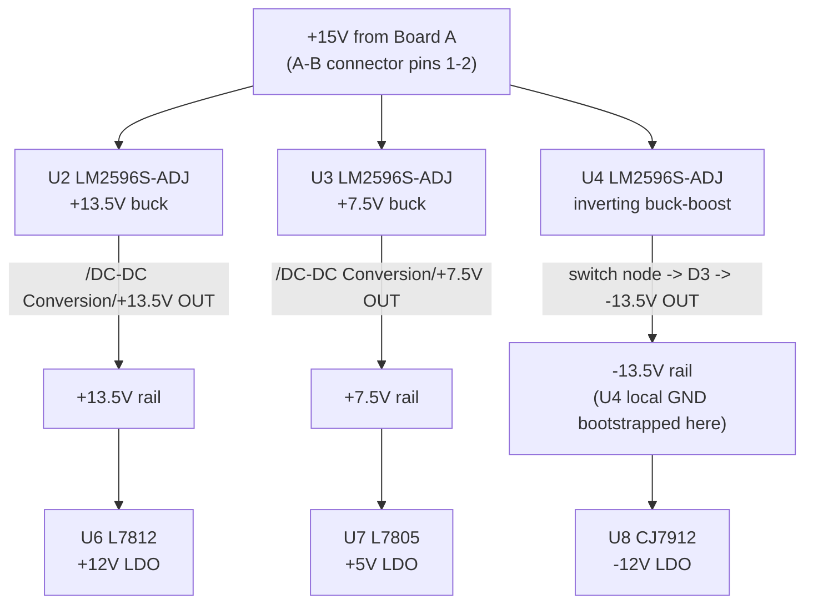
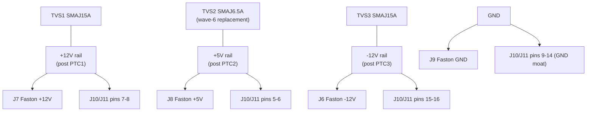

Board B is the **synth power conversion** half of the 2-board split (epic
[#86](https://github.com/Takazudo/zudo-pd/issues/86)). It receives a regulated
15 V from Board A (the USB-PD sink core) over a 6-pin cable and converts it into
the modular-synth rails: +12 V/1.2 A, −12 V/0.8 A, +5 V/0.5 A. Board B carries
every DC-DC converter, every linear regulator, all protection parts, and all
output connectors — in other words, essentially all of the board's dollar cost
and assembly complexity.

<Note>

Board B now has a real, generated KiCad project: `boards/board-b/board-b.kicad_sch`,
built by the `schgen` toolchain from `scripts/schgen/board_b_spec.py` — not hand-drawn.
The spec module is the source of truth; regenerate with `python3
scripts/schgen/gen_schematic.py board_b_spec` after editing it (see
`scripts/schgen/README.md`). PCB layout for Board B has not started yet (see epic #86
"Non-goals"). The stage-level net tables below are read directly from the spec module's
`NETS` table, which carries forward the DC-DC/LDO/protection/output connectivity from
the legacy, still-combined `zudo-pd.kicad_sch` (net names kept byte-identical to
`scripts/schgen/baselines/board-b.json` so `check_baseline.py` diffs cleanly) plus the
wave-6 locked decision deltas — part swaps, the `P1` ATT/PDOK provision, and the `TVS3`
orientation lock — see [Protection Stage](#protection-stage) and
[DC-DC Conversion Stage](#dc-dc-conversion-stage) below. The A↔B interface connector is
`J5` in the spec module (this page's connectivity tables use `J5`; the locked pinout
contract below keeps the generic "both boards" wording it was written with, since it is
byte-identical to the same block in the Board A doc).

</Note>

## Role in the 2-Board Split

| | Board A (USB-PD core) | **Board B (this doc)** |
|---|---|---|
| Carries | STUSB4500, USB-C receptacle, load switch, NVM programming pads | DC-DC converters, LDOs, protection, Eurorack + Faston outputs |
| Reusable elsewhere | Yes — generic "USB-PD 15 V sink module" | No — synth-specific rails and connectors |
| Component cost | Low (~$0.45, dominated by one $2.50 IC) | High (~$3.51 — see [Bill of Materials and Cost Split](#bill-of-materials-and-cost-split)) |
| Re-order cost when it fails | Small board, few Extended parts | Larger board, most of the design's Extended-part and hand-solder load |

This project has failed USB-PD negotiation on **four consecutive JLCPCB
orders** (v1–v4; see [current status](../inbox/current-status.md)), and every
failure traced back to the USB-PD front end, never to the DC-DC/LDO/protection
circuitry documented here. Splitting the boards means the next debug iteration
re-orders only the small, cheap board that actually keeps failing — see the
cost comparison below.

## Input: Board A ↔ Board B Interface Connector

<Warning>

The pinout table below is copied **exactly** from the locked spec in
[Board Split Decision](../inbox/board-split-decision.md) (#90, section
"Decision set (b)") and from sub-issue #92's own locked-spec block, so it is
byte-identical to the copy in the Board A doc
(`overview/board-a-usb-pd-core.md`). Do not edit the table's wording —
wave-4 (#95) diff-checks both copies against each other and against the
decision doc.

</Warning>

**Connector (both boards):** JST **B6B-XH-A(LF)(SN)** — 6-pin top-entry
shrouded THT header, 2.5 mm pitch, **LCSC C144397** (genuine JST; stock listed
2026-07-05, re-verify at order time). Rated 3 A/contact (AWG #22), 250 V.
**Cable:** commodity pre-crimped 6-way XH↔XH, AWG 22, 80–150 mm (or JST XHP-6
housings + SXH-001T-P0.6 contacts — verify stock at order time; cable-side
parts are not on the PCBA BOM).

| Pin | Signal | Direction | Notes |
|-----|--------|-----------|-------|
| 1 | +15V | A → B | Board A `VBUS_OUT` (post Q1 load switch), PD-contract 15 V |
| 2 | +15V | A → B | Paired with pin 1 (current sharing) |
| 3 | ATT | A → B, open-drain, active-low | STUSB4500 pin 11 (ATTACH). No pull-up on Board A; Board B (or any host) pulls up 10–100 kΩ to a local rail ≤5 V if used. May be left unconnected |
| 4 | PDOK | A → B, open-drain, active-low | STUSB4500 pin 20 (POWER_OK2): asserts when the PDO2 (15 V) contract is live. Same pull-up rule as ATT. May be left unconnected |
| 5 | GND | — | Paired return |
| 6 | GND | — | Paired return |

**Current-rating math:** worst case = PD contract cap **3.0 A @ 15 V**
(computed steady draw ≈2.5 A at the rated 26.5 W output budget). XH contact
nameplate 3.0 A; 80% continuous derate → 2.4 A/contact. 2 contacts per power
rail → 4.8 A derated capacity; at 3.0 A each contact carries 1.5 A = 50% of
nameplate → **1.6× derated margin (2.0× nameplate)**. GND identical (2
contacts, symmetric return). Cable drop ≈16 mV round trip at 3 A (2× AWG 22
per leg, 100 mm) — negligible.

**Keying/foolproofing:** the XH shrouded housing is mechanically polarized
(reversed insertion blocked). The 6-pin XH is the **only** 6-position XH on
either board — Board B's Eurorack outputs are 2×8 shrouded IDC and the Faston
tabs are physically incompatible, so the A↔B cable cannot land on a wrong
header. Pin 1 is silkscreened on both boards.

**Mechanical:** side-by-side, cable-linked (stacking rejected — see the
decision doc for the full rationale: USB-C enclosure access, Board A's NVM
pogo-pad access, Board B's TO-263 top-side airflow, and reuse). Each board
gets its own 4× M3 (3.2 mm) mounting holes; no shared hole pattern.

### How the connector feeds Board B's existing circuitry

In `boards/board-b/board-b.kicad_sch` (generated from `board_b_spec.py`), the interface
connector is `J5` and its pins map onto Board B's carried-forward nets like this:

| Connector pin(s) | Board B net | Note |
|---|---|---|
| 1, 2 (+15V) | `+15V -> +13.5V gen` | The shared bus feeding `U2.1 U3.1 U4.1` (see [DC-DC Conversion Stage](#dc-dc-conversion-stage)) |
| 5, 6 (GND) | `GND` | The system ground net |
| 3 (ATT), 4 (PDOK) | `ATT`, `PDOK` | Locked provision (decision `p1-form`,
`scripts/schgen/decisions.json`): routed to `P1`, a `PogoPad_1x04` bare-pad header (no
fitted component, out of BOM) — pin 1 = ATT, pin 2 = PDOK, pin 3 = GND probe return, pin
4 = declared no-connect. Board B is power-only and has no logic to consume these flags;
both signals are open-drain with **no on-board pull-up on either board** — any future
consumer wired to `P1` must supply its own pull-up to its own logic rail |

<Info>

The DC-DC input bus net is literally named `+15V -> +13.5V gen` in the
existing netlist — a leftover label from when U2 was the only thing on it (see
[Board B Architecture Review](../inbox/board-b-architecture-review.md) §2).
It already fans out to all three DC-DC converters, so Board B's layout simply
renames/re-derives this bus from the new connector instead of from the old
USB-PD sheet.

</Info>

## DC-DC Conversion Stage

Three LM2596S-ADJ (TO-263-5) converters, all fed from the shared +15 V input
bus: two non-inverting bucks (U2, U3) and one inverting buck-boost (U4). Net
connectivity below is from the current `dc-dc-conversion.kicad_sch` sheet,
unchanged by the split.

### Feedback dividers

| Converter | Rail | Top resistor (to output) | Bottom resistor (to GND) | Feedforward cap | Formula result |
|-----------|------|---------------------------|---------------------------|------------------|-----------------|
| U2 | +13.5V | R1 = 10k → FB | R2 = 1k, FB → GND | C31 (22nF) across R1 | `1.23 x (1 + 10k/1k) = 13.53V` |
| U3 | +7.5V | R3 = 5.1k → FB | R4 = 1k, FB → GND | C32 (22nF) across R3 | `1.23 x (1 + 5.1k/1k) = 7.503V` |
| U4 | −13.5V (inverting) | R6 = 1k, FB → −13.5V OUT | R5 = 10k, FB → GND | C33 (22nF) across R5 | `1.23 x (1 + 10k/1k) = 13.53V` (mirrored divider — see note below) |

All three recompute to their intended rail (formula per LM2596S-ADJ
datasheet, `Vout = 1.23 x (1 + Rtop/Rbottom)`, Vref = 1.23V). For U4, the IC's
own GND pin bootstraps to the negative output (see below), so the divider's
roles swap: the "bottom" resistor (R5, to system GND) and "top" resistor (R6,
to the negative output) give the mirrored formula
`|Vout| = 1.23 x (1 + R5/R6)`.

### Net tables

<Info title="Wave-6 part swaps on this stage's electrolytics">

Two locked decisions (`scripts/schgen/decisions.json`) change LCSC numbers on caps that
appear in the tables below, though the net names and pin roles are unchanged:

- **C5/C7** (decision (d)): swapped from the 100 µF/25 V ACMECON part to **FOLLON
  470 µF/35 V, LCSC C22387780** — the same line already fitted at C14/C20/C21/C24/C25.
  Restores positive input-cap voltage margin at both the 20 V mis-contract edge and the
  D5 clamp table point, and raises input bulk capacitance from 200 µF to 940 µF total.
- **C4/C22/C23** (decision (c)): canonical LCSC is **C335982** (ROQANG,
  `RVT1A471M0607`, 470 µF/10 V) — matches the drawn symbol and the `470uF 10V` Value
  label; `C22383803` (the number this project's docs previously carried) is a 16 V-rated
  alias part with far lower stock and is not what the spec module emits.

</Info>

**U2 — +13.5V buck**

| Net | Connected pins (Ref.Pin) | Value/Note |
|-----|--------------------------|------------|
| `+15V -> +13.5V gen` | `U2.1 C5.1 C6.1` (+ U3.1, U4.1 shared) | +15V input from Board A via the A↔B connector |
| `Net-(D1-K)` | `U2.2 D1.1 L1.1` | Switch node |
| `/DC-DC Conversion/+13.5V OUT` | `L1.2 R1.2 C3.1 C31.2` (+ `C14.1 C20.1 U6.1(IN)` on the LDO sheet) | +13.5V DC-DC output (U2's switch node reaches this net through L1); feeds U6 (L7812) |
| `Net-(U2-Feedback)` | `U2.4 R1.1 R2.2 C31.1` | FB divider midpoint |
| `GND` | `U2.3(Gnd) U2.5(~ON/OFF) U2.6(TAB) R2.1 C5.2 C6.2` | Always-enabled (ON/OFF tied to GND) |

**U3 — +7.5V buck**

| Net | Connected pins (Ref.Pin) | Value/Note |
|-----|--------------------------|------------|
| `+15V -> +13.5V gen` | `U3.1 C7.1 C8.1` (shared bus) | +15V input |
| `Net-(D2-K)` | `U3.2 D2.1 L2.1` | Switch node |
| `/DC-DC Conversion/+7.5V OUT` | `L2.2 R3.1 C4.1 C32.2` (+ `C15.1 C22.1 U7.1(IN)` on the LDO sheet) | +7.5V DC-DC output (U3's switch node reaches this net through L2); feeds U7 (L7805) |
| `Net-(U3-Feedback)` | `U3.4 R3.2 R4.1 C32.1` | FB divider midpoint |
| `GND` | `U3.3(Gnd) U3.5(~ON/OFF) U3.6(TAB) R4.2 C7.2 C8.2` | Always-enabled |

**U4 — −13.5V inverting buck-boost**

| Net | Connected pins (Ref.Pin) | Value/Note |
|-----|--------------------------|------------|
| `+15V -> +13.5V gen` | `U4.1 C9.1 C10.1` (shared bus) | +15V input |
| `Net-(D3-K)` | `U4.2 D3.1 L3.1` | Switch node |
| `/DC-DC Conversion/-13.5V OUT` | `U4.3(Gnd) U4.5(~ON/OFF) U4.6(TAB) D3.2 C9.2 C10.2 C11.2 R6.2` (+ `C16.1 C24.2 U8.2(VIN)` on the LDO sheet) | U4's own GND pin, ON/OFF, and TAB all bootstrap to −13.5V (not system GND) — feeds U8 (CJ7912) |
| `Net-(U4-Feedback)` | `U4.4 R5.1 R6.1 C33.1` | FB divider midpoint |
| `GND` (system) | `L3.2` only | Inductor references system GND (inverting topology: inductor switch-node→GND, catch diode switch-node→output — opposite of U2/U3's buck arrangement) |

### DC-DC stage topology

## Linear Regulator (LDO) Stage

Three L78xx-family LDOs clean up the DC-DC outputs for &lt;1mVp-p ripple.
Dropout margins below are from
[Board B Architecture Review](../inbox/board-b-architecture-review.md) (#89),
sourced against the L7812/L7805/CJ7912 datasheets.

| LDO | Rail | Intermediate → output | Available margin | Datasheet dropout (typ) | Actual load | Verdict |
|-----|------|------------------------|-------------------|---------------------------|--------------|---------|
| U6 L7812 | +12V | 13.5V → 12V | 1.5V | 2.0V @ `IO = 1A` | **1.2A** | **Open item — see below** |
| U7 L7805 | +5V | 7.5V → 5V | 2.5V | 2.0V @ `IO = 1A` | 0.5A | OK — real dropout at half the test current expected well under 2.0V |
| U8 CJ7912 | −12V | −13.5V → −12V | 1.5V | 1.1V @ `Io = 1A` | 0.8A | OK, thinner margin than +5V — worth a bench check at full load |

<Warning title="L7812 dropout — open design item, deferred to the Board B design plan">

The datasheet's own typical dropout (2.0V, measured at 1A) already exceeds the
1.5V available on this board — and the actual load (1.2A) is *higher* than the
1A test point, where dropout is worse, not better. This is **not** resolved
here; per the #90 decision (disposition A5#1) it is explicitly deferred,
bench-gated:

- **Gate:** bench-measure a real L7812 at 1.2A from a 13.5V source before
  Board B's layout is frozen.
- **Preferred direction if confirmed:** raise the +13.5V intermediate rail
  (e.g. R1 10k → 11k gives 14.76V). This raises U6's dissipation from
  ~1.8W to ~3.3W, so the final setpoint is locked together with Board B's
  thermal budget (heatsinking, TO-263 copper pour), not before.
- **Fallback:** swap U6 for a lower-dropout regulator.

Do not silently "fix" this by picking a rail voltage in this doc — the numeric
setpoint is a Board B design-phase decision, not a documentation decision.

</Warning>

### Net tables (linear-regulation.kicad_sch)

| Net | Connected pins (Ref.Pin) | Value/Note |
|-----|--------------------------|------------|
| `/DC-DC Conversion/+13.5V OUT` (relevant) | `C14.1 C20.1 U6.1(IN)` | +12V LDO input |
| `Net-(U6-OUT)` | `U6.3(OUT) C17.2 C21.1 R7.1 PTC1.1` | +12V LDO output, before PTC1 |
| `/DC-DC Conversion/+7.5V OUT` (relevant) | `C15.1 C22.1 U7.1(IN)` | +5V LDO input |
| `Net-(U7-OUT)` | `U7.3(OUT) C18.1 C23.1 R8.1 PTC2.1` | +5V LDO output, before PTC2 |
| `/DC-DC Conversion/-13.5V OUT` (relevant) | `C16.1 C24.2 U8.2(VIN)` | −12V LDO input |
| `Net-(U8-OUT)` | `U8.3(OUT) C19.1 C25.2 R9.1 PTC3.1` | −12V LDO output, before PTC3 |
| `GND` (relevant) | `C14.2 C15.2 C17.1 C18.2 C20.2 C21.2 C22.2 C23.2 U6.4 U7.2 U8.1` | +12V/+5V decoupling references GND individually (see below for the −12V network's corrected form) |

<Info title="Negative-rail decoupling — fixed in #93, document the corrected network">

The as-designed −12V decoupling network (C16/C19/C24/C25) has a genuine
missing-GND defect: today's netlist still shows all four caps' far plates
tied to each other on an isolated node (`Net-(C16-Pad2)`), not to `GND` —
unlike the mirrored +12V/+5V networks, where the equivalent far plates connect
individually to `GND`. Per the #90 decision (A5#2), this is **fixed in #93**
by merging `Net-(C16-Pad2)` into `GND` (`C16.2`, `C24.1`, `C19.2`, `C25.1` all
become `GND` members). Board B's design should carry forward the **corrected**
network — i.e. C16.2/C24.1 and C19.2/C25.1 route straight to `GND`, matching
the +12V/+5V pattern — not the network as it appears in today's still-unfixed
netlist.

</Info>

## Protection Stage

PTC resettable fuses plus TVS clamps on each output rail.

| Ref | Part (LCSC) | Hold current | Voltage rating | Rail | Rated load | Margin | Status |
|-----|-------------|--------------|-----------------|------|------------|--------|--------|
| PTC1 | [SMD1210P150TF/16](../components/ptc-12v.md) (C7529589) | 1.50A hold / 3.00A trip | 16V | +12V | 1.2A | +4V nominal (+2.5V at the passthrough corner) | OK — wave-6 replacement, decision (g) |
| PTC2 | [mSMD110-33V](../components/ptc-5v.md) (C70119) | 1.10A hold | 33V | +5V | 0.5A | 2.2× | OK |
| PTC3 | [BSMD1206-150-16V](../components/ptc-12v-neg.md) (C883133) | 1.50A hold | 16V | −12V | 0.8A | 1.875× | OK — 85°C-derated hold (0.77A) sits just under the 0.8A budget, NEEDS BENCH (finding BB-8) |
| TVS1 | [SMAJ15A](../components/smaj15a.md) (C571368) | — | VRWM 15V, clamp 24.4V @ 1A | +12V | — | 25% standoff headroom | OK |
| TVS3 | SMAJ15A (C571368) | — | same as TVS1; **locked orientation**: cathode (pin 1) → GND, anode (pin 2) → −12V rail | −12V | — | 25% standoff headroom | OK — orientation locked by decision `tvs3-orientation` |
| TVS2 | [SMAJ6.5A](https://jlcpcb.com/partdetail/C87267) (C87267) | — | VRWM 6.5V, breakdown ≥7.22V, clamp 11.2V @ 35.7A | +5V | — | +1.5V standoff over nominal, +1.3V over the L7805's guaranteed 5.2V band top | OK — wave-6 replacement, decision (a) |

<Info title="PTC1 and TVS2 were replaced by the wave-6 decision lock">

Both rows above changed from earlier drafts of this page:

- **PTC1** was `SMD1210P200TF` (C20808) — a part whose primary-sourced `Vmax` is
  **6 VDC**, a deterministic BLOCKER on a +12V rail (finding BB-1, `fact-ptc1-vmax`).
  This is now replaced by `SMD1210P150TF/16` (C7529589, 16V) in the Board B spec.
- **TVS2** was `SD05` (C502527), `VRWM = 5V` — exactly the +5V rail's nominal voltage
  (0% standoff margin), and the L7805's own datasheet allows the output to reach 5.2V
  under normal operation, already above that standoff (finding BB-2). This is now
  replaced by `SMAJ6.5A` (C87267) in the Board B spec.

Both replacements are locked in `scripts/schgen/decisions.json` (decisions (a) and (g))
and land in `boards/board-b/board-b.kicad_sch` via `scripts/schgen/board_b_spec.py` —
not as a future "Board B design phase" item. [components/sd05.md](../components/sd05.md)
still documents the removed SD05 part rather than the fitted SMAJ6.5A (it is linked from
~15 other pages across this site, so retitling it is a larger follow-up, not folded into
this pass) — the TVS2 row above links straight to the JLCPCB catalog page instead.

</Info>

## Output Connectors

### J6–J9 — Faston rail terminals

| Ref | Net | Signal |
|-----|-----|--------|
| J6 | `-12V rail` | −12V |
| J7 | `+12V rail` | +12V |
| J8 | `+5V rail` | +5V |
| J9 | `GND` | GND |

Unambiguous 1:1 rail assignment — each Faston terminal's two tabs are tied to
the same net.

### J10/J11 — 2×8 Eurorack power headers

| Pin(s) | Net | Note |
|--------|-----|------|
| 1–2 | `GATE rail` | Isolated stub — power-only board, nothing else on this net |
| 3–4 | `CV rail` | Isolated stub |
| 5–6 | `+5V rail` | |
| 7–8 | `+12V rail` | |
| 9–14 | `GND` | Six-pin GND "moat" separating +12V from −12V |
| 15–16 | `-12V rail` | Far end from CV/Gate/+5V — a one-pin connector misalignment lands on GND, never on +12V/−12V or a signal line |

This matches the community-standard Doepfer/Eurorack 16-pin power-header
convention. The exact physical key/polarization-slot orientation of the
`2541WR-2X08P` footprint (whether pin 1 truly sits under the red-stripe
cable convention) is not verifiable from the netlist — confirm against the
footprint silkscreen or a physical board before finalizing Board B's layout.

### Output stage topology

## Bill of Materials and Cost Split

Board B carries essentially all of the design's dollar cost and assembly
complexity. Figures below are the existing single-board
[BOM](./bom.md)'s per-stage subtotals, remapped onto the split.

### Component subtotal by board

| Board | Stages carried | Component subtotal | Source |
|-------|-----------------|---------------------|--------|
| Board A | USB-PD (STUSB4500, load switch, USB-C receptacle, ESD/TVS, resistors/caps) | **~$0.45** | [BOM](./bom.md) Stage 1 |
| **Board B** | DC-DC ($2.09) + LDO ($0.37) + Protection ($0.77) + Output ($0.28) | **~$3.51** | [BOM](./bom.md) Stages 2–5 |

Both boards additionally carry one A↔B interface connector (JST B6B-XH-A,
LCSC C144397, a few cents each) — negligible next to the totals above.

### Why the expensive parts land on Board B

| Category | Parts | Unit price | Qty | Board |
|----------|-------|------------|-----|-------|
| USB-PD controller | U1 STUSB4500QTR | $2.50 | 1 | A |
| Power inductors, 100µH/4.5A | L1, L2, L3 | $0.378 | 3 | **B** |
| DC-DC converter ICs (TO-263-5) | U2, U3, U4 LM2596S-ADJ | $0.266 | 3 | **B** |
| Bulk electrolytics, 470µF (25V/35V) | C3, C11, C14, C20, C21, C24, C25 | $0.04 | 7 | **B** |
| Bulk electrolytics, 470µF (16V) | C4, C22, C23 | $0.05 | 3 | **B** |
| LDO regulators (TO-263-2 / TO-252) | U6 L7812, U7 L7805, U8 CJ7912 | $0.11 | 3 | **B** |
| Faston power terminals | J6–J9 | ~$0.26 | 4 | **B** |
| 2×8 Eurorack headers | J10, J11 | ~$0.08 | 2 | **B** |
| USB-C receptacle | J1 | $0.05 | 1 | A |
| Load-switch MOSFET | Q1 AO3401A | $0.02 | 1 | A |

U1 (STUSB4500) is Board A's single priciest part, but Board B still carries
**~8× Board A's total component cost** — and, more importantly for
manufacturing cost, nearly all of the design's physically large/hand-solder-
candidate parts (electrolytics up to 10.2mm tall, THT Faston tabs, THT 2×8
headers) and distinct Extended-part-fee line items (JLCPCB charges
**¥470 per unique Extended part number**, one-time — see
[BOM](./bom.md#jlcpcb-assembly-cost-structure)).

### Why split: debug-iteration cost comparison

This project has needed **four** re-orders so far (v1–v4), and every failure
has been in the USB-PD front end — never in the DC-DC/LDO/protection
circuitry this doc covers. Under the current single, combined board, every
one of those re-orders paid for the *entire* board:

| | Single combined board (current) | Split — Board A only re-ordered |
|---|---|---|
| Extended parts re-paid | ~20 unique Extended parts (~¥9,400 setup fee, per [BOM](./bom.md#jlcpcb-assembly-cost-structure)) | A handful — STUSB4500, USB-C receptacle, the shared A↔B connector (roughly 3–4 unique Extended parts) |
| Hand-solder / THT candidates re-paid | Faston terminals, 2×8 headers, tall electrolytics — none of which were the bug | None of these exist on Board A |
| PCB fabrication + stencil | Full-size board | Small board (front-end only) |
| Reference single-unit total (from [BOM](./bom.md#jlcpcb-assembly-cost-structure)) | **~¥16,500** for 1 board | Order-of-magnitude estimate: **~¥3,000–5,000** for 1 board, given roughly 3–4 of ~20 Extended parts and a much smaller PCB |

<Note>

The Board-A-only figure is an **illustrative, order-of-magnitude estimate**,
not a quote — Board A's actual layout, part count, and size are not finalized
yet (that is the next plan, per epic #86's "Non-goals"). The point the split
is designed to prove is qualitative and robust regardless of the exact
multiplier: a USB-PD-only debug iteration (the failure mode this project has
hit on every revision to date) no longer has to re-pay for inductors, LDOs,
electrolytics, and connectors that were never the problem.

</Note>

## Design Notes from the #89 Architecture Review

Every finding from
[Board B Architecture Review](../inbox/board-b-architecture-review.md) (#89)
carried into this doc, with its locked disposition from
[Board Split Decision](../inbox/board-split-decision.md) (#90, section A5):

| Finding | Disposition | Status |
|---------|-------------|--------|
| U6 (L7812) dropout margin: 1.5V available &lt; 2.0V typ dropout at a *lower* test current than the actual 1.2A load | **Deferred to the Board B design plan, bench-gated** | Open — see [Linear Regulator Stage](#linear-regulator-ldo-stage) |
| U8 (CJ7912) −12V decoupling network's `Net-(C16-Pad2)` missing its GND tie | **Fixed in #93** | Resolved — document the corrected network (see [Linear Regulator Stage](#linear-regulator-ldo-stage)) |
| C9 (100µF, 25V rated) bridges +15V to −13.5V = 28.5V nominal (33.5V @ 20V edge case), over its own rating | **Fixed in #93** — swapped to DMBJ RVT1H101M0810, 100µF 50V, LCSC C970687 (alt: Semtech CK1H101M-CRF10, C129420); can grows to 8×10.2mm | Resolved — Board B gets a fresh layout anyway, so the footprint change is free |
| TVS2 (SD05) zero standoff margin on the +5V rail | **Resolved — wave-6 decision (a)** — swapped to Brightking SMAJ6.5A, LCSC C87267 | Resolved — see [Protection Stage](#protection-stage) |
| C4/C22/C23 Value field says "16V" but the actual LCSC part (`RVT1A471M0607`/C335982) is 10V-rated | **Fixed in #93** — Value field corrected to `470uF 10V` (electrically safe on the 7.5V/5V nets either way); LCSC number canonicalized on C335982 in the Board B spec (wave-6 decision (c)) | Resolved — data-integrity only, no netlist change |
| PTC1 voltage rating not confirmed from available sources | **Resolved — wave-5 evidence review confirmed 6VDC (BLOCKER, finding BB-1); wave-6 decision (g)** — swapped to RUILON SMD1210P150TF/16, LCSC C7529589 (16V) | Resolved — see [Protection Stage](#protection-stage) |
| U4 inverting buck-boost referencing (GND/ON-OFF/TAB bootstrap, D3/L3 orientation) | OK-confirmed, no action | Carried forward unchanged |
| C5/C7 input-cap margin at the 20V edge case (20% headroom) | **Resolved — wave-6 decision (d)** — swapped to FOLLON 470µF/35V, LCSC C22387780 (same line as C14/C20/C21/C24/C25); margin now +2.6V at the D5 clamp table point and +15V at the 20V edge | Resolved — see [DC-DC Conversion Stage](#dc-dc-conversion-stage) |
| J10/J11 Eurorack header structure (GND moat, −12V placement) | OK-confirmed (structure); physical key orientation not netlist-verifiable | Carried forward — verify key orientation against the footprint/physical board before Board B layout is finalized |

## References

- [Board Split Decision](../inbox/board-split-decision.md) (#90) — the locked
  A↔B interface contract and the #89 finding dispositions this doc implements
- [Board B Architecture Review](../inbox/board-b-architecture-review.md) (#89)
  — full DC-DC/LDO/protection/output review this doc's stage sections summarize
- [Spec-Architecture Review](../inbox/spec-architecture-review.md) — the wave-5
  evidence review behind the PTC1/TVS2/C5-C7/C4-C22-C23 part-swap decisions above
  (findings BB-1, BB-2, BB-6)
- `scripts/schgen/decisions.json` and `scripts/schgen/board_b_spec.py` — the locked
  wave-6 decision record and the spec module that generates
  `boards/board-b/board-b.kicad_sch`
- [generated component records](/docs/components/records/) — validated evidence for every
  part on both boards, projected from the component skill bundles
- [Bill of Materials](./bom.md) — full single-board parts list, prices, and
  the JLCPCB Extended-parts fee structure referenced in the cost split above
- [Mechanical Design](./mechanical-design.md) — component heights driving
  Board B's enclosure/heatsink design
- [Circuit Diagrams](./circuit-diagrams.mdx) — schemdraw-generated diagrams
  for the DC-DC ([D2](./circuit-diagrams.mdx#diagram2-usb-pd-15v--135v-buck-converter-lm2596s-adj-1)/[D3](./circuit-diagrams.mdx#diagram3-15v--75v-buck-converter-lm2596s-adj-2-u3)/[D4](./circuit-diagrams.mdx#diagram4-15v---135v-inverting-buck-boost-lm2596s-adj-u4))
  and LDO ([D5](./circuit-diagrams.mdx#diagram5-135v--12v-linear-regulator-l7812-u6)/[D6](./circuit-diagrams.mdx#diagram6-75v--5v-linear-regulator-l7805-u7)/[D7](./circuit-diagrams.mdx#diagram7--135v---12v-linear-regulator-cj7912-u8))
  stages, still valid for Board B
- [Net-Table + Mermaid Convention](../how-to/net-table-convention.md) — the
  documentation convention followed above
- Board A (USB-PD core) design doc — `overview/board-a-usb-pd-core.md`
  (sibling doc, #91)
