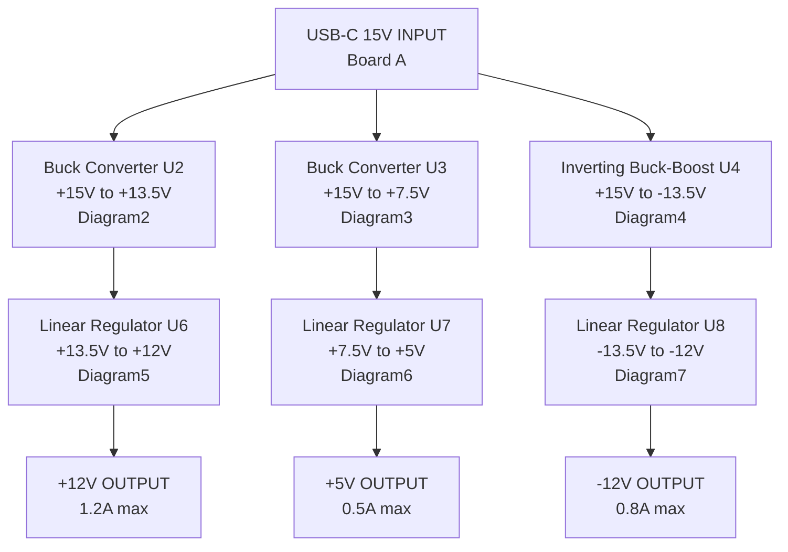

Complete circuit configuration shown in stages.

These diagrams cover the **Board B** conversion chain (DC-DC → LDO → protection). The
USB-PD front end that feeds it now lives on **Board A** and is documented in
[Board A: USB-PD Core](./board-a-usb-pd-core.md) — see
[USB-PD Input Stage (Board A)](#usb-pd-input-stage-board-a) below.

## Power Flow Overview

This diagram shows the complete power conversion chain from USB-C input to all output rails, including the relationship between all circuit diagrams.



**Power Conversion Strategy:**

- **Two-stage design**: DC-DC converters provide efficient voltage reduction, linear regulators provide low-noise final outputs
- **+12V rail**: USB-C 15V → Buck (U2) → LDO (U6) → +12V OUT
- **+5V rail**: USB-C 15V → Buck (U3) → LDO (U7) → +5V OUT
- **-12V rail**: USB-C 15V → Inverting Buck-Boost (U4) → LDO (U8) → -12V OUT

---

## USB-PD Input Stage (Board A)

The USB-PD front end is no longer documented here. It moved to its own board and its own
page when the project split in two: **[Board A: USB-PD Core](./board-a-usb-pd-core.md)**
carries the STUSB4500 (U1), the USB-C receptacle (J1), the Q1 load switch and its gate
network, the D5 VBUS clamp, the D8 gate-source zener, and the J4 interface connector that
feeds Board B's `+15V` rail.

That page is generated against `scripts/schgen/board_a_spec.py`, the spec module that
`boards/board-a/board-a.kicad_sch` is built from, so it stays in step with the schematic.
The ASCII drawing that used to sit here did not: it still showed `D4` (USBLC6-2SC6), a part
[removed entirely](./board-a-usb-pd-core.md#deltas-vs-the-current-single-board-circuit) from
the design, and `R17`/`R18` as fitted when both are now DNP.

Start with these sections of the Board A page:

- [Net-connectivity table](./board-a-usb-pd-core.md#net-connectivity-table-fixed-circuit) — the authoritative pin-to-net record, replacing the old ASCII schematic
- [Deltas vs the current single-board circuit](./board-a-usb-pd-core.md#deltas-vs-the-current-single-board-circuit) — what was removed, set DNP, rewired, and added
- [Load switch: Q1 gate network and soft-start](./board-a-usb-pd-core.md#load-switch-q1-gate-network-and-soft-start) — the R11/R12/C35 network and the 5.6 ms time constant
- [Power sequencing (VBUS_EN_SNK)](./board-a-usb-pd-core.md#power-sequencing-vbus_en_snk) — the negotiation-to-power-on sequence
- [A↔B interface contract](./board-a-usb-pd-core.md#a↔b-interface-contract-locked-—-copied-verbatim-from-90) — the J4/J5 pinout this page's `+15V` input arrives on

<Note title="Diagram numbering is unchanged">

The remaining diagrams keep their original D2–D7 numbers and anchors, so existing links
into them still resolve. There is no Diagram1 any more.

</Note>

## Diagram2: USB-PD +15V → +13.5V Buck Converter (LM2596S-ADJ #1)


**Key Points:**

- **Two-stage design**: Buck converter (U2) reduces voltage with high efficiency, then linear regulator (LM7812) provides low-noise final output
- **Capacitor order**: C5/C6 (input filter) → [U2 + L1] → C3 (buck output filter) → [LM7812] → output capacitors
- **C3 role**: Filters switching ripple from buck converter before feeding the linear regulator
- **Switching node**: Junction at OUTPUT pin 2, where L1 and D1 cathode connect
- **D1 flyback path**: Provides current path when U2's internal switch is OFF (D1 cathode → switching node; D1 anode → GND)
- **L1 output and D1 anode are completely separate paths** - they do NOT connect to each other

<Details title="View ASCII art circuit">

  ``` Buck Converter IC: ┌──────────────────────┐ +15V IN ────────────┤1 VIN OUTPUT 2├─── Switching Node ──┬─→ L1 (100µH, 4.5A) ─→ +13.5V │ │ │ │ FB 4├─── Tap │ │ │ (feedback) │ ┌──┤3 GND │ │ │ │5 ON/OFF (tie to GND) │ D1 SS34 │ └──────────────────────┘ cathode GND LM2596S-ADJ │ (TO-263-5L) anode │ GND Input Capacitors (C6 closest to IC): +15V ──┬────────────────┬─── To IC Pin 1 │ │ C5 C6 470µF/35V 100nF electrolytic ceramic (farther) (CLOSE!) │ │ GND GND Output Filter: ┌─── To Linear Regulator (LM7812) │ +13.5V ──────────┼─── C3 (470µF/25V) │ electrolytic │ │ │ GND │ Signal Path: +15V → [U2] → L1 → +13.5V → C3 → [LM7812] → +12V OUT Feedback Network (Voltage Divider with Compensation): +13.5V ──┬─── R1 (10kΩ) ───┬─── R2 (1kΩ) ─── GND │ │ └─── C31 (22nF) ──┤ │ Tap → To IC Pin 4 (FB) Components: - R1 (10kΩ) with C31 (22nF) in parallel: Creates pole-zero compensation (Type II) - R2 (1kΩ): Sets feedback tap voltage - C31 (22nF ceramic): Feedback compensation capacitor in parallel with R1 - Improves transient response and loop stability - Reduces switching noise on feedback line - Prevents oscillation Tap voltage = +13.5V × R2/(R1+R2) = 13.5V × 1kΩ/11kΩ = 1.23V U2 maintains FB pin at 1.23V reference by adjusting duty cycle ```

</Details>

<Details title="Connection List">

  **Input Power:** - `+15V input` → `U2 (LM2596S-ADJ) pin 1 (VIN)` - `GND` → `U2 pin 5 (ON/OFF)` (always-on: tie to GND or leave floating) **Output Path (Buck Converter Topology):** 1. `U2 pin 2 (OUTPUT)` → `L1 (100µH, 4.5A)` → Junction point 2. Junction point → `C3 (470µF/25V)` → `GND` (output filter capacitor) 3. Junction point → `+13.5V output` (to next stage) **Flyback Diode (Freewheeling Diode):** - `D1 (SS34 Schottky)`: - Cathode → Junction between `OUTPUT (pin 2)` and `L1` - Anode → `GND` - Purpose: Provides path for inductor current when switch turns off **Input Capacitors:** - `C5 (470µF/35V electrolytic)`: `+15V input` ⟷ `GND` (bulk input filter; raised from 100µF/25V by wave-6 decision (d)) - `C6 (100nF ceramic)`: `+15V input` ⟷ `GND` (high-frequency decoupling) **Output Capacitor:** - `C3 (470µF/25V electrolytic)`: Connected **in parallel** between `+13.5V output` ⟷ `GND` - Purpose: Output filtering, ripple reduction, and energy storage for transient response - **Important**: C3 is NOT in series with the output - it's a shunt element that allows AC ripple current to flow to GND **Feedback Network (Voltage Setting):** - Voltage divider: `+13.5V output` → `R1 (10kΩ)` → **Tap point** → `R2 (1kΩ)` → `GND` - `U2 pin 4 (FB)` → Connected to **tap point** (junction between R1 and R2) - The tap point voltage = `13.5V × R2/(R1+R2) = 13.5V × 1kΩ/11kΩ = 1.23V` - Chip maintains FB pin at 1.23V by adjusting duty cycle - Output voltage formula: `VOUT = 1.23V × (1 + R1/R2) = 1.23V × (1 + 10kΩ/1kΩ) = 13.53V` **Ground:** - `U2 pin 3 (GND)` → `System GND` - All capacitor negative terminals → `System GND` - `D1 anode` → `System GND` **Key Points:** - The inductor L1 is on the **OUTPUT side** of pin 2 (OUTPUT), not the input side - D1 cathode connects to the junction between OUTPUT (pin 2) and L1 (the "switching node") - When U2's internal switch is ON: Current flows VIN → Switch → OUTPUT → L1 → C3 → Load - When U2's internal switch is OFF: Inductor current flows through D1 (L1 → D1 → GND → L1)

</Details>

## Diagram3: +15V → +7.5V Buck Converter (LM2596S-ADJ #2, U3)


**Key Points:**

- **Switching node** is the junction at OUTPUT pin 2
- **Path 1**: Switching node → L2 → +7.5V output (main current path)
- **Path 2**: Switching node → D2 cathode; D2 anode → GND (flyback/freewheeling path)
- **D2** has exactly 2 connections: cathode to switching node, anode to GND
- **L2 output and D2 anode are completely separate paths** - they do NOT connect to each other

<Details title="View ASCII art circuit">

  ``` Input: +15V ──┬─── C7 (470µF/35V) ─── GND │ └─── C8 (100nF) ─── GND Controller: U3 (LM2596S-ADJ) +15V ────────┤ VIN (1) OUTPUT (2) ├─── Switching Node FB (4) ├───→ Tap (see feedback network below) GND ─────────┤ GND (3) │ ON/OFF (5) (always-on: tie to GND or leave floating) Switching Node splits into TWO paths: Path 1 (to output): Switching Node ──→ L2 (100µH, 4.5A) ──→ +7.5V Out Path 2 (flyback): Switching Node ──→ D2 cathode (SS34 Schottky) D2 anode ──→ GND Output Filter: +7.5V Out ──→ C4 (470µF/10V) ──→ GND ``` ### Feedback Network (Voltage Divider with Compensation) ``` Feedback Network (Voltage Divider with Compensation): +7.5V ──┬─── R3 (5.1kΩ) ──┬─── R4 (1kΩ) ─── GND │ │ └─── C32 (22nF) ──┤ │ Tap → To IC Pin 4 (FB) Components: - R3 (5.1kΩ) with C32 (22nF) in parallel: Creates pole-zero compensation (Type II) - R4 (1kΩ): Sets feedback tap voltage - C32 (22nF ceramic): Feedback compensation capacitor in parallel with R3 - Improves transient response and loop stability - Reduces switching noise on feedback line - Prevents oscillation Tap voltage = +7.5V × R4/(R3+R4) = 7.5V × 1kΩ/6.1kΩ = 1.23V U3 maintains FB pin at 1.23V reference by adjusting duty cycle ```

</Details>

<Details title="Connection List">

  **Input Power:** - `+15V input` → `U3 (LM2596S-ADJ) pin 1 (VIN)` - `GND` → `U3 pin 5 (ON/OFF)` (always-on: tie to GND or leave floating) **Output Path (Buck Converter Topology):** 1. `U3 pin 2 (OUTPUT)` → `L2 (100µH, 4.5A)` → Junction point 2. Junction point → `C4 (470µF/10V)` → `GND` (output filter capacitor) 3. Junction point → `+7.5V output` (to L7805 linear regulator) **Flyback Diode (Freewheeling Diode):** - `D2 (SS34 Schottky)`: - Cathode → Junction between `OUTPUT (pin 2)` and `L2` - Anode → `GND` - Purpose: Provides path for inductor current when switch turns off **Input Capacitors:** - `C7 (470µF/35V electrolytic)`: `+15V input` ⟷ `GND` (U3's own bulk input filter — U2 has its own pair, C5/C6) - `C8 (100nF ceramic)`: `+15V input` ⟷ `GND` (high-frequency decoupling) **Output Capacitor:** - `C4 (470µF/10V electrolytic)`: Connected **in parallel** between `+7.5V output` ⟷ `GND` - Purpose: Output filtering, ripple reduction, and energy storage for transient response - **Important**: C4 is NOT in series with the output - it's a shunt element that allows AC ripple current to flow to GND **Feedback Network (Voltage Setting):** - Voltage divider: `+7.5V output` → `R3 (5.1kΩ)` → **Tap point** → `R4 (1kΩ)` → `GND` - `U3 pin 4 (FB)` → Connected to **tap point** (junction between R3 and R4) - The tap point voltage = `7.5V × R4/(R3+R4) = 7.5V × 1kΩ/6.1kΩ = 1.23V` - Chip maintains FB pin at 1.23V by adjusting duty cycle - Output voltage formula: `VOUT = 1.23V × (1 + R3/R4) = 1.23V × (1 + 5.1kΩ/1kΩ) = 7.5V` **Ground:** - `U3 pin 3 (GND)` → `System GND` - All capacitor negative terminals → `System GND` - `D2 anode` → `System GND` **Key Points:** - The inductor L2 is on the **OUTPUT side** of pin 2 (OUTPUT), not the input side - D2 cathode connects to the junction between OUTPUT (pin 2) and L2 (the "switching node") - When U3's internal switch is ON: Current flows VIN → Switch → OUTPUT → L2 → C4 → Load - When U3's internal switch is OFF: Inductor current flows through D2 (L2 → D2 → GND → L2) - This stage provides +7.5V to the L7805 linear regulator for final +5V output

</Details>

## Diagram4: +15V → -13.5V Inverting Buck-Boost (LM2596S-ADJ, U4)


**Key Points:**

- **Inverting buck-boost topology**: LM2596S-ADJ configured to convert positive input to negative output in a single stage
- **Bootstrapped ground**: IC GND pin connected to negative output (-13.5V), allowing FB pin to regulate correctly
- **High efficiency**: Single-stage conversion eliminates intermediate -15V stage
- **Same IC family**: Uses LM2596S-ADJ (same as Diagram2/3 buck converters)
- **Input voltage**: +15V from USB-PD
- **Output voltage**: -13.5V (feeds LM7912 linear regulator for final -12V output)
- **Current capability**: 800mA+ (sufficient for -12V rail)
- **Switching frequency**: 150kHz (LM2596 default)

<Details title="View ASCII art circuit">

  ``` Inverting Buck-Boost Configuration (LM2596S-ADJ, U4): Critical Concept: IC GND pin is connected to -13.5V output (bootstrapped) System GND (0V) is the reference point for input and feedback Input Power Path: ┌──────────────────┐ │ LM2596S-ADJ │ +15V IN ─────────────────────┤1 VIN │ │ (U4) │ │ │ │ ON/OFF 5 ──┼──○ (Float = ON) │ │ │ FB 4──┼─── (see feedback network below) │ │ │ OUT 2──┼─── (see switching section below) │ │ │3 IC GND ─────────┼──── -13.5V OUT └──────────────────┘ (Bootstrapped: IC GND pin at -13.5V, NOT 0V!) Input Capacitors (bridge between +15V and -13.5V, in parallel): +15V IN ──┬─── C9 (100µF electrolytic) ───┬─── -13.5V OUT │ │ (IC GND pin 3) └─── C10 (100nF ceramic) ───────┘ ⚠️ Critical: Input capacitors C9/C10 span from +15V to -13.5V (28.5V total stress!) IC GND pin is NOT at system ground - it's at -13.5V Buck-Boost Switching Section: ┌─────────────────────────┐ │ U4 pin 2 (OUT) │ └──────┬──────────────────┘ │ Switching Node (junction point) │ ┌────────────┴────────────┐ │ │ [ L3 ] D3 Cathode Inductor │ 100µH Schottky │ SS34 │ 3A 40V │ │ │ D3 Anode │ │ System GND (0V) -13.5V OUT (= IC GND pin 3) Output Filter Capacitor (between System GND (0V) and -13.5V): System GND (0V) ──── C11 (470µF electrolytic) ──── -13.5V OUT (+ to System GND (0V)) Operation Sequence: 1. SW ON: Current flows VIN → U4 switch → OUT → L3 → System GND (0V) (D3 is reverse-biased, energy stored in L3) 2. SW OFF: Inductor current continues flowing L3 → D3 → -13.5V OUT (D3 conducts, transferring energy to output capacitor) Detailed Component Connections: Input Filter Capacitors (parallel connection): +15V IN ─┬─── C9 (100µF electrolytic) ───┬─── -13.5V OUT │ (bulk filter, │ (IC GND pin 3) │ farther from IC) │ │ │ └─── C10 (100nF ceramic) ───────┘ (high-freq decoupling, CLOSE to IC!) ⚠️ Critical: Input caps see VIN + |VOUT| = 15V + 13.5V = 28.5V total! Use 50V rated capacitors for safety margin ⚠️ Electrolytic C9 polarity: Positive (+) terminal → +15V IN Negative (-) terminal → -13.5V OUT (IC GND pin 3) Output Filter Capacitor: System GND (0V) ──── C11 (470µF electrolytic) ──── -13.5V OUT (output filter) (IC GND pin 3) ⚠️ Electrolytic C11 polarity: Positive (+) terminal → System GND (0V) Negative (-) terminal → -13.5V OUT Note: Only one output capacitor needed - linear regulator (LM7912) provides additional filtering downstream Feedback Network (Voltage Divider with Compensation): System GND (0V) ──┬─── R5 (10kΩ) ───┬─── FB pin 4 (to U4) │ │ └─── C33 (22nF) ──┤ │ R6 (1kΩ) │ -13.5V OUT Components: - R5 (10kΩ) with C33 (22nF) in parallel: Creates pole-zero compensation (Type II) - R6 (1kΩ): Sets feedback tap voltage - C33 (22nF ceramic): Feedback compensation capacitor in parallel with R5 - Improves transient response and loop stability - Reduces switching noise on feedback line - Prevents oscillation FB Pin Voltage Calculation: - IC regulates FB to +1.23V above IC GND (-13.5V) - Output voltage: VOUT = -1.23V × (1 + R5/R6) - With R5=10kΩ, R6=1kΩ: VOUT = -1.23V × 11 = -13.53V ✓ FB pin absolute voltage (relative to system GND): VFB = -13.5V + 1.23V = -12.27V (relative to system GND) But FB is +1.23V relative to IC GND (what matters!) ✓ Complete Pin Connections: - Pin 1 (VIN): +15V input power - Pin 2 (OUT): Switch output → L3 inductor → System GND (0V) - Pin 3 (IC GND): -13.5V output (bootstrapped ground) - Pin 4 (FB): Feedback divider tap (R5/R6) - Pin 5 (ON/OFF): Floating (internal pull-up enables regulator) ``` **Component Selection:** - **U4**: LM2596S-ADJ (same IC as Diagram2/3) - **L3**: 100µH inductor, 4.5A saturation current rating (same as Diagram2/3) - **D3**: SS34 Schottky diode, 3A, 40V (LCSC C8678 — the same part as D1/D2; catch diode from SW to -13.5V, 40V reverse rating against the 28.5V nominal VIN+|VOUT| stress = 1.4× margin) - **C9**: 100µF electrolytic, 50V rating (input bulk, sees VIN+|VOUT| = 28.5V) - **C10**: 100nF ceramic, 50V X7R (input decoupling) - **C11**: 470µF electrolytic, 25V rating (output filter - single cap, LM7912 filters downstream) - **R5**: 10kΩ ±1% (feedback upper resistor) - **R6**: 1kΩ ±1% (feedback lower resistor) - **C33**: 22nF ceramic, 25V X7R (feedback compensation, parallel with R5) **Key Design Notes:** 1. **Bootstrapped Ground**: IC GND pin connects to negative output, not system ground 2. **Input Voltage Stress**: Input caps see VIN + |VOUT| = 28.5V (use 50V rating) 3. **Diode Selection**: D3 must handle VIN + |VOUT| reverse voltage (SS34's 40V gives 1.4× margin at the 28.5V nominal stress) 4. **FB Pin Safety**: FB is always +1.23V above IC GND (safe, within spec) 5. **Single Stage**: Eliminates intermediate -15V conversion, improves efficiency 6. **Output Polarity**: Output capacitor C11 has + terminal to System GND (0V), - terminal to -13.5V

</Details>

<Details title="Connection List">

  **Input Power:** - `+15V input` → `U4 (LM2596S-ADJ) pin 1 (VIN)` - `U4 pin 3 (IC GND)` → `-13.5V output` (bootstrapped ground, NOT system GND!) - `U4 pin 5 (ON/OFF)` → Floating (internal pull-up enables regulator) **Output Path (Inverting Buck-Boost Topology):** 1. `U4 pin 2 (OUT)` → `L3 (100µH, 3A)` → `System GND (0V)` 2. `System GND (0V)` → `C11 (470µF)` → `-13.5V output` (filter capacitor) 3. `-13.5V output` → To LM7912 linear regulator (Diagram7) **Catch Diode (Freewheeling Path):** - `D3 (SS34 Schottky, 3A, 40V)`: - Cathode → Junction between `OUT (pin 2)` and `L3` - Anode → `-13.5V output` (IC GND) - Purpose: Provides energy transfer path when switch turns off **Input Capacitors:** - `C9 (100µF electrolytic, 50V)`: Between `+15V input` and `-13.5V output` (IC GND) - **Critical**: Sees VIN + |VOUT| = 28.5V total voltage! - `C10 (100nF ceramic, 50V)`: Between `+15V input` and `-13.5V output` (high-frequency decoupling) **Output Capacitor:** - `C11 (470µF electrolytic, 25V)`: Between `System GND (0V)` and `-13.5V output` - **Polarity**: Positive terminal to System GND (0V), negative terminal to -13.5V - Single capacitor sufficient - LM7912 linear regulator provides additional filtering **Feedback Network (Voltage Setting):** - Voltage divider: `System GND (0V)` → `R5 (10kΩ)` → **Tap point** → `R6 (1kΩ)` → `-13.5V output` - `U4 pin 4 (FB)` → Connected to **tap point** (junction between R5 and R6) - The tap point voltage = `1.23V above IC GND` (FB regulation point) - Output voltage formula: `VOUT = -1.23V × (1 + R5/R6) = -1.23V × 11 = -13.53V` **Key Topology Points:** - **Parallel paths from switching node:** OUT pin splits into TWO parallel branches: 1. L3 inductor path: OUT → L3 → System GND (0V) 2. Diode path: OUT → D3 cathode; D3 anode → -13.5V OUT (IC GND) - **Switch ON phase:** Current flows VIN → Switch → OUT → L3 → System GND (0V) - D3 is reverse-biased (cathode at +voltage, anode at -13.5V) - Energy stored in L3 magnetic field - **Switch OFF phase:** Inductor maintains current flow L3 → D3 → -13.5V OUT - D3 conducts forward (provides return path for inductor current) - Energy transferred from L3 to output capacitor - **Result:** Negative output voltage relative to System GND (0V) **Voltage Reference Points:** - **System GND (0V)**: Reference point for measurements and feedback network top - **IC GND (U4 pin 3)**: Connected to -13.5V output (bootstrapped) - **FB pin**: Regulated to +1.23V above IC GND = -12.27V relative to system GND (but IC sees +1.23V, which is safe!)

</Details>

## Diagram5: +13.5V → +12V Linear Regulator (L7812, U6)


**Capacitor Placement (Critical for PCB layout):**

- **C17 (ceramic)**: Place RIGHT NEXT to the output pin (minimize trace length for high-freq filtering)
- **C14/C20/C21 (electrolytic)**: Can be placed farther from IC (bulk storage, less sensitive to distance)

**Key Points:**

- **Two-stage design**: Buck converter (U2) provides efficient voltage reduction, linear regulator (U6) provides low-noise final output
- **Input capacitors**: C14 and C20 — **both** 470µF/35V electrolytics on `+13.5V`. Unlike U7/U8, this position carries no small ceramic on its input (`board_b_spec.py`: `C14.1` and `C20.1` are the only LDO-input pins on the `+13.5V OUT` net)
- **Output capacitor order**: C17 (100nF ceramic, close to IC) and C21 (470µF/35V bulk, farther)
- **LED indicator**: Green LED (LED2) with R7 (1kΩ) current-limiting resistor shows +12V rail is active
- **Dropout headroom is an open item**: 13.5V − 12V leaves 1.5V against the L7812's 2.0V *typical* dropout at 1A, and DS0422 states no dropout figure at all at this rail's 1.2A load. Decision (f) in `scripts/schgen/decisions.json` deliberately makes **no** spec change here — the setpoint stays 13.5V and the margin is bench-gated, not resolved

**Protection Circuit (+12V rail, 1.2A design budget):**

- **Protection layers**: U6's own current limiting → U6's thermal shutdown → PTC1 trips (≥3.0A) → USB-PD source protection
- **PTC1**: C7529589 (SMD1210P150TF/16, 16V) — 1.5A hold, 3.0A trip, auto-reset. Wave-6 replacement for the SMD1210P200TF (C20808), whose 6VDC Vmax was a blocker on a 12V rail (decision (g))
- **TVS1**: SMAJ15A (unidirectional, 15V) - Overvoltage protection (cathode to +12V OUT, anode to GND)
- **Operation**: Normal (&lt;1.5A) = PTC low resistance, LED on; overload (1.5A–3.0A) = PTC warms toward trip over seconds while U6's faster electronic limit acts first; ≥3.0A = PTC1 trips; auto-reset after 30-60s cooling

<Warning title="U6's own limit thresholds are not sourced">

The L7812CD2T evidence bundle retains no current-limit figure and no thermal-shutdown
temperature. Figures like "≈2.2A limit" and "150°C shutdown" appeared in older revisions of
this page and are **not** backed by DS0422 here — see
[Board B → PTC1 and the L7812 current-limit cascade](./board-b-synth-power.md#protection-stage-ptc1-and-the-l7812-current-limit-cascade).
The *ordering* of the cascade is sound; the regulator-side numbers are not.

</Warning>

<Details title="View ASCII art circuit">

  ``` Regulator IC: ┌──────────────────┐ +13.5V IN ──────────┤1 IN OUT 3├──────────── +12V OUT │ │ ┌──┤2 GND │ │ └──────────────────┘ GND LM7812 (TO-263-2) Input Capacitors (both electrolytic, no ceramic at this position): +13.5V ──┬────────────────┬─── To IC Pin 1 │ │ C20 C14 470µF/35V 470µF/35V electrolytic electrolytic │ │ GND GND Output Capacitors (C17 closest to IC): From IC Pin 3 ──┬────────────────┬─── +12V │ │ C17 C21 100nF 470µF/35V ceramic electrolytic (CLOSE!) (farther) │ │ GND GND Status LED: +12V ──── R7 (1kΩ) ──── LED2 (Green) ──── GND Protection Circuit: +12V OUT ─── PTC1 ───┬─→ To Load SMD1210P150TF/16 │ (1.5A hold) │ (3.0A trip) │ │ ┌┴┐ TVS1 (SMAJ15A) │ │ Cathode up └┬┘ Anode down │ GND ```

</Details>

<Details title="Connection List">

  **Regulator:** - U6 (L7812CD2T-TR): `+13.5V input` → Pin 1 (IN), Pin 3 (OUT) → `+12V output`, Pin 2 (GND) → `GND` **Input Capacitors (connected in parallel between +13.5V and GND):** - C14 (470µF/35V electrolytic): Input bulk stabilization - C20 (470µF/35V electrolytic): Input bulk stabilization **Output Capacitors (connected in parallel between +12V and GND):** - C17 (100nF ceramic): High-frequency decoupling - C21 (470µF/35V electrolytic): Output stabilization and transient response **Protection (after the LDO output):** - `Net-(U6-OUT)` → `PTC1 (SMD1210P150TF/16)` → `+12V rail` → `TVS1.1 (cathode)`; `TVS1.2 (anode)` → `GND` **Status LED:** - LED2 (Green): `+12V` → `R7 (1kΩ)` → `LED2 anode (pin 1)` → `LED2 cathode (pin 2)` → `GND` - LED current: `I = (12V - 2V) / 1kΩ ≈ 10mA`

</Details>

## Diagram6: +7.5V → +5V Linear Regulator (L7805, U7)


**Capacitor Placement (Critical for PCB layout):**

- **C15/C18 (ceramic)**: Place RIGHT NEXT to IC pins (minimize trace length for high-freq filtering)
- **C22/C23 (electrolytic)**: Can be placed farther from IC (bulk storage, less sensitive to distance)

**Key Points:**

- **Two-stage design**: Buck converter (U3) provides efficient voltage reduction, linear regulator (U7) provides low-noise final output
- **Input capacitor order**: C22 (470µF/10V bulk, farther) and C15 (470nF ceramic, close to IC)
- **Output capacitor order**: C18 (100nF ceramic, close to IC) and C23 (470µF/10V bulk, farther)
- **LED indicator**: Blue LED (LED3) with R8 (1kΩ, 0805, LCSC C17513) current-limiting resistor shows +5V rail is active
- **LED current**: I = (5V − 2.8V) / 1kΩ ≈ 2.2mA — dimmer than the ±12V indicators, which run ~10mA through the same 1kΩ value
- **Dropout voltage**: LM7805 requires ~2V dropout, so 7.5V input provides 2.5V headroom

**Protection Circuit (+5V rail, 0.5A design budget):**

- **Protection layers**: U7's own current limiting → U7's thermal shutdown → PTC2 trips (≥2.2A) → USB-PD source protection
- **PTC2**: C70119 (mSMD110-33V, 33V) — 1.1A hold, 2.2A trip, auto-reset. 33V against a 5V rail is 28V of voltage margin
- **TVS2**: SMAJ6.5A (C87267, unidirectional, VRWM 6.5V, SMA) — wave-6 replacement for the SD05 (C502527), whose 5V standoff sat *at* the rail's nominal and below the L7805's guaranteed 5.2V band top, so it could conduct during normal regulation (decision (a))
- **Operation**: Normal (&lt;1.1A) = PTC low resistance, LED on; overload (1.1A–2.2A) = PTC warms toward trip over seconds while U7's faster electronic limit acts first; ≥2.2A = PTC2 trips; auto-reset after 30-60s cooling

<Note title="1.5A is a package capability, not this rail's budget">

The +5V rail is budgeted at **0.5A** (`CLAUDE.md`; the L7805ABD2T bundle records `iout-rating`
as 0.5A). 1.5A is a capability of the L78xx package family and is not a figure this design
draws on — see
[Board B → PTC2 hold-current rationale](./board-b-synth-power.md#protection-stage-ptc2-hold-current-rationale-on-the-5-v-rail).

</Note>

<Details title="View ASCII art circuit">

  ``` Regulator IC: ┌──────────────────┐ +7.5V IN ───────────┤1 IN OUT 3├──────────── +5V OUT │ │ ┌──┤2 GND │ │ └──────────────────┘ GND LM7805 (TO-263-2) Input Capacitors (C15 closest to IC): +7.5V ───┬────────────────┬─── To IC Pin 1 │ │ C22 C15 470µF/10V 470nF electrolytic ceramic (farther) (CLOSE!) │ │ GND GND Output Capacitors (C18 closest to IC): From IC Pin 3 ──┬────────────────┬─── +5V │ │ C18 C23 100nF 470µF/10V ceramic electrolytic (CLOSE!) (farther) │ │ GND GND Status LED: +5V ──── R8 (1kΩ) ──── LED3 (Blue) ──── GND Protection Circuit: +5V OUT ─── PTC2 ───┬─→ To Load mSMD110-33V │ (1.1A hold) │ (2.2A trip) │ │ ┌┴┐ TVS2 (SMAJ6.5A) │ │ Cathode up └┬┘ Anode down │ GND ```

</Details>

<Details title="Connection List">

  **Regulator:** - U7 (L7805ABD2T-TR): `+7.5V input` → Pin 1 (IN), Pin 3 (OUT) → `+5V output`, Pin 2 (GND) → `GND` **Input Capacitors (connected in parallel between +7.5V and GND):** - C15 (470nF ceramic): High-frequency noise filtering - C22 (470µF/10V electrolytic): Input bulk stabilization **Output Capacitors (connected in parallel between +5V and GND):** - C18 (100nF ceramic): High-frequency decoupling - C23 (470µF/10V electrolytic): Output stabilization and transient response **Protection (after the LDO output):** - `Net-(U7-OUT)` → `PTC2 (mSMD110-33V)` → `+5V rail` → `TVS2.1 (cathode)`; `TVS2.2 (anode)` → `GND` **Status LED:** - LED3 (Blue): `+5V` → `R8 (1kΩ)` → `LED3 anode (pin 2)` → `LED3 cathode (pin 1)` → `GND` - LED current: `I = (5V - 2.8V) / 1kΩ ≈ 2.2mA`

</Details>

## Diagram7: -13.5V → -12V Linear Regulator (CJ7912, U8)


**Capacitor Placement (Critical for PCB layout):**

- **C16/C19 (ceramic)**: Place RIGHT NEXT to IC pins (minimize trace length for high-freq filtering)
- **C24/C25 (electrolytic)**: Can be placed farther from IC (bulk storage, less sensitive to distance)

**Important: Negative Voltage Component Polarities**

- **Electrolytic capacitors REVERSED**: C24 and C25 have negative terminal to negative voltage, positive terminal to GND
- **LED polarity REVERSED**: LED4 anode to GND (0V, highest potential), cathode through R9 to -12V (lowest potential)

**Key Points:**

- **Two-stage design**: Buck converter (U4) provides efficient voltage reduction, linear regulator (U8) provides low-noise final output
- **Input capacitor order**: C24 (470µF/35V bulk, farther) and C16 (470nF ceramic, close to IC)
- **Output capacitor order**: C19 (100nF ceramic, close to IC) and C25 (470µF/35V bulk, farther)
- **LED indicator**: Red LED (LED4) with R9 (1kΩ) current-limiting resistor shows -12V rail is active
- **LED current**: I = (0V - 2V - (-12V)) / 1kΩ = 10mA (current flows from GND through LED to -12V)
- **Dropout headroom**: −13.5V in, −12V out leaves 1.5V. The CJ7912 bundle retains no dropout figure, so this is unverified against the part — treat it as a bench item of the same class as U6's (decision (f))
- **LM7912 pinout**: Different from positive regulators - pin 1=GND, pin 2=IN, pin 3=OUT (79xx series)

**Protection Circuit (-12V rail, 0.8A design budget):**

- **Protection layers**: U8's own current limiting → U8's thermal shutdown → PTC3 trips (≥3.0A) → USB-PD source protection
- **PTC3**: C883133 (BSMD1206-150-16V, 16V) — 1.5A hold, 3.0A trip, auto-reset. Its 85°C-derated hold (0.77A) sits just under the 0.8A budget — a bench item (finding BB-8)
- **TVS3**: SMAJ15A (unidirectional, 15V) - **Anode (pin 2) to -12V rail, Cathode (pin 1) to GND** (reversed for negative rail; orientation locked by decision `tvs3-orientation` as explicit pin-to-net rows in `board_b_spec.py`)
- **Operation**: Normal (&lt;1.5A) = PTC low resistance, LED on; overload (1.5A–3.0A) = PTC warms toward trip over seconds while U8's faster electronic limit acts first; ≥3.0A = PTC3 trips; auto-reset after 30-60s cooling

<Details title="View ASCII art circuit">

  ``` Regulator IC: ┌──────────────────┐ -13.5V IN ──────────┤2 IN OUT 3├──────────── -12V OUT │ │ ┌──┤1 GND │ │ └──────────────────┘ GND LM7912 (TO-252-3) Input Capacitors (C16 closest to IC): -13.5V ──┬────────────────┬─── To IC Pin 2 (IN) │ │ C24 C16 470µF/35V 470nF electrolytic ceramic (farther) (CLOSE!) Polarity: - to -13.5V, + to GND │ │ GND GND Output Capacitors (C19 closest to IC): From IC Pin 3 (OUT) ──┬────────────────┬─── -12V │ │ C19 C25 100nF 470µF/35V ceramic electrolytic (CLOSE!) (farther) Polarity: - to -12V, + to GND │ │ GND GND Status LED (reversed polarity for negative rail): GND ──── LED4 Anode (Red) ──── LED4 Cathode ──── R9 (1kΩ) ──── -12V Protection Circuit: -12V IN ─── PTC3 ───┬─→ -12V OUT BSMD1206-150-16V │ (1.5A hold) │ (3.0A trip) │ │ ┌┴┐ TVS3 (SMAJ15A) │ │ Anode up (reversed) └┬┘ Cathode down │ GND ```

</Details>

<Details title="Connection List">

  **Regulator:** - U8 (CJ7912): Pin 1 (GND) → `GND`, Pin 2 (IN) ← `-13.5V input`, Pin 3 (OUT) → `-12V output` - **Note:** LM7912 pinout differs from LM7812/7805: pin 1=GND, pin 2=IN, pin 3=OUT (79xx negative regulators) **Input Capacitors (connected in parallel between -13.5V and GND):** - C16 (470nF ceramic): High-frequency noise filtering - C24 (470µF/35V electrolytic): Input bulk stabilization - **Polarity:** Negative terminal to `-13.5V`, Positive terminal to `GND` **Output Capacitors (connected in parallel between -12V and GND):** - C19 (100nF ceramic): High-frequency decoupling - C25 (470µF/35V electrolytic): Output stabilization and transient response - **Polarity:** Negative terminal to `-12V`, Positive terminal to `GND` **Protection (after the LDO output):** - `Net-(U8-OUT)` → `PTC3 (BSMD1206-150-16V)` → `-12V rail` → `TVS3.2 (anode)`; `TVS3.1 (cathode)` → `GND` **Status LED:** - LED4 (Red): `GND` → `LED4 anode (pin 2)` → `LED4 cathode (pin 1)` → `R9 (1kΩ)` → `-12V` - LED current: `I = (0V - (-12V) - 2V) / 1kΩ = 10mA` - **Note:** LED is reversed compared to positive rails (anode to GND, cathode to negative voltage)

</Details>
